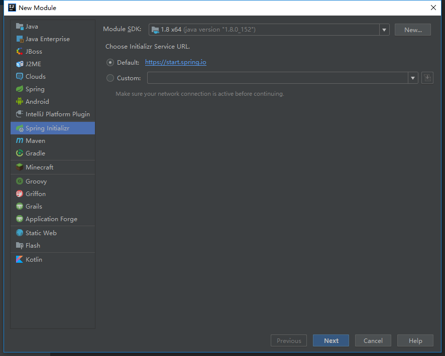
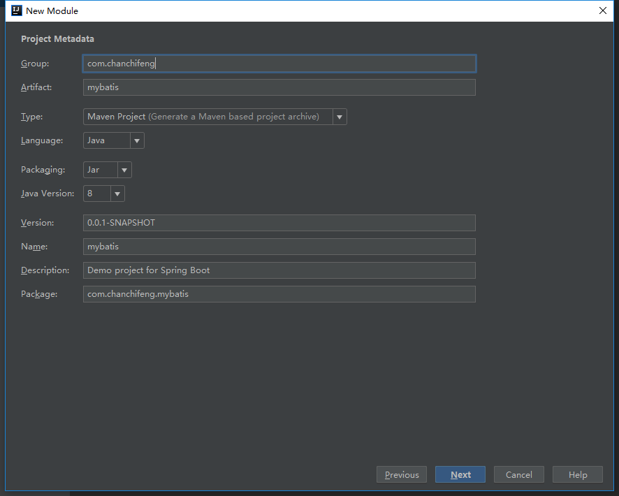
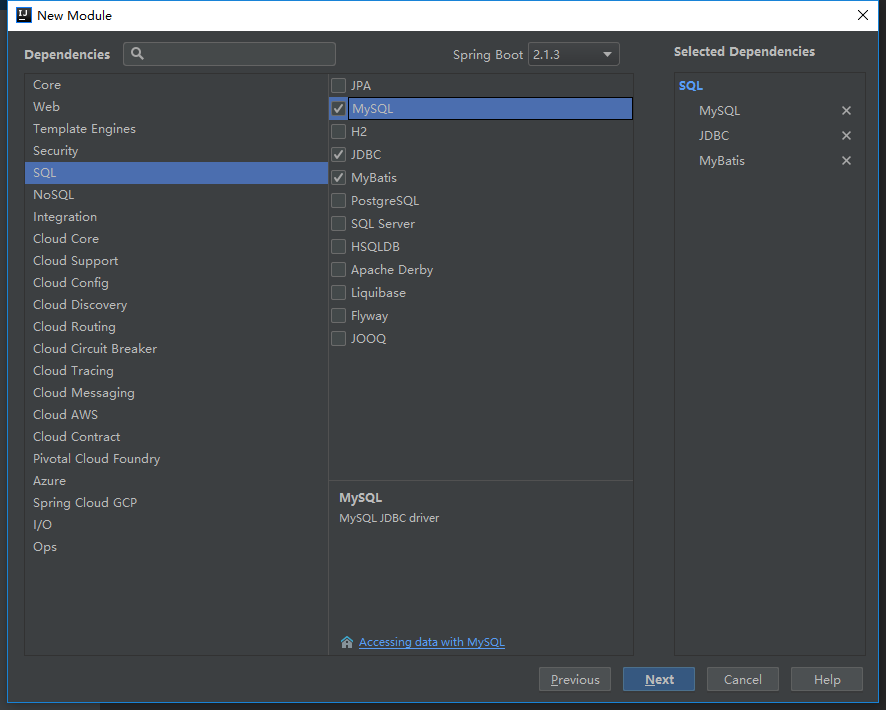
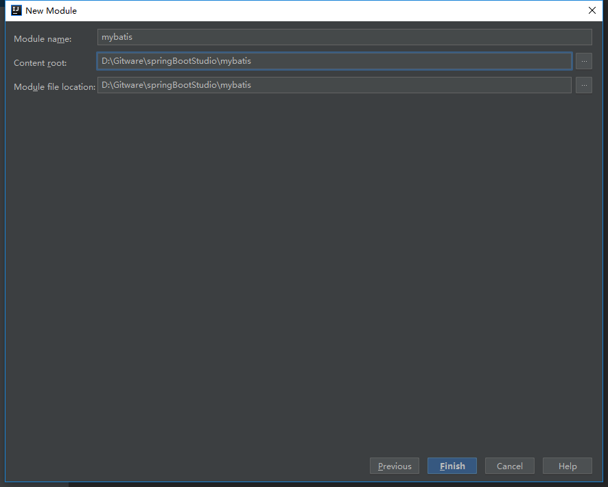
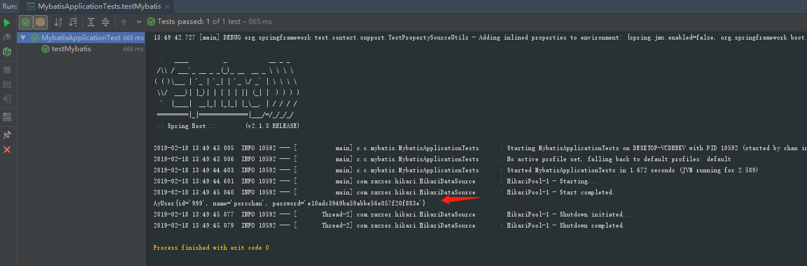

1.在springBootStudio项目中添加Module。

2.选择Spring Initializr，点击next。



3.Group填写com.chanchifeng，Artifact填写mybatis。



4.勾选SQL中的MySQL、JDBC和MyBatis，点击next。



5.Content_root和Module file location选择springBootStudio项目路径。



6.修改pom.xml的MySQL版本号，核心代码如下：

```

	<dependencies>
	    <dependency>
	        <groupId>org.springframework.boot</groupId>
	        <artifactId>spring-boot-starter-jdbc</artifactId>
	    </dependency>
	    <dependency>
	        <groupId>org.mybatis.spring.boot</groupId>
	        <artifactId>mybatis-spring-boot-starter</artifactId>
	        <version>2.0.0</version>
	    </dependency>
	
	    <dependency>
	        <groupId>mysql</groupId>
	        <artifactId>mysql-connector-java</artifactId>
	        <version>5.1.46</version>
	        <scope>runtime</scope>
	    </dependency>
	
	    <dependency>
	        <groupId>org.springframework.boot</groupId>
	        <artifactId>spring-boot-starter-test</artifactId>
	        <scope>test</scope>
	    </dependency>
	</dependencies>

```

7.在MySQL中创建一张user表。

```

	SET NAMES utf8mb4;
	SET FOREIGN_KEY_CHECKS = 0;
	
	-- ----------------------------
	-- Table structure for user
	-- ----------------------------
	DROP TABLE IF EXISTS `user`;
	CREATE TABLE `user`  (
	  `id` int(32) NOT NULL AUTO_INCREMENT COMMENT '主键',
	  `name` varchar(10) CHARACTER SET utf8 COLLATE utf8_general_ci NULL DEFAULT NULL COMMENT '用户名',
	  `password` varchar(32) CHARACTER SET utf8 COLLATE utf8_general_ci NULL DEFAULT NULL COMMENT '密码',
	  PRIMARY KEY (`id`) USING BTREE
	) ENGINE = InnoDB AUTO_INCREMENT = 4 CHARACTER SET = utf8 COLLATE = utf8_general_ci ROW_FORMAT = Dynamic;
	
	-- ----------------------------
	-- Records of user
	-- ----------------------------
	INSERT INTO `user` VALUES (1, '李四', 'e10adc3949ba59abbe56e057f20f883e');
	INSERT INTO `user` VALUES (2, '张三', 'e10adc3949ba59abbe56e057f20f883e');
	INSERT INTO `user` VALUES (3, '阿华', 'e10adc3949ba59abbe56e057f20f883e');
	INSERT INTO `user` VALUES (999, 'porschan', 'e10adc3949ba59abbe56e057f20f883e');
	
	
	SET FOREIGN_KEY_CHECKS = 1;

```

8.在application.properties中添加连接MySQL数据库和MyBatis的信息，信息如下：

```

	###  MySQL 连接信息
	spring.datasource.url = jdbc:mysql://127.0.0.1:3306/test?useSSL=true
	spring.datasource.username = root
	spring.datasource.password = 1qaz2wsx
	spring.datasource.driver-class-name = com.mysql.jdbc.Driver
	
	### mybatis配置
	mybatis.mapper-locations=classpath:/mappers/*Mapper.xml
	mybatis.type-aliases-package=com.example.demo.dao

```

9.在项目中创建一个model包，在其下创建User的类，代码如下：

```

	public class User {
	
	    private String id;
	    private String name;
	    private String password;
	
	    public String getId() {
	        return id;
	    }
	
	    public void setId(String id) {
	        this.id = id;
	    }
	
	    public String getName() {
	        return name;
	    }
	
	    public void setName(String name) {
	        this.name = name;
	    }
	
	    public String getPassword() {
	        return password;
	    }
	
	    public void setPassword(String password) {
	        this.password = password;
	    }
	
	    @Override
	    public String toString() {
	        return "AyUser{" +
	                "id='" + id + '\'' +
	                ", name='" + name + '\'' +
	                ", password='" + password + '\'' +
	                '}';
	    }
	
	}

```

10.在项目中创建一个dao包，在其下创建UserDao的接口，代码如下：

```

	@Mapper
	public interface UserDao {
	
	    User findByNameAndPassword(@Param("name") String name, @Param("password") String password);
	
	}

```

11.在项目中创建一个service包，在其下创建UserService的接口，代码如下：

```

	public interface UserService {
	
	    User findByNameAndPassword(String name, String password);
	
	}

```

12.在项目中创建一个service.impl包，在其下创建UserServiceImpl的类，代码如下：

```

	@Service
	public class UserServiceImpl implements UserService {
	
	    @Resource
	    UserDao userDao;
	
	    @Override
	    public User findByNameAndPassword(String name, String password) {
	        return userDao.findByNameAndPassword(name, password);
	    }
	}

```

13.编写测试类，测试Mybatis是否连接成功，核心代码如下：

```

	@RunWith(SpringRunner.class)
	@SpringBootTest
	public class MybatisApplicationTests {
	
	    @Resource
	    UserService userService;
	
	    @Test
	    public void testMybatis(){
	        User user = userService.findByNameAndPassword("porschan", "e10adc3949ba59abbe56e057f20f883e");
	        System.out.println(user.toString());
	    }
	
	}

```

14.控制台输出，如下图：



