1.创建maven的空白工程，如下图所示：

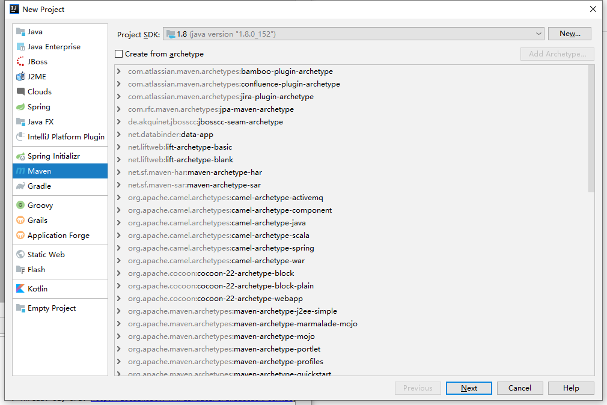

2.GroupID和ArtifactId命名为com.chanchifeng和Springboot-Neo4j-UI-SHADOW,如下图所示：

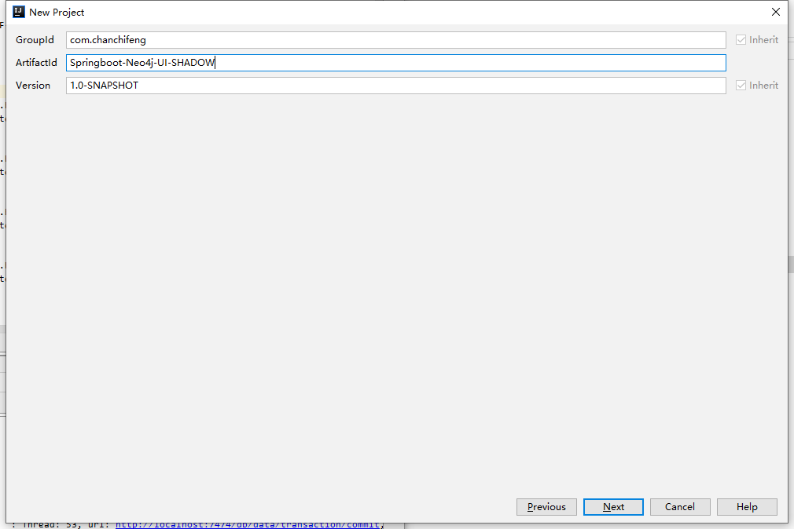

3.设置项目的电脑位置，如下图所示：

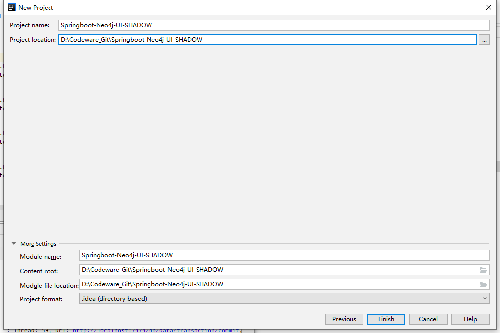

4.将src删除，操作如下图所示：

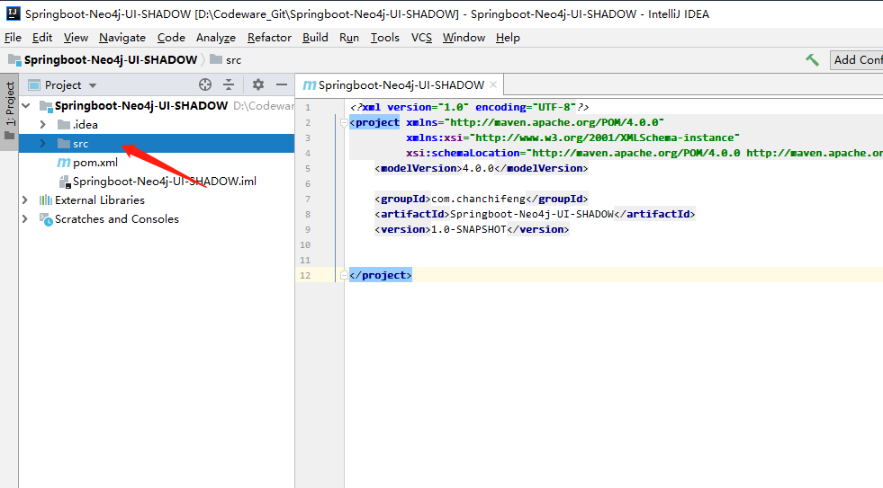

5.在maven的项目中添加模块，操作如下图所示：


6.选择maven项目，操作如下图所示：


7.将AritfactId设置为data,操作如下图所示：

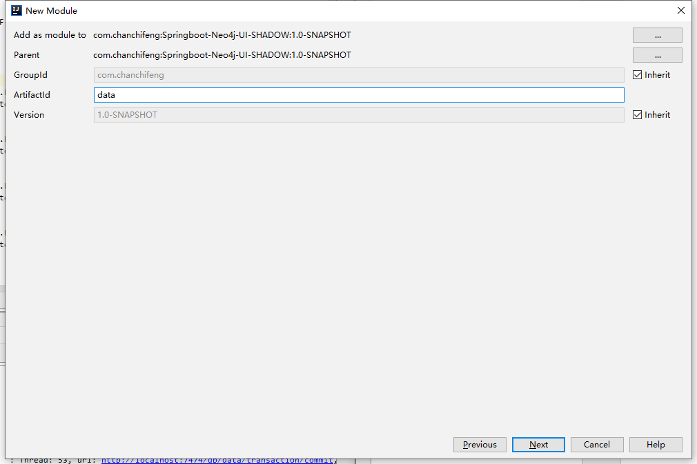

8.设置Module 的名称和物理位置，操作如下图所示：


9.在maven项目中创建模块，操作如下图所示：

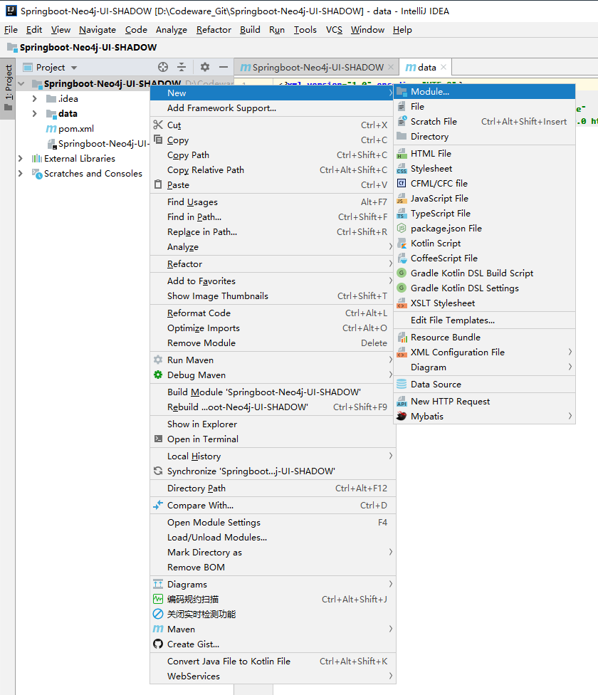

10.选择maven项目，操作如下图所示：

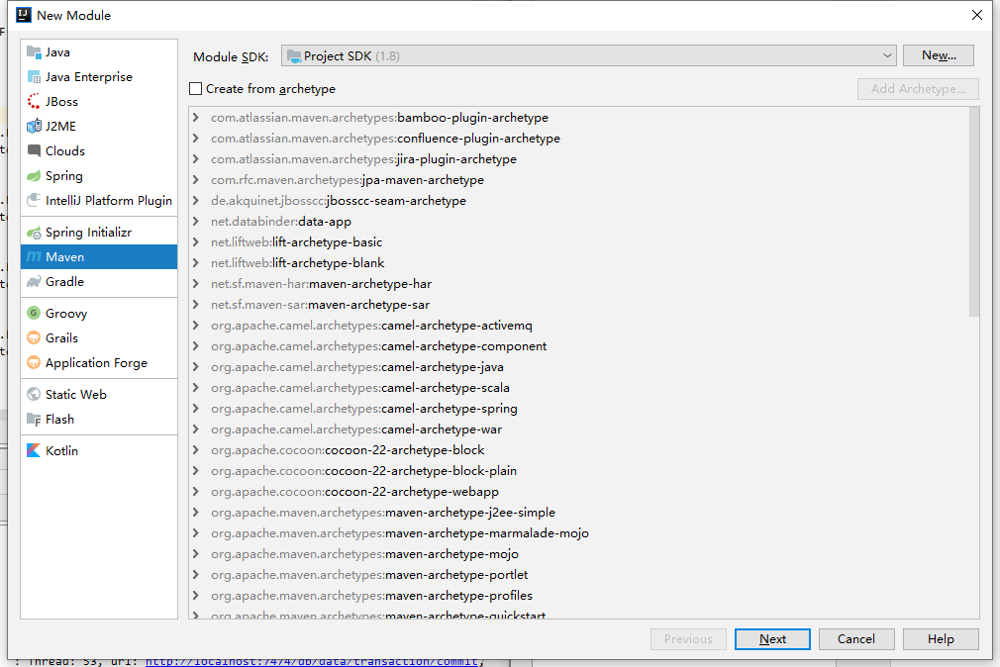

11.设置ArtifactId为webui,操作如下图所示：

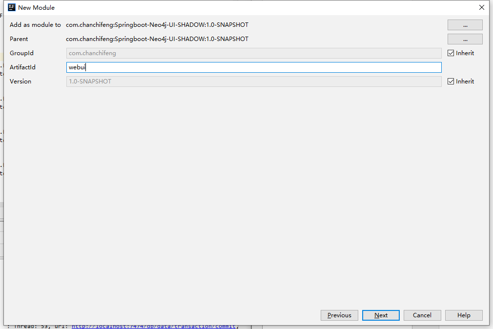

12.设置Module的名称和该模块的物理位置，操作如下图所示：

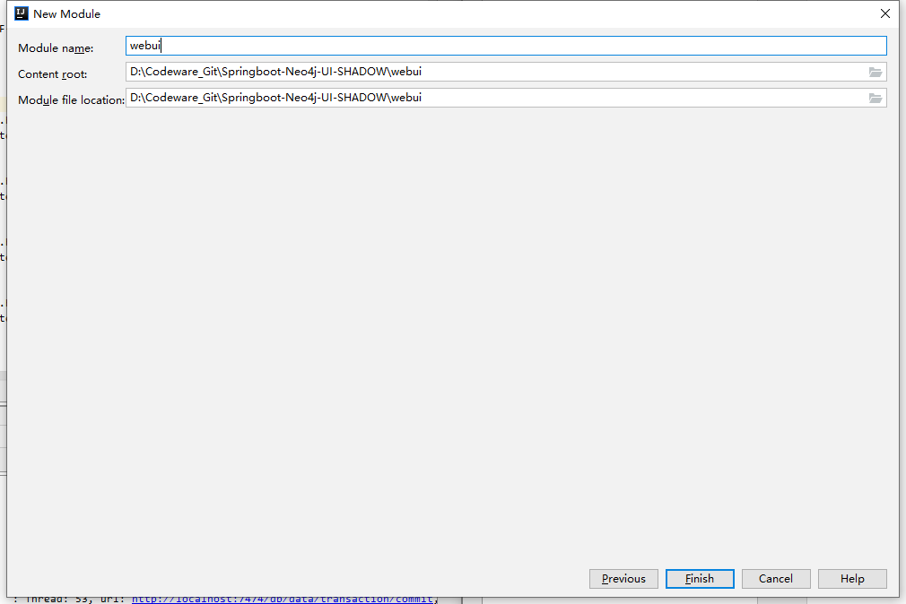

13.这里一个Maven工程里面，有data和webui模块，结构如下图所示：

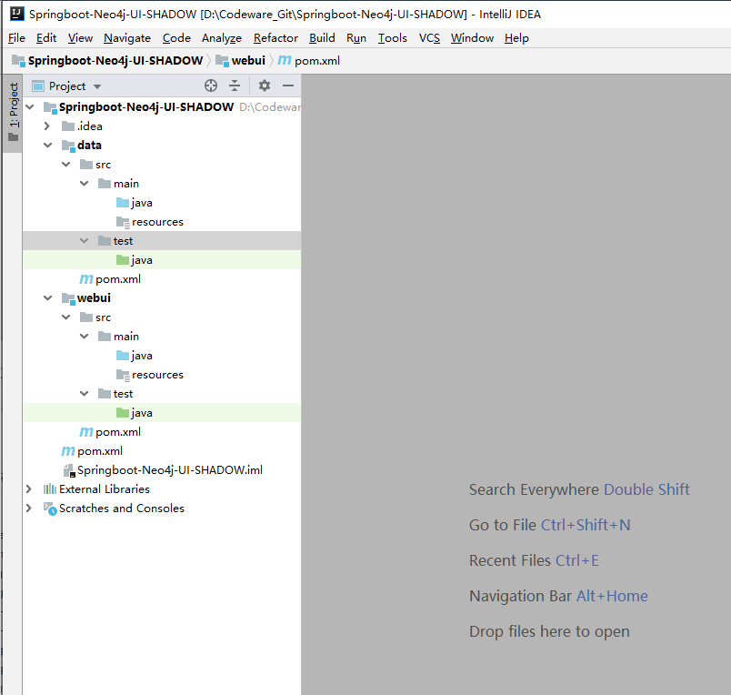

14.最后状态的目录结构如下图所示：

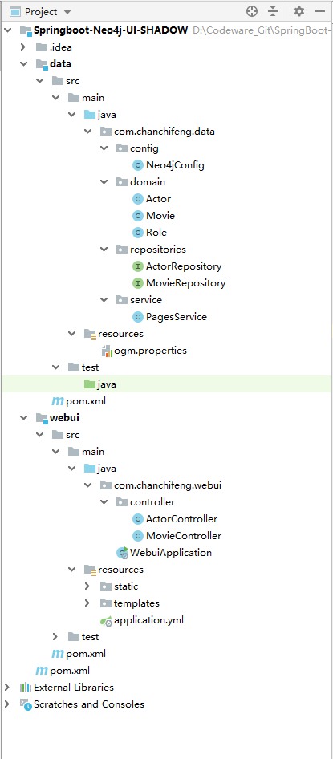

15.Neo4jConfig：

```java
import org.neo4j.ogm.session.SessionFactory;
import org.springframework.context.annotation.Configuration;
import org.springframework.data.neo4j.config.Neo4jConfiguration;
import org.springframework.data.neo4j.repository.config.EnableNeo4jRepositories;
import org.springframework.transaction.annotation.EnableTransactionManagement;

@Configuration
@EnableTransactionManagement
@EnableNeo4jRepositories(basePackages = { "com.chanchifeng.data.repositories" })
public class Neo4jConfig extends Neo4jConfiguration {
//SDN 升级到4.1.5，连接服务器的配置改在ogm.properties中设定，这样可以访问Neo4j 2.x 到 3.x 版本
//    @Override
//    public Neo4jServer neo4jServer() {
//        return new RemoteServer("http://192.168.1.211:7474","neo4j","12345678");
//    }

    @Override
    public SessionFactory getSessionFactory() {
        return new SessionFactory("com.chanchifeng.data.domain");
    }
}
```

16.Actor

```java
import com.fasterxml.jackson.annotation.JsonIdentityInfo;
import com.voodoodyne.jackson.jsog.JSOGGenerator;
import org.neo4j.ogm.annotation.GraphId;
import org.neo4j.ogm.annotation.NodeEntity;
import org.neo4j.ogm.annotation.typeconversion.DateLong;
import org.springframework.format.annotation.DateTimeFormat;

import java.util.Date;

@JsonIdentityInfo(generator= JSOGGenerator.class)
@NodeEntity
public class Actor {
    @GraphId
    Long id;
    private String name;
    private int sex;
    @DateLong
    @DateTimeFormat(pattern = "yyyy-MM-dd HH:mm:ss")
    private Date born;

    public Actor() { }

    public Long getId() {
        return id;
    }

    public void setId(Long id) {
        this.id = id;
    }

    public String getName() {
        return name;
    }

    public void setName(String name) {
        this.name = name;
    }

    public int getSex() {
        return sex;
    }

    public void setSex(int sex) {
        this.sex = sex;
    }

    public Date getBorn() {
        return born;
    }

    public void setBorn(Date born) {
        this.born = born;
    }
}
```

17.Movie

```java
import com.fasterxml.jackson.annotation.JsonIdentityInfo;
import com.voodoodyne.jackson.jsog.JSOGGenerator;
import org.neo4j.ogm.annotation.GraphId;
import org.neo4j.ogm.annotation.NodeEntity;
import org.neo4j.ogm.annotation.Relationship;
import org.neo4j.ogm.annotation.typeconversion.DateLong;
import org.springframework.format.annotation.DateTimeFormat;

import java.util.ArrayList;
import java.util.Date;
import java.util.List;

@JsonIdentityInfo(generator= JSOGGenerator.class)
@NodeEntity
public class Movie {
    @GraphId
    Long id;
    private String name;
    private String photo;
    @DateLong
    @DateTimeFormat(pattern = "yyyy-MM-dd HH:mm:ss")
    private Date createDate;

    @Relationship(type="扮演", direction = Relationship.INCOMING)
    List<Role> roles = new ArrayList<>();

    public Role addRole(Actor actor, String name){
        Role role = new Role(actor,this,name);
        this.roles.add(role);
        return role;
    }

    public Movie() { }

    public Long getId() {
        return id;
    }

    public void setId(Long id) {
        this.id = id;
    }

    public List<Role> getRoles() {
        return roles;
    }

    public void setRoles(List<Role> roles) {
        this.roles = roles;
    }

    public String getName() {
        return name;
    }

    public void setName(String name) {
        this.name = name;
    }

    public String getPhoto() {
        return photo;
    }

    public void setPhoto(String photo) {
        this.photo = photo;
    }

    public Date getCreateDate() {
        return createDate;
    }

    public void setCreateDate(Date createDate) {
        this.createDate = createDate;
    }
}
```

18.Role

```java
import com.fasterxml.jackson.annotation.JsonIdentityInfo;
import com.voodoodyne.jackson.jsog.JSOGGenerator;
import org.neo4j.ogm.annotation.EndNode;
import org.neo4j.ogm.annotation.GraphId;
import org.neo4j.ogm.annotation.RelationshipEntity;
import org.neo4j.ogm.annotation.StartNode;

@JsonIdentityInfo(generator= JSOGGenerator.class)
@RelationshipEntity(type = "扮演")
public class Role {
    @GraphId
    Long id;
    String name;
    @StartNode
    Actor actor;
    @EndNode
    Movie movie;

    public Role() {
    }

    public Role(Actor actor, Movie movie, String name) {
        this.actor = actor;
        this.movie = movie;
        this.name = name;
    }

    public Long getId() {
        return id;
    }

    public void setId(Long id) {
        this.id = id;
    }

    public String getName() {
        return name;
    }

    public void setName(String name) {
        this.name = name;
    }

    public Actor getActor() {
        return actor;
    }

    public Movie getMovie() {
        return movie;
    }

}
```

19.ActorRepository

```java
import com.chanchifeng.data.domain.Actor;
import org.springframework.data.neo4j.repository.GraphRepository;
import org.springframework.stereotype.Repository;

@Repository
public interface ActorRepository extends GraphRepository<Actor> {
}
```

20.MovieRepository

```java
import com.chanchifeng.data.domain.Movie;
import org.springframework.data.domain.Page;
import org.springframework.data.domain.Pageable;
import org.springframework.data.neo4j.annotation.Query;
import org.springframework.data.neo4j.repository.GraphRepository;
import org.springframework.data.repository.query.Param;
import org.springframework.stereotype.Repository;

@Repository
public interface MovieRepository extends GraphRepository<Movie> {
    Movie findByName(@Param("name") String name);

    @Query("MATCH (m:Movie) WHERE m.name =~ ('(?i).*'+{name}+'.*') RETURN m")
    Page<Movie> findByName(@Param("name") String name, Pageable pageable);//not support yet
}
```

21.PagesService

```java
import org.neo4j.ogm.cypher.Filters;
import org.neo4j.ogm.cypher.query.Pagination;
import org.neo4j.ogm.cypher.query.SortOrder;
import org.neo4j.ogm.session.Session;
import org.springframework.beans.factory.annotation.Autowired;
import org.springframework.data.domain.Page;
import org.springframework.data.domain.PageImpl;
import org.springframework.data.domain.Pageable;
import org.springframework.data.domain.Sort;
import org.springframework.stereotype.Service;

import java.util.ArrayList;
import java.util.Collection;
import java.util.Iterator;
import java.util.List;

@Service
public class PagesService<T> {
    @Autowired
    private Session session;


    public Page<T> findAll(Class<T> clazz, Pageable pageable, Filters filters){
        Collection data = this.session.loadAll(clazz, filters, convert(pageable.getSort()), new Pagination(pageable.getPageNumber(), pageable.getPageSize()), 1);
        return updatePage(pageable, new ArrayList(data));
    }

    private Page<T> updatePage(Pageable pageable, List<T> results) {
        int pageSize = pageable.getPageSize();
        int pageOffset = pageable.getOffset();
        int total = pageOffset + results.size() + (results.size() == pageSize?pageSize:0);
        return new PageImpl(results, pageable, (long)total);
    }

    private SortOrder convert(Sort sort) {
        SortOrder sortOrder = new SortOrder();
        if(sort != null) {
            Iterator var3 = sort.iterator();

            while(var3.hasNext()) {
                Sort.Order order = (Sort.Order)var3.next();
                if(order.isAscending()) {
                    sortOrder.add(new String[]{order.getProperty()});
                } else {
                    sortOrder.add(SortOrder.Direction.DESC, new String[]{order.getProperty()});
                }
            }
        }
        return sortOrder;
    }
}
```

22.ogm.properties

````properties
compiler=org.neo4j.ogm.compiler.MultiStatementCypherCompiler
driver=org.neo4j.ogm.drivers.http.driver.HttpDriver
URI=http://localhost:7474
username = neo4j
password = 1qaz2wsx
````

23.ActorController

```java
import com.chanchifeng.data.domain.Actor;
import com.chanchifeng.data.repositories.ActorRepository;
import org.slf4j.Logger;
import org.slf4j.LoggerFactory;
import org.springframework.beans.factory.annotation.Autowired;
import org.springframework.data.domain.Page;
import org.springframework.data.domain.PageRequest;
import org.springframework.data.domain.Pageable;
import org.springframework.data.domain.Sort;
import org.springframework.ui.ModelMap;
import org.springframework.web.bind.annotation.PathVariable;
import org.springframework.web.bind.annotation.RequestMapping;
import org.springframework.web.bind.annotation.RequestMethod;
import org.springframework.web.bind.annotation.RestController;
import org.springframework.web.servlet.ModelAndView;

import javax.servlet.http.HttpServletRequest;

@RestController
@RequestMapping("/actor")
public class ActorController {
    private static Logger logger = LoggerFactory.getLogger(ActorController.class);
    @Autowired
    private ActorRepository actorRepository;

    @RequestMapping("/index")
    public ModelAndView index() {
        return new ModelAndView("actor/index");
    }

    @RequestMapping(value = "/{id}")
    public ModelAndView show(ModelMap model, @PathVariable Long id) {
        Actor actor = actorRepository.findOne(id);
        model.addAttribute("actor", actor);
        return new ModelAndView("actor/show");
    }

    @RequestMapping("/new")
    public ModelAndView create() {
        return new ModelAndView("actor/new");
    }

    @RequestMapping(value = "/save", method = RequestMethod.POST)
    public String save(Actor actor) throws Exception {
        actorRepository.save(actor);
        logger.info("新增->ID={}", actor.getId());
        return "1";
    }

    @RequestMapping(value = "/edit/{id}")
    public ModelAndView update(ModelMap model, @PathVariable Long id) {
        Actor actor = actorRepository.findOne(id);
        model.addAttribute("actor", actor);
        return new ModelAndView("actor/edit");
    }

    @RequestMapping(method = RequestMethod.POST, value = "/update")
    public String update(Actor actor) throws Exception {
        actorRepository.save(actor);
        logger.info("修改->ID=" + actor.getId());
        return "1";
    }

    @RequestMapping(value = "/delete/{id}", method = RequestMethod.GET)
    public String delete(@PathVariable Long id) throws Exception {
        Actor actor = actorRepository.findOne(id);
        actorRepository.delete(actor);
        logger.info("删除->ID=" + id);
        return "1";
    }

    @RequestMapping(value = "/list")
    public Page<Actor> list(HttpServletRequest request) throws Exception {
        String name = request.getParameter("name");
        String page = request.getParameter("page");
        String size = request.getParameter("size");
        Pageable pageable = new PageRequest(page == null ? 0 : Integer.parseInt(page), size == null ? 10 : Integer.parseInt(size),
                new Sort(Sort.Direction.DESC, "id"));

        return actorRepository.findAll(pageable);
    }

}
```

24.MovieController

```java
import com.chanchifeng.data.domain.Actor;
import com.chanchifeng.data.domain.Movie;
import com.chanchifeng.data.repositories.ActorRepository;
import com.chanchifeng.data.repositories.MovieRepository;
import com.chanchifeng.data.service.PagesService;
import org.neo4j.ogm.cypher.Filter;
import org.neo4j.ogm.cypher.Filters;
import org.slf4j.Logger;
import org.slf4j.LoggerFactory;
import org.springframework.beans.factory.annotation.Autowired;
import org.springframework.data.domain.Page;
import org.springframework.data.domain.PageRequest;
import org.springframework.data.domain.Pageable;
import org.springframework.data.domain.Sort;
import org.springframework.ui.ModelMap;
import org.springframework.util.StringUtils;
import org.springframework.web.bind.annotation.PathVariable;
import org.springframework.web.bind.annotation.RequestMapping;
import org.springframework.web.bind.annotation.RequestMethod;
import org.springframework.web.bind.annotation.RestController;
import org.springframework.web.servlet.ModelAndView;

import javax.servlet.http.HttpServletRequest;

@RestController
@RequestMapping("/movie")
public class MovieController {
    private static Logger logger = LoggerFactory.getLogger(MovieController.class);
    @Autowired
    private MovieRepository movieRepository;
    @Autowired
    private ActorRepository actorRepository;
    @Autowired
    private PagesService<Movie> pagesService;

    @RequestMapping("/index")
    public ModelAndView index() {
        return new ModelAndView("movie/index");
    }

    @RequestMapping(value = "/{id}")
    public ModelAndView show(ModelMap model, @PathVariable Long id) {
        Movie movie = movieRepository.findOne(id);
        model.addAttribute("movie", movie);
        return new ModelAndView("movie/show");
    }

    @RequestMapping("/new")
    public ModelAndView create(ModelMap model) {
        String[] files = {"/images/movie/西游记.jpg", "/images/movie/西游记续集.jpg"};
        model.addAttribute("files", files);
        return new ModelAndView("movie/new");
    }

    @RequestMapping(value = "/save", method = RequestMethod.POST)
    public String save(Movie movie) throws Exception {
        movieRepository.save(movie);
        logger.info("新增->ID={}", movie.getId());
        return "1";
    }

    @RequestMapping(value = "/edit/{id}")
    public ModelAndView update(ModelMap model, @PathVariable Long id) {
        Movie movie = movieRepository.findOne(id);
        String[] files = {"/images/movie/西游记.jpg", "/images/movie/西游记续集.jpg"};
        String[] rolelist = new String[]{"唐僧", "孙悟空", "猪八戒", "沙僧"};
        Iterable<Actor> actors = actorRepository.findAll();

        model.addAttribute("files", files);
        model.addAttribute("rolelist", rolelist);
        model.addAttribute("movie", movie);
        model.addAttribute("actors", actors);

        return new ModelAndView("movie/edit");
    }

    @RequestMapping(method = RequestMethod.POST, value = "/update")
    public String update(Movie movie, HttpServletRequest request) throws Exception {
        String rolename = request.getParameter("rolename");
        String actorid = request.getParameter("actorid");

        Movie old = movieRepository.findOne(movie.getId());
        old.setName(movie.getName());
        old.setPhoto(movie.getPhoto());
        old.setCreateDate(movie.getCreateDate());

        if (!StringUtils.isEmpty(rolename) && !StringUtils.isEmpty(actorid)) {
            Actor actor = actorRepository.findOne(new Long(actorid));
            old.addRole(actor, rolename);
        }
        movieRepository.save(old);
        logger.info("修改->ID=" + old.getId());
        return "1";
    }

    @RequestMapping(value = "/delete/{id}", method = RequestMethod.GET)
    public String delete(@PathVariable Long id) throws Exception {
        Movie movie = movieRepository.findOne(id);
        movieRepository.delete(movie);
        logger.info("删除->ID=" + id);
        return "1";
    }

    @RequestMapping(value = "/list")
    public Page<Movie> list(HttpServletRequest request) throws Exception {
        String name = request.getParameter("name");
        String page = request.getParameter("page");
        String size = request.getParameter("size");
        Pageable pageable = new PageRequest(page == null ? 0 : Integer.parseInt(page), size == null ? 10 : Integer.parseInt(size),
                new Sort(Sort.Direction.DESC, "id"));

        Filters filters = new Filters();
        if (!StringUtils.isEmpty(name)) {
            Filter filter = new Filter("name", name);
            filters.add(filter);
        }

        return pagesService.findAll(Movie.class, pageable, filters);
    }
}
```

25.WebuiApplication

```java
import org.springframework.boot.SpringApplication;
import org.springframework.boot.autoconfigure.SpringBootApplication;
import org.springframework.context.annotation.ComponentScan;

@SpringBootApplication
@ComponentScan(basePackages = "com.chanchifeng")
public class WebuiApplication {
    public static void main(String[] args) {
        SpringApplication.run(WebuiApplication.class, args);
    }
}
```

26.application.yml

```yml
server:
  port: 80
  tomcat:
    uri-encoding: UTF-8
```

27.webui模块中的resources中的static和templates请到下面的github中获取！！！

> SpringBoot-Sample/Springboot-Neo4j-UI-SHADOW：[https://github.com/porschan/SpringBoot-Sample)