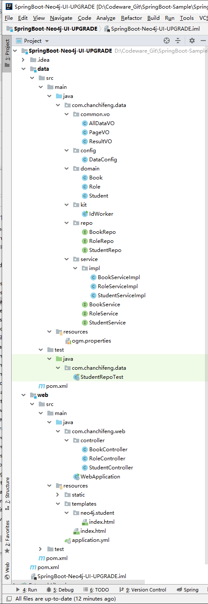
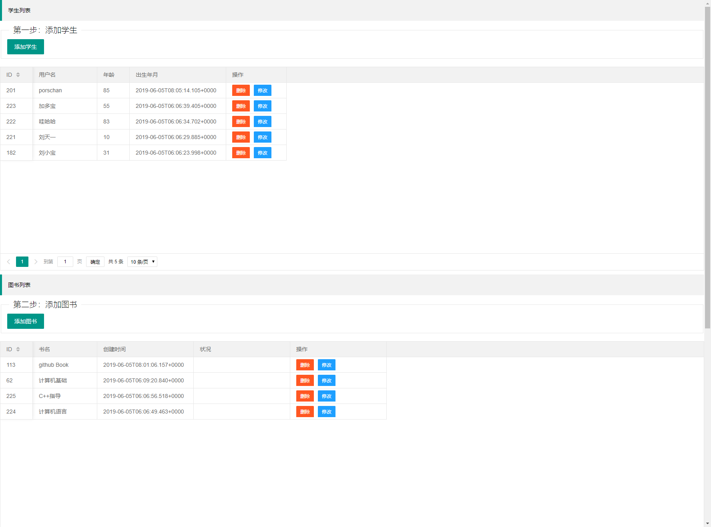
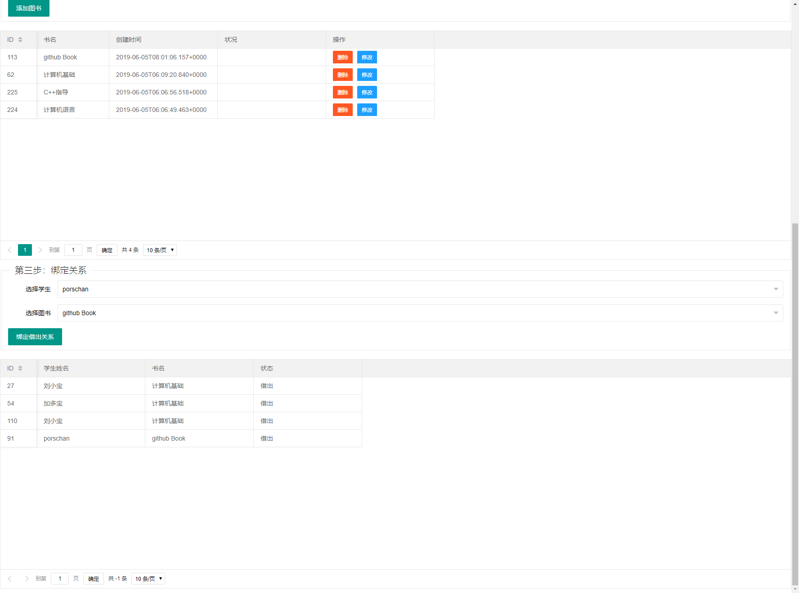

此次的项目是由上一个项目[使用 IDEA 中创建 SpringBoot + Neo4J 的 WEB 项目]模仿并进行改进而来。

> [使用 IDEA 中创建 SpringBoot + Neo4J 的 WEB 项目](/2019/06/01/springboot-neo4j-ui-shado/ "使用 IDEA 中创建 SpringBoot + Neo4J 的 WEB 项目")

这里只显示较为重要的代码部分，若需要整体项目，请到文章底部获取Github地址。

1.项目目录结构，如下图所示：



2.DataConfig:

```java
import org.neo4j.ogm.config.ClasspathConfigurationSource;
import org.neo4j.ogm.config.ConfigurationSource;
import org.neo4j.ogm.session.SessionFactory;
import org.springframework.context.annotation.Bean;
import org.springframework.context.annotation.Configuration;
import org.springframework.data.neo4j.repository.config.EnableNeo4jRepositories;
import org.springframework.data.neo4j.transaction.Neo4jTransactionManager;
import org.springframework.transaction.annotation.EnableTransactionManagement;

@Configuration
@EnableNeo4jRepositories(basePackages = {"com.chanchifeng.data.repo"})
@EnableTransactionManagement
public class DataConfig {

    @Bean
    public SessionFactory sessionFactory() {
        // with domain entity base package(s)
        return new SessionFactory(configuration(), "com.chanchifeng.data.domain");
    }

    @Bean
    public org.neo4j.ogm.config.Configuration configuration() {
        ConfigurationSource properties = new ClasspathConfigurationSource("ogm.properties");
        org.neo4j.ogm.config.Configuration configuration = new org.neo4j.ogm.config.Configuration.Builder(properties).build();
        return configuration;
    }

    @Bean
    public Neo4jTransactionManager transactionManager() {
        return new Neo4jTransactionManager(sessionFactory());
    }

}
```

3.Book:

```java
import lombok.Getter;
import lombok.NoArgsConstructor;
import lombok.Setter;
import org.neo4j.ogm.annotation.GeneratedValue;
import org.neo4j.ogm.annotation.Id;
import org.neo4j.ogm.annotation.NodeEntity;
import org.neo4j.ogm.annotation.Relationship;
import org.neo4j.ogm.annotation.typeconversion.DateLong;
import org.springframework.format.annotation.DateTimeFormat;

import java.util.ArrayList;
import java.util.Date;
import java.util.List;

@NoArgsConstructor
@NodeEntity
public class Book {

    @Id @GeneratedValue @Getter @Setter private Long bookId;

    @Getter @Setter private String bookName;

    @DateLong @DateTimeFormat(pattern = "yyyy-MM-dd HH:mm:ss") @Getter @Setter private Date bookCreateTime;

    @Relationship(type = "借出") List<Role> roles = new ArrayList<>();

    public Role addRole(Student student,String roleName){
        Role role = new Role(null, roleName, student, this);
        this.roles.add(role);
        return role;
    }

}
```

4.Role:

```java
import lombok.*;
import org.neo4j.ogm.annotation.*;


@AllArgsConstructor
@NoArgsConstructor
@RelationshipEntity(type = "借出")
public class Role {

    @Id @GeneratedValue @Getter @Setter private Long roleId;

    @Getter @Setter private String roleName;

    @EndNode @Getter @Setter private Student student;

    @StartNode @Getter @Setter private Book book;

}
```

5.Student:

```java
import lombok.*;
import org.neo4j.ogm.annotation.GeneratedValue;
import org.neo4j.ogm.annotation.Id;
import org.neo4j.ogm.annotation.NodeEntity;
import org.neo4j.ogm.annotation.typeconversion.DateLong;
import org.springframework.format.annotation.DateTimeFormat;

import java.util.Date;

@NoArgsConstructor
@NodeEntity
public class Student {

    @Id @GeneratedValue @Getter @Setter private Long studentId;

    @Getter @Setter private String studentName;

    @Getter @Setter private int studentAge;

    @DateLong @DateTimeFormat(pattern = "yyyy-MM-dd HH:mm:ss") @Getter @Setter private Date studentBorn;

}

```

6.RoleRepo:

```java
import com.chanchifeng.data.domain.Role;
import org.springframework.data.neo4j.annotation.Query;
import org.springframework.data.repository.PagingAndSortingRepository;
import org.springframework.stereotype.Repository;

import java.util.List;

@Repository
public interface RoleRepo extends PagingAndSortingRepository<Role,Long> {

    @Query("match p = (n)-[r:`借出`]->(b) return p")
    List<Role> getLikes();

    @Query("match p = (n)-[r:Role]->(b) return p")
    List<Object> getLikesObj();
}
```

7.BookServiceImpl:

```java
import com.chanchifeng.data.common.vo.PageVO;
import com.chanchifeng.data.domain.Book;
import com.chanchifeng.data.repo.BookRepo;
import com.chanchifeng.data.service.BookService;
import org.springframework.beans.factory.annotation.Autowired;
import org.springframework.data.domain.Page;
import org.springframework.data.domain.PageRequest;
import org.springframework.data.domain.Sort;
import org.springframework.stereotype.Service;

import java.util.List;

@Service
public class BookServiceImpl implements BookService {

    @Autowired
    BookRepo bookRepo;

    @Override
    public PageVO<Book> finlAllPage(int page, int size) {
        Sort sort = new Sort(Sort.Direction.DESC,"bookCreateTime");
        Page<Book> all = bookRepo.findAll(PageRequest.of(page, size,sort));
        List<Book> content = all.getContent();
        return new PageVO<Book>(all.getNumber(),all.getTotalPages(),all.getContent(),all.getTotalElements());
    }
}
```

8.ogm.properties:

```properties
URI=http://localhost:7474
username=neo4j
password=1qaz2wsx
```

9.WebApplication:

```java
import org.springframework.boot.SpringApplication;
import org.springframework.boot.autoconfigure.SpringBootApplication;
import org.springframework.context.annotation.ComponentScan;
import org.springframework.data.neo4j.repository.config.EnableNeo4jRepositories;


@SpringBootApplication
@ComponentScan(basePackages="com.chanchifeng")
@EnableNeo4jRepositories
public class WebApplication {
    public static void main(String[] args) {
        SpringApplication.run(WebApplication.class, args);
    }
}
```

10.resources/templates/ndeo4j/student/index.html:

```html
<!DOCTYPE html>
<html lang="en" xmlns:th="http://www.springframework.org/schema/data/jaxb">
<head>
    <meta charset="UTF-8">
    <title>Student</title>
    <link rel="stylesheet" th:href="@{/common/layerui/css/layui.css}" media="all">
</head>
<body>


<blockquote class="layui-elem-quote">学生列表</blockquote>

<fieldset class="layui-elem-field">
    <legend>第一步：添加学生</legend>
    <div class="layui-field-box">
        <button type="button" class="layui-btn" onclick="showAddEditView()">添加学生</button>
    </div>
</fieldset>

<table id="demo"></table>

<blockquote class="layui-elem-quote">图书列表</blockquote>

<fieldset class="layui-elem-field">
    <legend>第二步：添加图书</legend>
    <div class="layui-field-box">
        <button type="button" class="layui-btn" onclick="showAddEditBookView()">添加图书</button>
    </div>
</fieldset>

<table id="book"></table>

<fieldset class="layui-elem-field">
    <legend>第三步：绑定关系</legend>
    <div class="layui-field-box">
        <div class="layui-form">
            <div class="layui-form-item" lay-filter="test1">
                <label class="layui-form-label">选择学生</label>
                <div class="layui-input-block">
                    <select name="student" id="studentSel" lay-verify="required">

                    </select>
                </div>
            </div>

            <div class="layui-form-item">
                <label class="layui-form-label">选择图书</label>
                <div class="layui-input-block">
                    <select name="book" id="bookSel" lay-verify="required">
                    </select>
                </div>
            </div>
        </div>

        <button type="button" class="layui-btn" onclick="bing()">绑定借出关系</button>
    </div>
</fieldset>

<table id="role"></table>

<!-- 你必须先引入jQuery1.8或以上版本 -->
<script th:src="@{/js/jquery-3.4.1.min.js}"></script>
<script th:src="@{/common/layerui/layui.js}"></script>
<script th:inline="none">

    $(function(){
        initTable();
        initBookTable();
        bingView();
        initRoleTable();
    })

    /* 学生 start */
    function initTable(){
        layui.use('table', function(){
            var table = layui.table;

            //第一个实例
            table.render({
                elem: '#demo'
                ,height:510
                ,url: '../student/list' //数据接口
                ,where:{
                    // name:$("#searchName").val()
                    // ,password:$("#searchPassword").val()
                }
                ,parseData: function(res){ //res 即为原始返回的数据
                    return {
                        "code": 0 //解析接口状态
                        ,"count": res.totalElements //解析数据长度
                        ,"data": res.data //解析数据列表
                    };
                }
                ,page: true //开启分页
                ,limit: 10
                ,cols: [[ //表头
                    {field: 'studentId', title: 'ID', width:80, sort: true, fixed: 'left'}
                    ,{field: 'studentName', title: '用户名', width:160}
                    ,{field: 'studentAge', title: '年龄', width:80}
                    ,{field: 'studentBorn', title: '出生年月', width:240}

                    ,{field:'title', title: '操作', width: 150
                        ,templet: function(d){
                            return '<a class="layui-btn layui-btn-sm layui-btn-danger" onclick="delView(' + d.studentId + ',&quot;' + d.studentName + '&quot;)">删除</a>' +
                                '<a class="layui-btn layui-btn-sm layui-btn-normal" onclick="showAddEditView(' + d.studentId + ',&quot;' + d.studentName + '&quot;)">修改</a>'
                        }
                    }
                ]]
            });

        });
    }


    function showAddEditView(studentId,studentName){
        var tips = "";
        tips = studentId != null ? '输入修改学生姓名' : '输入新增学生姓名' ;
        var message = "";
        tips = studentId != null ? '修改' : '新增' ;
        var initValue = "";
        initValue = studentId != null ? studentName : '' ;
        layer.prompt({title: tips, formType: 0,value: initValue}, function(studentName, index){
            layer.close(index);

            var para = {"studentName":studentName,"studentId":studentId};
            $.post("../student/subStudent", para,function(data) {
                if(data.state){
                    layer.msg(tips + "成功");
                    initTable();
                    bingView();
                }else{
                    layer.msg(tips + "失败，请重试");
                }

            });
        });
    }

    function delView(studentId,studentName){
        layer.confirm('是否删除' + studentName + '？', {
            btn: ['是','否'] //按钮
        }, function(){
            $.post("../student/delStudent", {"studentId":studentId},function(data) {
                if(data.state){
                    layer.msg("删除成功");
                    initTable();
                    bingView();
                }else{
                    layer.msg("删除失败，请重新删除");
                }
            });
        }, function(){});
    }

    /* 学生 end */

    /* 图书 start */
    function initBookTable(){
        layui.use('table', function(){
            var table = layui.table;

            //第一个实例
            table.render({
                elem: '#book'
                ,height:510
                ,url: '../book/list' //数据接口
                ,where:{
                    // name:$("#searchName").val()
                    // ,password:$("#searchPassword").val()
                }
                ,parseData: function(res){ //res 即为原始返回的数据
                    return {
                        "code": 0 //解析接口状态
                        ,"count": res.totalElements //解析数据长度
                        ,"data": res.data //解析数据列表
                    };
                }
                ,page: true //开启分页
                ,limit: 10
                ,cols: [[ //表头
                    {field: 'bookId', title: 'ID', width:80, sort: true, fixed: 'left'}
                    ,{field: 'bookName', title: '书名', width:160}
                    ,{field: 'bookCreateTime', title: '创建时间', width:240}
                    ,{field: 'roles', title: '状况', width:240}

                    ,{field:'title', title: '操作', width: 240
                        ,templet: function(d){
                            return '<a class="layui-btn layui-btn-sm layui-btn-danger" onclick="delBookView(' + d.bookId + ',&quot;' + d.bookName + '&quot;)">删除</a>' +
                                '<a class="layui-btn layui-btn-sm layui-btn-normal" onclick="showAddEditBookView(' + d.bookId + ',&quot;' + d.bookName + '&quot;)">修改</a>';
                        }
                    }
                ]]
            });

        });
    }

    function showAddEditBookView(bookId,bookName){
        var tips = "";
        tips = bookId != null ? '输入修改图书名称' : '输入新增图书名称' ;
        var message = "";
        message = bookId != null ? '修改' : '添加' ;
        var initValue = "";
        initValue = bookId != null ? bookName : '' ;
        layer.prompt({title: tips, formType: 0,value: initValue}, function(bookName, index){
            layer.close(index);

            var para = {"bookName":bookName,"bookId":bookId};
            $.post("../book/subBook", para,function(data) {
                if(data.state){
                    layer.msg(message + "成功");
                    initBookTable();
                    bingView();
                }else{
                    layer.msg(message + "失败，请重试");
                }

            });
        });
    }

    function delBookView(bookId,bookName){
        layer.confirm('是否删除' + bookName + '？', {
            btn: ['是','否'] //按钮
        }, function(){
            $.post("../book/delBook", {"bookId":bookId},function(data) {
                if(data.state){
                    layer.msg("删除成功");
                    initBookTable();
                    bingView();
                }else{
                    layer.msg("删除失败，请重新删除");
                }
            });
        }, function(){});
    }
    /* 图书 end */

    /* 关系 start */
    function initRoleTable(){
        layui.use('table', function(){
            var table = layui.table;

            //第一个实例
            table.render({
                elem: '#role'
                ,height:510
                ,url: '../role/list' //数据接口
                ,where:{
                    // name:$("#searchName").val()
                    // ,password:$("#searchPassword").val()
                }
                ,parseData: function(res){ //res 即为原始返回的数据
                    return {
                        "code": 0 //解析接口状态
                        ,"count": res.totalElements //解析数据长度
                        ,"data": res.data //解析数据列表
                    };
                }
                ,page: true //开启分页
                ,limit: 10
                ,cols: [[ //表头
                    {field: 'roleId', title: 'ID', width:80, sort: true, fixed: 'left'}

                    ,{field:'title', title: '学生姓名', width: 240
                        ,templet: function(d){
                            return d.student.studentName;
                        }
                    }

                    ,{field:'title', title: '书名', width: 240
                        ,templet: function(d){
                            return d.book.bookName;
                        }
                    }
                    ,{field: 'roleName', title: '状态', width:240}
                ]]
            });

        });
    }

    function bingView(bookId,bookName){
        $.post("../role/allData", {},function(data) {
            var books = data.allBook;
            var students = data.allStudent;

            var bookHtml = '<option value=""></option>';
            $(books).each(function(index,book){
                bookHtml += '<option value="' + book.bookId + '">' + book.bookName + '</option>'
            })

            var studentHtml = '<option value=""></option>';
            $(students).each(function(index,student){
                studentHtml += '<option value="' + student.studentId + '">' + student.studentName + '</option>'
            })

            $("#bookSel").html(bookHtml);
            $("#studentSel").html(studentHtml);


            layui.use('form', function(){
                var form = layui.form;
                form.render('select'); //刷新select选择框渲染
            });

        });
    }

    function bing(){
        var bookSel = $("#bookSel  option:selected").val();
        var studentSel = $("#studentSel  option:selected").val();
        if(bookSel != null && bookSel >0){
            if(studentSel != null && studentSel > 0){
                $.post("../role/bing", {"bookId":bookSel,"studentId":studentSel},function(data) {
                    console.info(data);
                    if(data.state){
                        initRoleTable();
                        layer.msg("绑定成功");
                    }else{
                        layer.msg("绑定失败");
                    }

                });
            }else{
                layer.alert("请选择学生");
            }
        }else{
            layer.alert("请选择图书");
        }
    }
    /* 关系 end */
</script>
</body>
</html>
```

11.application.yml:

```yml
server:
  port: 8080
  servlet:
    context-path: /neo4j
spring:
  resources:
    static-locations: classpath:/static/
    chain:
      strategy:
        content:
          enabled: true
          paths: /**
  thymeleaf:
    encoding: utf-8
    prefix: classpath:/templates/
    suffix: .html
    cache: false
```

12.data/pom.xml:

```xml
<?xml version="1.0" encoding="UTF-8"?>
<project xmlns="http://maven.apache.org/POM/4.0.0"
         xmlns:xsi="http://www.w3.org/2001/XMLSchema-instance"
         xsi:schemaLocation="http://maven.apache.org/POM/4.0.0 http://maven.apache.org/xsd/maven-4.0.0.xsd">
    <parent>
        <artifactId>Springboot-Neo4j-UI-UPGRADE</artifactId>
        <groupId>com.chanchifeng</groupId>
        <version>1.0-SNAPSHOT</version>
    </parent>
    <modelVersion>4.0.0</modelVersion>

    <artifactId>data</artifactId>

    <dependencies>

        <dependency>
            <groupId>org.springframework.boot</groupId>
            <artifactId>spring-boot-starter-data-neo4j</artifactId>
        </dependency>

        <dependency>
            <groupId>org.springframework.boot</groupId>
            <artifactId>spring-boot-starter-test</artifactId>
            <scope>test</scope>
        </dependency>

        <!-- https://mvnrepository.com/artifact/org.projectlombok/lombok -->
        <dependency>
            <groupId>org.projectlombok</groupId>
            <artifactId>lombok</artifactId>
            <version>1.18.2</version>
            <scope>provided</scope>
        </dependency>

        <dependency>
            <groupId>org.neo4j</groupId>
            <artifactId>neo4j-ogm-http-driver</artifactId>
        </dependency>

    </dependencies>


</project>
```

13.web/pom.xml:

```xml
<?xml version="1.0" encoding="UTF-8"?>
<project xmlns="http://maven.apache.org/POM/4.0.0"
         xmlns:xsi="http://www.w3.org/2001/XMLSchema-instance"
         xsi:schemaLocation="http://maven.apache.org/POM/4.0.0 http://maven.apache.org/xsd/maven-4.0.0.xsd">
    <parent>
        <artifactId>Springboot-Neo4j-UI-UPGRADE</artifactId>
        <groupId>com.chanchifeng</groupId>
        <version>1.0-SNAPSHOT</version>
    </parent>
    <modelVersion>4.0.0</modelVersion>

    <artifactId>web</artifactId>

    <dependencies>

        <dependency>
            <groupId>com.chanchifeng</groupId>
            <artifactId>data</artifactId>
            <version>${project.version}</version>
        </dependency>

        <dependency>
            <groupId>org.springframework.boot</groupId>
            <artifactId>spring-boot-starter-thymeleaf</artifactId>
        </dependency>

<!--        <dependency>-->
<!--            <groupId>org.springframework.boot</groupId>-->
<!--            <artifactId>spring-boot-starter-web</artifactId>-->
<!--        </dependency>-->

        <dependency>
            <groupId>org.springframework.boot</groupId>
            <artifactId>spring-boot-devtools</artifactId>
            <scope>runtime</scope>
        </dependency>
<!--        <dependency>-->
<!--            <groupId>com.chanchifeng</groupId>-->
<!--            <artifactId>data</artifactId>-->
<!--            <version>1.0-SNAPSHOT</version>-->
<!--            <scope>compile</scope>-->
<!--        </dependency>-->

    </dependencies>

    <build>
        <plugins>
            <plugin>
                <groupId>org.springframework.boot</groupId>
                <artifactId>spring-boot-maven-plugin</artifactId>
                <executions>
                    <execution>
                        <goals>
                            <goal>repackage</goal>
                        </goals>
                    </execution>
                </executions>
            </plugin>
        </plugins>
    </build>

</project>
```

14.项目根路径/pom.xml:

```xml
<?xml version="1.0" encoding="UTF-8"?>
<project xmlns="http://maven.apache.org/POM/4.0.0"
         xmlns:xsi="http://www.w3.org/2001/XMLSchema-instance"
         xsi:schemaLocation="http://maven.apache.org/POM/4.0.0 http://maven.apache.org/xsd/maven-4.0.0.xsd">
    <modelVersion>4.0.0</modelVersion>

    <groupId>com.chanchifeng</groupId>
    <artifactId>Springboot-Neo4j-UI-UPGRADE</artifactId>
    <packaging>pom</packaging>
    <version>1.0-SNAPSHOT</version>
    <modules>

        <module>web</module>
        <module>data</module>
    </modules>

    <parent>
        <groupId>org.springframework.boot</groupId>
        <artifactId>spring-boot-starter-parent</artifactId>
        <version>2.1.5.RELEASE</version>
        <relativePath/> <!-- lookup parent from repository -->
    </parent>

    <dependencies>
        <dependency>
            <groupId>org.springframework.boot</groupId>
            <artifactId>spring-boot-starter</artifactId>
        </dependency>
        <dependency>
            <groupId>org.springframework.boot</groupId>
            <artifactId>spring-boot-starter-web</artifactId>
        </dependency>
<!--        <dependency>-->
<!--            <groupId>org.springframework.boot</groupId>-->
<!--            <artifactId>spring-boot-starter-actuator</artifactId>-->
<!--        </dependency>-->
        <dependency>
            <groupId>org.springframework.boot</groupId>
            <artifactId>spring-boot-starter-test</artifactId>
            <scope>test</scope>
        </dependency>
    </dependencies>

</project>
```

15.在浏览器中输入<http://localhost:8080/neo4j/>，即可测试项目的功能，如下图所示：





> Github - [SpringBoot-Sample/SpringBoot-Neo4j-UI-UPGRADE](https://github.com/porschan/SpringBoot-Sample "SpringBoot-Sample/SpringBoot-Neo4j-UI-UPGRADE")