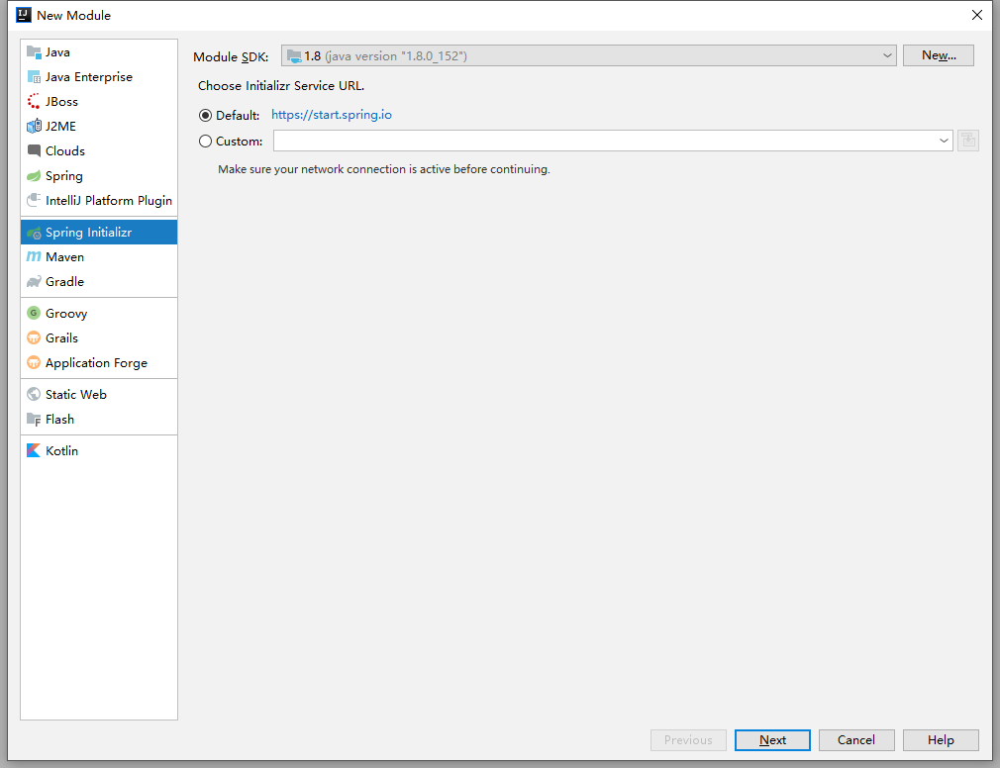
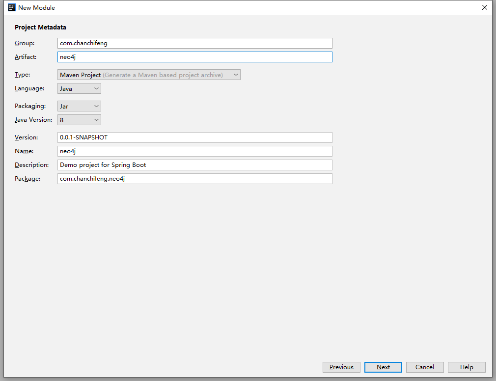
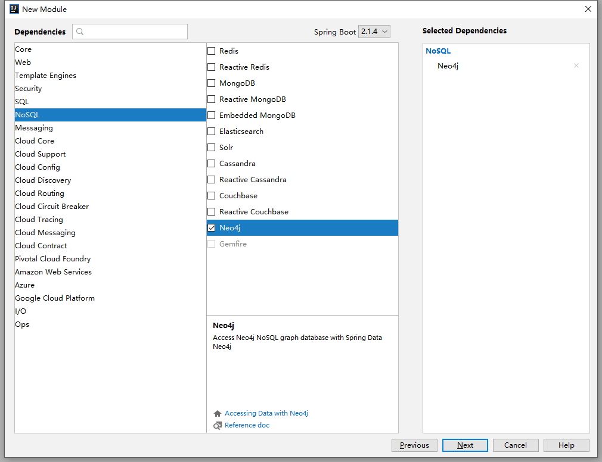
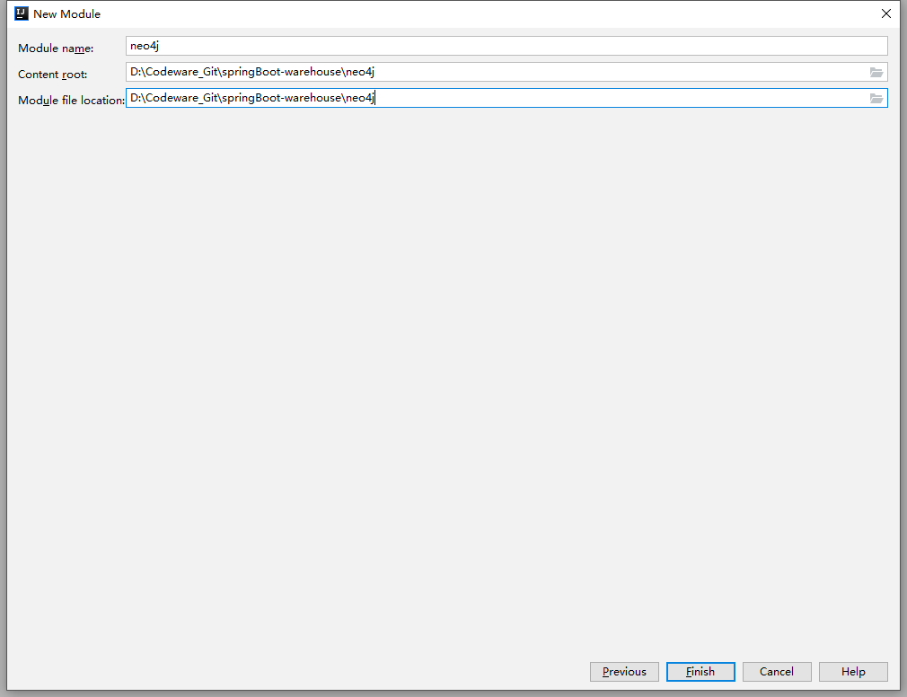
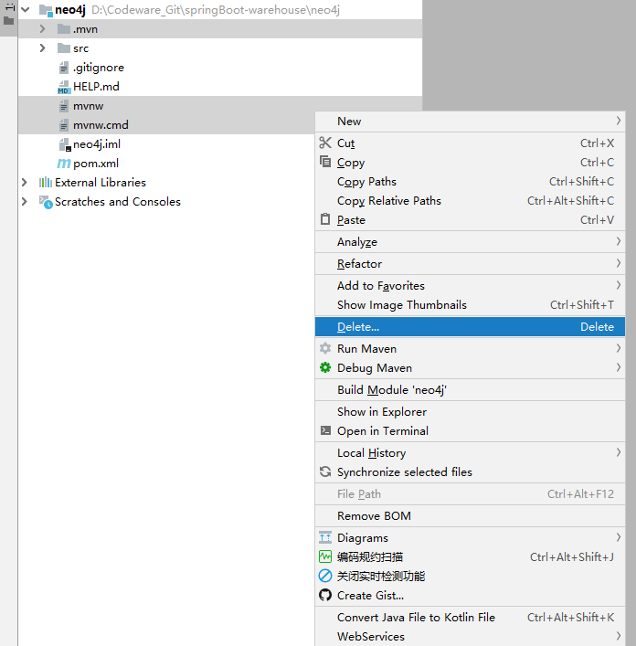
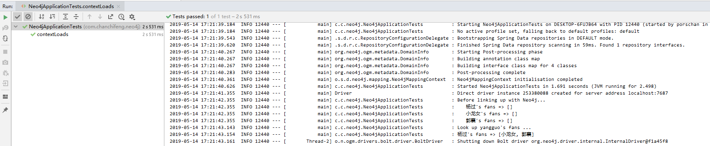
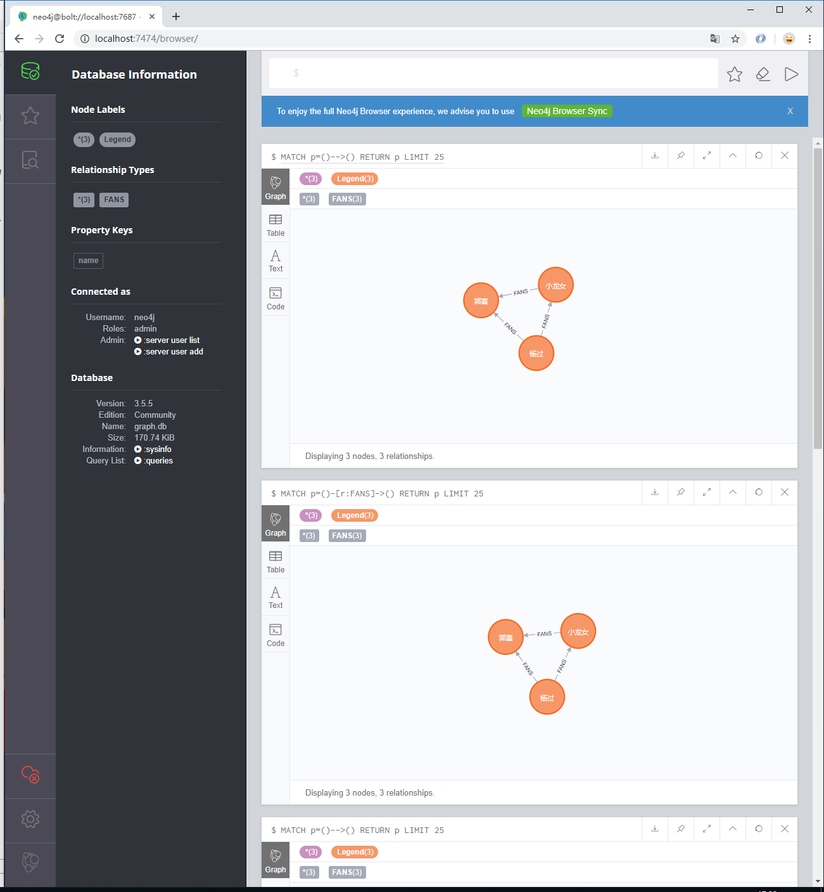

1.在springBootStudio项目中添加Module。

2.选择Spring Initializr，点击next。



3.Group填写com.chanchifeng，Artifact填写neo4j。



4.勾选SQL中的Neo4j，点击next。



5.Content_root和Module file location选择springBoot-warehouse项目路径。



6.pom.xml代码如下：

```
<dependencies>
    <dependency>
        <groupId>org.springframework.boot</groupId>
        <artifactId>spring-boot-starter-data-neo4j</artifactId>
    </dependency>

    <dependency>
        <groupId>org.springframework.boot</groupId>
        <artifactId>spring-boot-starter-test</artifactId>
        <scope>test</scope>
    </dependency>
</dependencies>
```

7.删除mvn自动删除的文件



> 以下例子引用了倒水河码农在csdn上面的例子：[Hello World 之Spring Boot 调用图数据库Neo4j](https://blog.csdn.net/weixin_41897365/article/details/79835319)

7.创建model包，在其下创建Legend：

```java
import org.neo4j.ogm.annotation.GeneratedValue;
import org.neo4j.ogm.annotation.Id;
import org.neo4j.ogm.annotation.NodeEntity;
import org.neo4j.ogm.annotation.Relationship;

import java.util.Collections;
import java.util.HashSet;
import java.util.Optional;
import java.util.Set;
import java.util.stream.Collectors;

@NodeEntity
public class Legend {
    @Id
    @GeneratedValue
    private Long id;

    private String name;

    private Legend() {
        // Empty constructor required as of Neo4j API 2.0.5
    }

    ;

    public Legend(String name) {
        this.name = name;
    }

    /**
     * Neo4j doesn't REALLY have bi-directional relationships. It just means when querying
     * to ignore the direction of the relationship.
     * https://dzone.com/articles/modelling-data-neo4j
     */
    @Relationship(type = "FANS", direction = Relationship.UNDIRECTED)
    public Set<Legend> fans;

    public void fansWith(Legend legend) {
        if (fans == null) {
            fans = new HashSet<>();
        }
        fans.add(legend);
    }

    @Override
    public String toString() {

        //java 8 stream and optional
        return this.name + "'s fans => "
                + Optional.ofNullable(this.fans).orElse(
                Collections.emptySet()).stream()
                .map(Legend::getName)
                .collect(Collectors.toList());
    }

    public String getName() {
        return name;
    }

    public void setName(String name) {
        this.name = name;
    }
}
```

8.创建repositoriesl包，在其下创建LegendRepo：

```java
import com.chanchifeng.neo4j.model.Legend;
import org.springframework.data.repository.CrudRepository;

public interface LegendRepo extends CrudRepository<Legend, Long> {
    Legend findByName(String name);
}
``

9.修改主运行程序，Neo4jApplication：

```java
import org.springframework.boot.SpringApplication;
import org.springframework.boot.autoconfigure.SpringBootApplication;
import org.springframework.data.neo4j.repository.config.EnableNeo4jRepositories;

@SpringBootApplication
@EnableNeo4jRepositories
public class Neo4jApplication {

    public static void main(String[] args) {
        SpringApplication.run(Neo4jApplication.class, args);
    }

}
```

10.修改application.properties：

```
spring.data.neo4j.username=neo4j
spring.data.neo4j.password=1qaz2wsx
```

11.[测试]修改Neo4jApplicationTests：
```java
import com.chanchifeng.neo4j.model.Legend;
import com.chanchifeng.neo4j.repositories.LegendRepo;
import org.junit.Test;
import org.junit.runner.RunWith;
import org.slf4j.Logger;
import org.slf4j.LoggerFactory;
import org.springframework.beans.factory.annotation.Autowired;
import org.springframework.boot.test.context.SpringBootTest;
import org.springframework.test.context.junit4.SpringRunner;

import java.util.Arrays;
import java.util.List;

@RunWith(SpringRunner.class)
@SpringBootTest
public class Neo4jApplicationTests {

    @Autowired
    LegendRepo legendRepo;

    private final static Logger log = LoggerFactory.getLogger(Neo4jApplicationTests.class);

    @Test
    public void contextLoads() {
        legendRepo.deleteAll();

        Legend yangguo = new Legend("杨过");
        Legend dragonGirl = new Legend("小龙女");
        Legend guoxiang = new Legend("郭襄");

        List<Legend> team = Arrays.asList(yangguo, dragonGirl, guoxiang);

        log.info("Before linking up with Neo4j...");
        //java 8 stream
        team.stream().forEach(legend -> log.info("\t" + legend.toString()));

        legendRepo.save(yangguo);
        legendRepo.save(dragonGirl);
        legendRepo.save(guoxiang);

        yangguo = legendRepo.findByName(yangguo.getName());
        yangguo.fansWith(dragonGirl);
        yangguo.fansWith(guoxiang);
        legendRepo.save(yangguo);

        dragonGirl = legendRepo.findByName(dragonGirl.getName());
        dragonGirl.fansWith(guoxiang);
        // We already know that dragonGirl is a fan of yangguo
        legendRepo.save(dragonGirl);

        // We already know guoxiang fans with yangguo and dragongirl
        log.info("Look up yangguo's fans ...");
        log.info(legendRepo.findByName("杨过").toString());
    }


}
```

12.查看测试效果，如下图：



13.登录neo4j查看，如下图：

