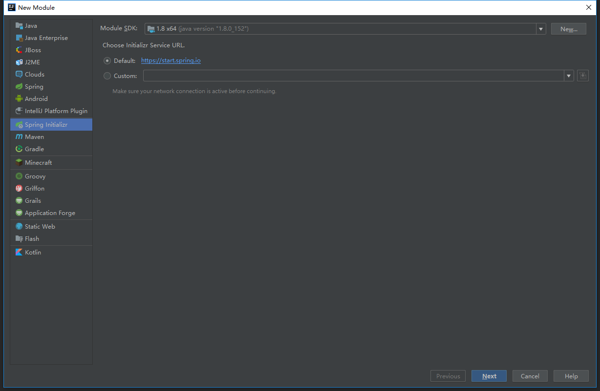
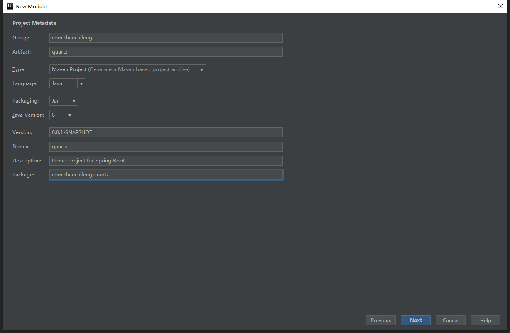
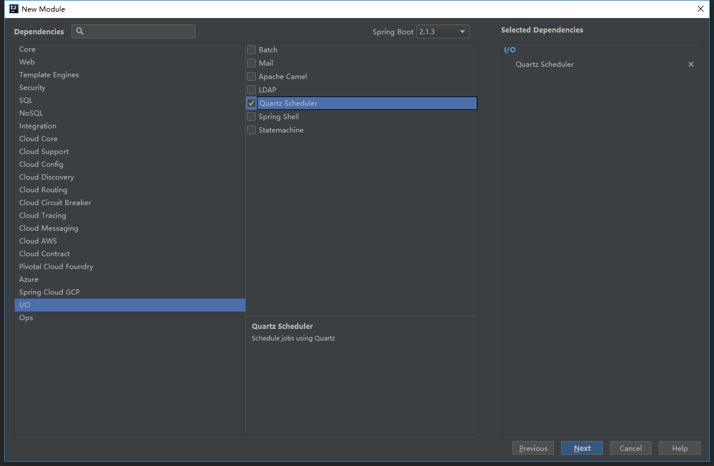
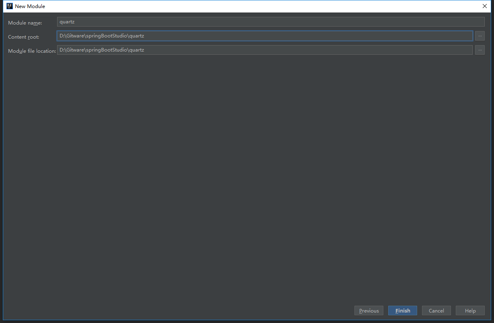

<div class="tip">
	来历：
				
	自身的特点：
		
	适合解决的问题：
		
	实际的应用场景：
		
</div>

1.在springBootStudio项目中添加Module。

2.选择Spring Initializr，点击next。



3.Group填写com.chanchifeng，Artifact填写quartz。



4.选择Quartz Scheduler，点击next。



5.Content_root和Module file location选择springBootStudio项目路径。



6.在项目中创建一个quartz包，在其下创建HelloTask的类，代码如下：

```

	@Component
	@Configurable
	@EnableScheduling
	public class HelloTask {
	
	    //每5秒执行一次
	    @Scheduled(cron = "*/5 * *  * * * ")
	    public void sayHelloTask(){
	        System.out.println("hello quartz");
	    }
	
	}

```

7.运行项目，可以查看控制台打印如下，则定时器运行成功，如下图：

