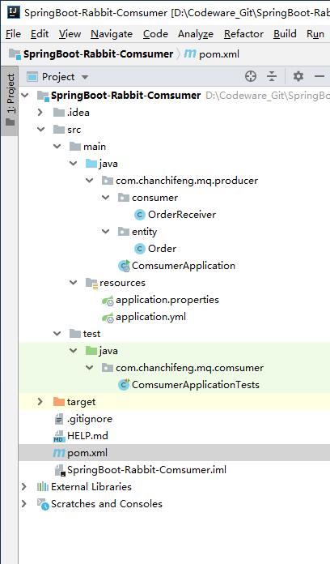
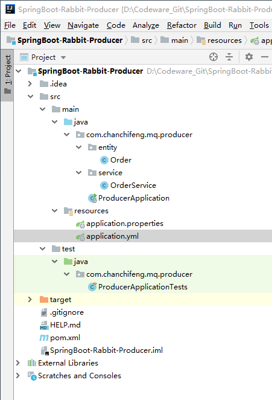
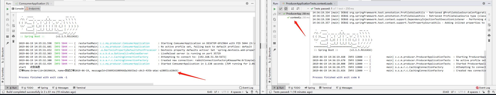

> RabbitMQ的安装请参考[RabbitMQ - CentOS系统安装](/2019/06/19/centos-RabbitMQ-install/ "RabbitMQ - CentOS系统安装")

#### 创建2个项目

1.Comsumer项目的目录结构如下所示：



1.1.OrderReceiver：

```java
import com.chanchifeng.mq.producer.entity.Order;
import com.rabbitmq.client.Channel;
import org.springframework.amqp.rabbit.annotation.*;
import org.springframework.amqp.support.AmqpHeaders;
import org.springframework.messaging.handler.annotation.Headers;
import org.springframework.messaging.handler.annotation.Payload;
import org.springframework.stereotype.Component;

import java.io.IOException;
import java.util.Map;

@Component
public class OrderReceiver {

    @RabbitListener(bindings = @QueueBinding(
            value = @Queue(value = "order-queue",durable = "true"),
            exchange = @Exchange(name="order-exchange",durable = "true",type = "topic"),
            key = "order.*"
        )
    )
    @RabbitHandler
    public void onOrderMessage(@Payload Order order
            ,@Headers Map<String,Object> headers
            ,Channel channer) throws IOException {
        //消费者操作

        System.out.println("start   收到消息");

//        System.out.println("订单ID:" + order.getId());
        System.out.println("订单Name:" + order);

        //手动签收

        Long deliveryTag = (Long)headers.get(AmqpHeaders.DELIVERY_TAG);
        //ACK
        channer.basicAck(deliveryTag,false);

    }

}
```

1.2.Order:

```java
import lombok.Data;

import java.io.Serializable;

@Data
public class Order implements Serializable {

    private int id;
    private String name;
    private String messageId;

}
```

1.3.ComsumerApplication:

```java
import org.springframework.boot.SpringApplication;
import org.springframework.boot.autoconfigure.SpringBootApplication;

@SpringBootApplication
public class ComsumerApplication {

    public static void main(String[] args) {
        SpringApplication.run(ComsumerApplication.class, args);
    }

}
```

1.4.application.properties:

```properties

```

1.5.application.yml:

```yml
## springboot整合rabbitmq的基本配置
spring:
  rabbitmq:
    addresses: 192.168.51.50:5672
    username: guest
    password: guest
    virtual-host: /
    ## 消费端配置
    listener:
      simple:
        concurrency: 5
        ## manual:手动 ack（确认）
        acknowledge-mode: manual
        max-concurrency: 10
        prefetch: 1
server:
  port: 8002
  servlet:
    context-path: /
```

1.6.pom.xml:

```xml
<?xml version="1.0" encoding="UTF-8"?>
<project xmlns="http://maven.apache.org/POM/4.0.0" xmlns:xsi="http://www.w3.org/2001/XMLSchema-instance"
         xsi:schemaLocation="http://maven.apache.org/POM/4.0.0 http://maven.apache.org/xsd/maven-4.0.0.xsd">
    <modelVersion>4.0.0</modelVersion>
    <parent>
        <groupId>org.springframework.boot</groupId>
        <artifactId>spring-boot-starter-parent</artifactId>
        <version>2.1.5.RELEASE</version>
        <relativePath/> <!-- lookup parent from repository -->
    </parent>
    <groupId>com.chanchifeng.mq</groupId>
    <artifactId>comsumer</artifactId>
    <version>0.0.1-SNAPSHOT</version>
    <name>comsumer</name>
    <description>Demo project for Spring Boot</description>

    <properties>
        <java.version>1.8</java.version>
    </properties>

    <dependencies>
        <dependency>
            <groupId>org.springframework.boot</groupId>
            <artifactId>spring-boot-starter-amqp</artifactId>
        </dependency>

        <dependency>
            <groupId>org.springframework.boot</groupId>
            <artifactId>spring-boot-devtools</artifactId>
            <scope>runtime</scope>
        </dependency>
        <dependency>
            <groupId>org.projectlombok</groupId>
            <artifactId>lombok</artifactId>
            <optional>true</optional>
        </dependency>
        <dependency>
            <groupId>org.springframework.boot</groupId>
            <artifactId>spring-boot-starter-test</artifactId>
            <scope>test</scope>
        </dependency>

        <!--工具类依赖包-->
        <dependency>
            <groupId>org.apache-commons</groupId>
            <artifactId>commons-lang3</artifactId>
        </dependency>
        <dependency>
            <groupId>commons-io</groupId>
            <artifactId>commons-io</artifactId>
            <version>2.4</version>
        </dependency>
        <dependency>
            <groupId>com.alibaba</groupId>
            <artifactId>fastjson</artifactId>
            <version>1.2.49</version>
        </dependency>
        <dependency>
            <groupId>javax.servlet</groupId>
            <artifactId>javax.servlet-api</artifactId>
            <scope>provided</scope>
        </dependency>
        <dependency>
            <groupId>log4j</groupId>
            <artifactId>log4j</artifactId>
            <version>1.2.17</version>
        </dependency>
    </dependencies>

    <build>
        <plugins>
            <plugin>
                <groupId>org.springframework.boot</groupId>
                <artifactId>spring-boot-maven-plugin</artifactId>
            </plugin>
        </plugins>
    </build>

</project>
```

2.Producer项目的目录结构如下所示：



2.1.Order:

```java
import lombok.Data;

import java.io.Serializable;

@Data
public class Order implements Serializable {

    private int id;
    private String name;
    private String messageId;

}
```

2.2.OrderService:

```java
import com.chanchifeng.mq.producer.entity.Order;
import org.springframework.amqp.rabbit.connection.CorrelationData;
import org.springframework.amqp.rabbit.core.RabbitTemplate;
import org.springframework.beans.factory.annotation.Autowired;
import org.springframework.stereotype.Service;

@Service
public class OrderService {

    @Autowired
    private RabbitTemplate rabbitTemplate;

    //发送消息方法调用: 构建自定义对象消息
    public void sendOrder(Order order) throws Exception {
        // 通过实现 ConfirmCallback 接口，消息发送到 Broker 后触发回调，确认消息是否到达 Broker 服务器，也就是只确认是否正确到达 Exchange 中
//        rabbitTemplate.setConfirmCallback(confirmCallback);
        //消息唯一ID
        CorrelationData correlationData = new CorrelationData();
        correlationData.setId(order.getMessageId());
        rabbitTemplate.convertAndSend("order-exchange", "order.ABC", order, correlationData);
    }

}
```

2.3.ProducerApplication:

```java
import org.springframework.boot.SpringApplication;
import org.springframework.boot.autoconfigure.SpringBootApplication;

@SpringBootApplication
public class ProducerApplication {

    public static void main(String[] args) {
        SpringApplication.run(ProducerApplication.class, args);
    }

}
```

2.4.application.properties:

```properties

```

2.5.application.yml:

```yml
server:
  port: 8001
  servlet:
    context-path: /

spring:
  rabbitmq:
    addresses: 192.168.51.50:5672
    username: guest
    password: guest
    virtual-host: /
    publisher-confirms: true
    publisher-returns: true
    template:
      mandatory: true
```

2.6.ProducerApplicationTests:

```java
import com.chanchifeng.mq.producer.entity.Order;
import com.chanchifeng.mq.producer.service.OrderService;
import org.junit.Test;
import org.junit.runner.RunWith;
import org.springframework.beans.factory.annotation.Autowired;
import org.springframework.boot.test.context.SpringBootTest;
import org.springframework.test.context.junit4.SpringRunner;

import java.util.UUID;

@RunWith(SpringRunner.class)
@SpringBootTest
public class ProducerApplicationTests {

    @Autowired
    private OrderService orderService;

    @Test
    public void contextLoads() {
        Order order = new Order();
        order.setId(20190619);
        order.setName("测试订单2019-06-19");
        order.setMessageId(System.currentTimeMillis()+"$"+ UUID.randomUUID().toString());
        try {
            orderService.sendOrder(order);
        } catch (Exception e) {
            e.printStackTrace();
        }
    }

}
```

2.7.pom.xml:

```xml
<?xml version="1.0" encoding="UTF-8"?>
<project xmlns="http://maven.apache.org/POM/4.0.0" xmlns:xsi="http://www.w3.org/2001/XMLSchema-instance"
         xsi:schemaLocation="http://maven.apache.org/POM/4.0.0 http://maven.apache.org/xsd/maven-4.0.0.xsd">
    <modelVersion>4.0.0</modelVersion>
    <parent>
        <groupId>org.springframework.boot</groupId>
        <artifactId>spring-boot-starter-parent</artifactId>
        <version>2.1.5.RELEASE</version>
        <relativePath/> <!-- lookup parent from repository -->
    </parent>
    <groupId>com.chanchifeng.mq</groupId>
    <artifactId>producer</artifactId>
    <version>0.0.1-SNAPSHOT</version>
    <name>producer</name>
    <description>Demo project for Spring Boot</description>

    <properties>
        <java.version>1.8</java.version>
    </properties>

    <dependencies>
        <!-- RabbitMQ 依赖 -->
        <dependency>
            <groupId>org.springframework.boot</groupId>
            <artifactId>spring-boot-starter-amqp</artifactId>
        </dependency>

        <dependency>
            <groupId>org.springframework.boot</groupId>
            <artifactId>spring-boot-devtools</artifactId>
            <scope>runtime</scope>
        </dependency>
        <dependency>
            <groupId>org.projectlombok</groupId>
            <artifactId>lombok</artifactId>
            <optional>true</optional>
        </dependency>
        <dependency>
            <groupId>org.springframework.boot</groupId>
            <artifactId>spring-boot-starter-test</artifactId>
            <scope>test</scope>
        </dependency>

        <!--工具类依赖包-->
        <dependency>
            <groupId>org.apache-commons</groupId>
            <artifactId>commons-lang3</artifactId>
        </dependency>
        <dependency>
            <groupId>commons-io</groupId>
            <artifactId>commons-io</artifactId>
            <version>2.4</version>
        </dependency>
        <dependency>
            <groupId>com.alibaba</groupId>
            <artifactId>fastjson</artifactId>
            <version>1.2.49</version>
        </dependency>
        <dependency>
            <groupId>javax.servlet</groupId>
            <artifactId>javax.servlet-api</artifactId>
            <scope>provided</scope>
        </dependency>
        <dependency>
            <groupId>log4j</groupId>
            <artifactId>log4j</artifactId>
            <version>1.2.17</version>
        </dependency>
    </dependencies>

    <build>
        <plugins>
            <plugin>
                <groupId>org.springframework.boot</groupId>
                <artifactId>spring-boot-maven-plugin</artifactId>
            </plugin>
        </plugins>
    </build>

</project>
```

3.测试的时候仅需要使用producer的ProducerApplicationTest中的测试例子即可，在此之前需要启动comsumer的项目，项目运行的效果如下图所示：



> 项目在Github中的SpringBoot-Sample/SpringBoot-Rabbit-Producer 和 SpringBoot-Sample/SpringBoot-Rabbit-Comsumer ：[](https://github.com/porschan/SpringBoot-Sample)