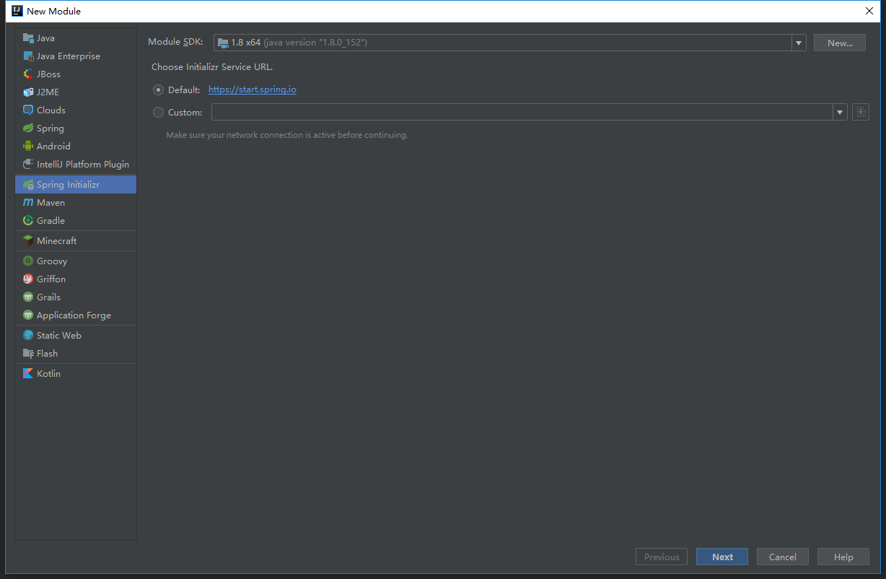
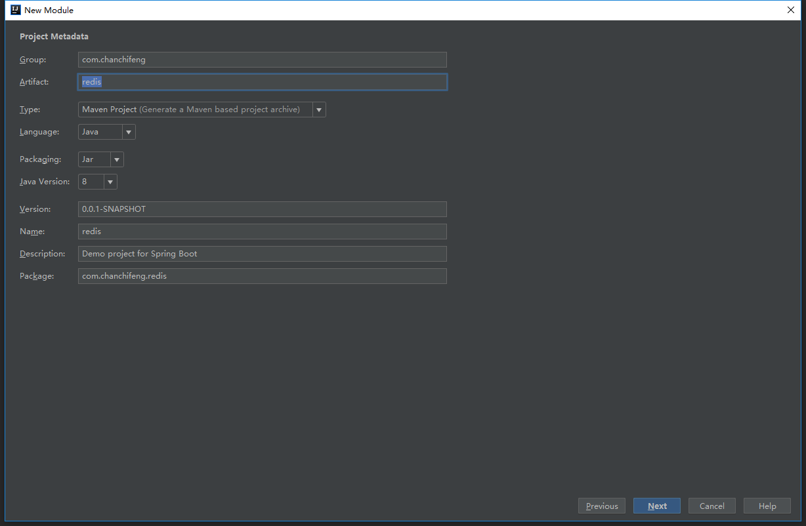
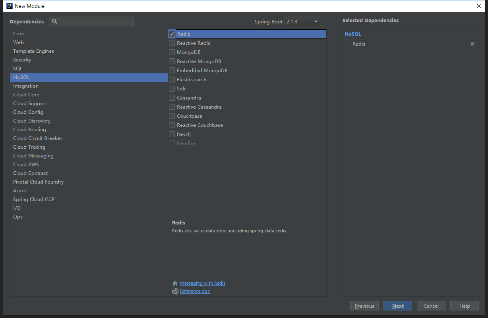
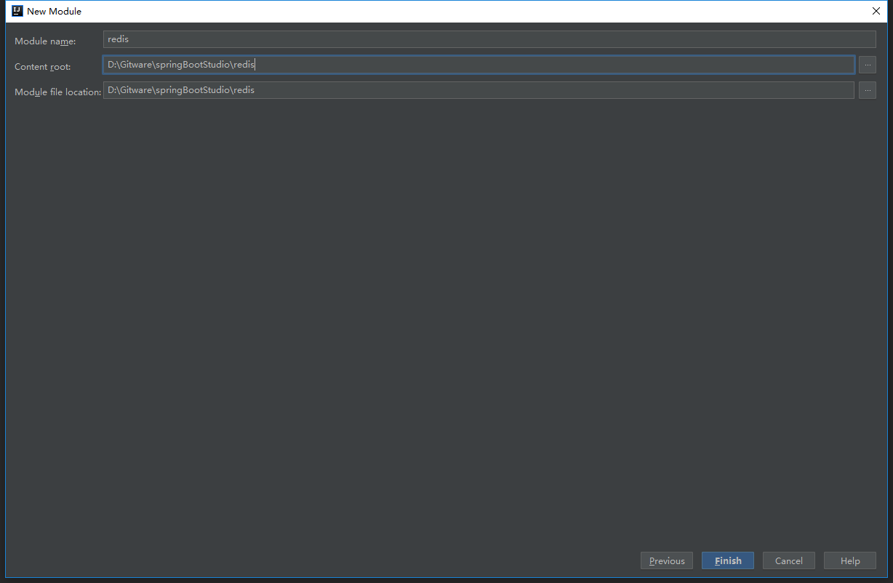

1.关于redis在windows系统如何安装，可以参考过完文章（Redis - windows系统安装）。

2.在springBootStudio项目中添加Module。

3.选择Spring Initializr，点击next。



3.Group填写com.chanchifeng，Artifact填写redis。



4.勾选SQL中的Redis，点击next。



5.Content_root和Module file location选择springBootStudio项目路径。



6.在application.properties中添加连接Redis数据库的信息，信息如下：

```

	### redis缓存配置
	### 默认redis数据库为db0
	spring.redis.database=0
	### 服务器地址，默认为localhost
	spring.redis.host=localhost
	### 链接端口，默认为6379
	spring.redis.port=6379
	### redis密码默认为空
	spring.redis.password=

```

7.为com.chanchifeng.mysql.MysqlApplicationTests测试类，测试Redis，核心代码如下：

```

	@RunWith(SpringRunner.class)
	@SpringBootTest
	public class RedisApplicationTests {
	
	    @Resource
	    private RedisTemplate redisTemplate;
	
	    @Resource
	    private StringRedisTemplate stringRedisTemplate;
	
	    @Test
	    public void stringRedisTemplateTest() {
	        //验证key是否存在；true存在，false不存在
	        Boolean isSucc = stringRedisTemplate.hasKey("name");
	        System.out.println("isSucc: " + isSucc);
	
	        //设置key=1
	        stringRedisTemplate.opsForValue().set("name", "porschan");
	
	        //读取key的值
	        String name = stringRedisTemplate.opsForValue().get("name");
	        System.out.println("name: " + name);
	
	        //设置key的值
	        stringRedisTemplate.opsForValue().set("name","1");
	
	        //将key的值+1 ；  如果要减1 就填入 -1
	        Long number = stringRedisTemplate.boundValueOps("name").increment(1);
	        System.out.println("number: " + number);
	
	        //删除某key
	        Boolean isDelete = stringRedisTemplate.delete("name");
	        System.out.println("isDelete: " + isDelete);
	
	    }
	
	}

```

