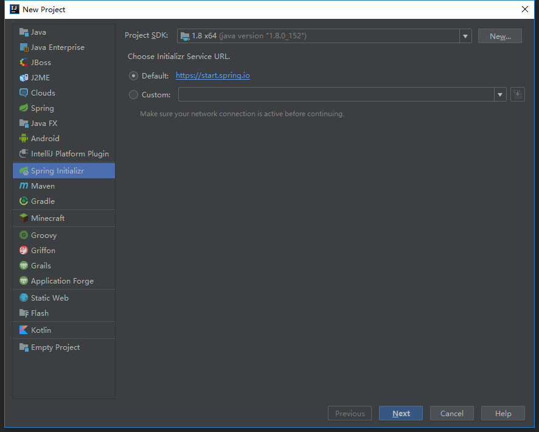
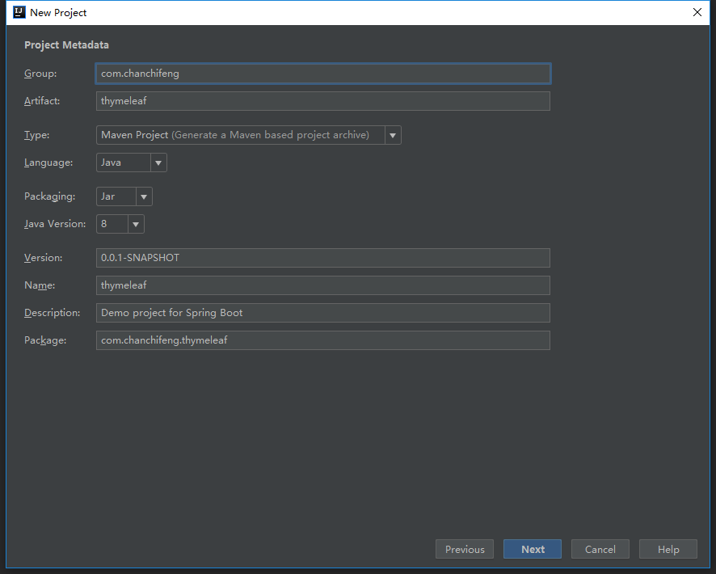
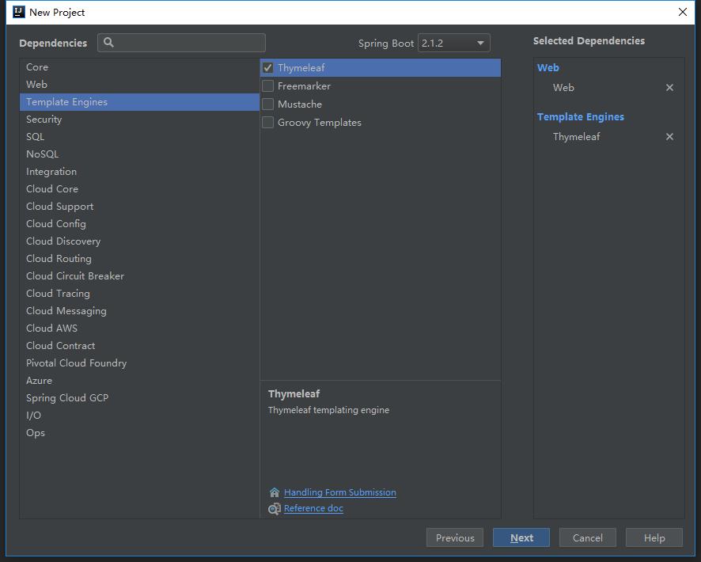
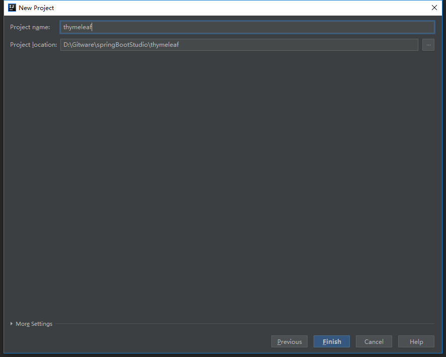
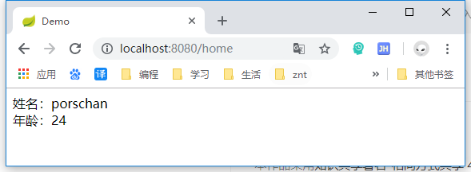

1.在springBootStudio项目中添加Module。



2.选择Spring Initializr，点击next。



3.Group填写com.chanchifeng，Artifact填写thymeleaf。



4.勾选SQL中的Web和Thymeleaf，点击next。



5.Content_root和Module file location选择springBootStudio项目路径。



6.在项目中创建一个controller包，在其下创建PageController的类，代码如下：

```

	@Controller
	public class PageController {
	
	    /**
	     * 跳转到注册 成功页面
	     *
	     * @return
	     */
	    @RequestMapping(value = "home")
	    public String success(Map<String, Object> paramMap) {
	
	        /** 默认Map的内容会放到请求域中，页面可以直接取值*/
	        paramMap.put("name", "porschan");
	        paramMap.put("age", 24);
	
	        /** 会自动跳转到默认的 classpath:/templates/success.html 页面*/
	        return "home";
	    }
	
	}

```

7.在项目中的templates创建一个home的html页面,代码如下：

```

	<!DOCTYPE html>
	<html lang="en" xmlns:th="http://www.thymeleaf.org">
	<head>
	    <meta charset="UTF-8">
	    <title>Demo</title>
	</head>
	<body>
	姓名：<span th:text="${name}"></span><br>
	年龄：<span th:text="${age}"></span>
	</body>
	</html>

```

8.运行ThymeleafApplication.main，在浏览器中访问http://localhost:8080/home，即可实现一个简单的thymeleaf的Demo，更多的使用方法请参考官方文档([https://www.thymeleaf.org/](https://www.thymeleaf.org/ "https://www.thymeleaf.org/"))。


<div class="tip">
	参考蚩尤后裔的《Spring Boot 引入 Thymeleaf 及入门》[https://blog.csdn.net/wangmx1993328/article/details/81053723](https://blog.csdn.net/wangmx1993328/article/details/81053723 "https://blog.csdn.net/wangmx1993328/article/details/81053723")
</div>