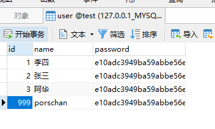

<div class="tip">
	来历：
				
	自身的特点：
		
	适合解决的问题：
		
	实际的应用场景：
		
</div>

### 在原本的项目中使用transactional的事务支持 ###

具体项目搭建参考：SPRINGBOOT - 使用JPA([https://chanchifeng.com/2019/01/31/springboot-jpa/](https://chanchifeng.com/2019/01/31/springboot-jpa/ "https://chanchifeng.com/2019/01/31/springboot-jpa/"))

1.修改com.chanchifeng.jpa.service.impl.UserServiceImpl中的save，核心代码如下：

```

	@Transactional
    @Override
    public User save(User ayUser) {
        User save = userRepository.save(ayUser);

        String error = null;
        error.split(",");

        return save;
    }

```

2.添加测试类，核心代码如下：

```

    @Test
    public void transactionalTest(){
        User ayUser = new User();
        ayUser.setId("999");
        ayUser.setName("porschan");
        ayUser.setPassword("e10adc3949ba59abbe56e057f20f883e");
        userService.save(ayUser);

    }

```

3.在报错的情况下，通过注释@Transactional的时候，会发现数据库插入一条数据。若没注释的时候，则会进行事务回滚，可以观察数据库的数据或者debug中获知。

