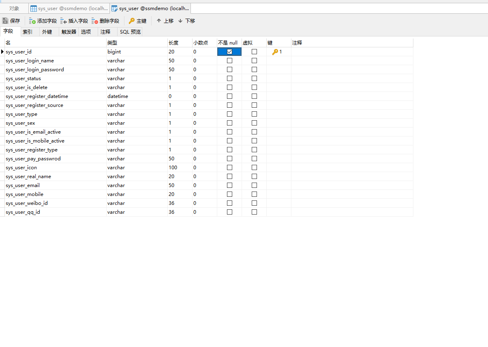
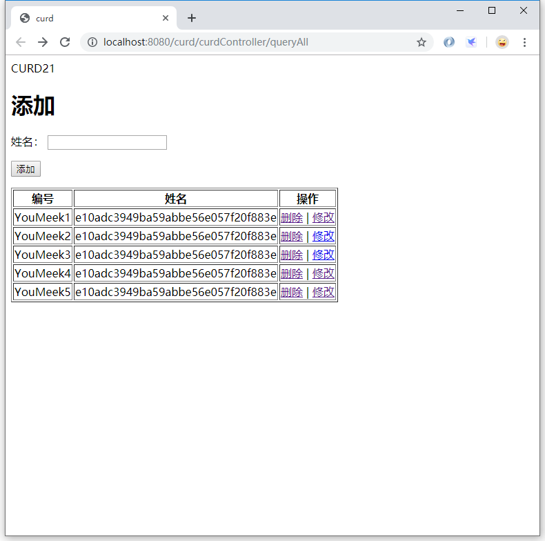

> 项目的搭建以在上节完成：[使用 IDEA 中创建 SPRINGMVC-SPRING-MYBATIS-DEMO 的 WEB 项目](https://chanchifeng.com/2019/05/21/springmvc-spring-mybatis-demo/)

1.搭建的构成这里不详细讲，详情参考上述文章。

2.更新pom.xml:

```xml
<?xml version="1.0" encoding="UTF-8"?>
<project xmlns="http://maven.apache.org/POM/4.0.0"
         xmlns:xsi="http://www.w3.org/2001/XMLSchema-instance"
         xsi:schemaLocation="http://maven.apache.org/POM/4.0.0 http://maven.apache.org/xsd/maven-4.0.0.xsd">
    <modelVersion>4.0.0</modelVersion>

    <groupId>com.chanchifeng</groupId>
    <artifactId>demo</artifactId>
    <version>1.0-SNAPSHOT</version>

    <!-- 集中定义公用的依赖版本号 -->
    <!--版本变量设置 start-->
    <properties>
        <!--架包版本变量 start-->

        <!--2016-02-20注释掉代码，切换到spring3试试-->
        <!--mybatis官网看到,如果要使用spring4的话,要用：mybatis-2-spring这个架包,http://blog.mybatis.org/2015/11/spring-4-got-you-down-with-no-ibatis.html-->
        <spring.version>4.0.2.RELEASE</spring.version>
        <mybatis.version>3.2.6</mybatis.version>
        <mybatis-spring.version>1.2.2</mybatis-spring.version>

        <!--2016-02-20切换到spring3试试-->
        <!--mybatis官网：http://blog.mybatis.org/2016/02/mybatis-331-and-mybatis-spring-124.html,在2016-02-13发布了3.3.1版本-->
        <!--                <spring.version>3.2.16.RELEASE</spring.version>-->
        <!--                <mybatis.version>3.3.1</mybatis.version>-->
        <!--                <mybatis-spring.version>1.2.4</mybatis-spring.version>-->


        <!--下面这两个是springAOP需要用到-->
        <aspectjweaver.version>1.7.2</aspectjweaver.version>
        <persistence-api.version>1.0.2</persistence-api.version>


        <junit.version>4.11</junit.version>
        <mysql-connector.version>5.1.21</mysql-connector.version>
        <druid.version>1.0.4</druid.version>

        <!--<slf4j.version>1.7.7</slf4j.version>-->
        <log4j.version>1.2.17</log4j.version>

        <javaee-api.version>7.0</javaee-api.version>
        <jstl.version>1.2</jstl.version>
        <jsp-api.version>2.0</jsp-api.version>
        <servlet-api.version>2.5</servlet-api.version>

        <commons-fileupload.version>1.3.1</commons-fileupload.version>
        <commons-io.version>2.4</commons-io.version>
        <commons-lang3.version>3.3.2</commons-lang3.version>
        <commons-email.version>1.3.2</commons-email.version>
        <commons-beanutils.version>1.9.2</commons-beanutils.version>

        <httpclient.version>4.3.3</httpclient.version>
        <jackson-databind.version>2.4.2</jackson-databind.version>
        <fastjson.version>1.1.43</fastjson.version>
        <!--架包版本变量 end-->

        <!--插件版本变量 start-->
        <tomcat6-maven-plugin.version>2.1</tomcat6-maven-plugin.version>
        <tomcat7-maven-plugin.version>2.2</tomcat7-maven-plugin.version>
        <jetty-plugin.version>8.1.16.v20140903</jetty-plugin.version>

        <maven-compiler-plugin.version>3.1</maven-compiler-plugin.version>
        <maven-war-plugin.version>2.3</maven-war-plugin.version>
        <maven-resources-plugin.version>2.6</maven-resources-plugin.version>
        <maven-install-plugin.version>2.4</maven-install-plugin.version>
        <maven-clean-plugin.version>2.5</maven-clean-plugin.version>
        <maven-antrun-plugin.version>1.7</maven-antrun-plugin.version>
        <maven-dependency-plugin.version>2.5.1</maven-dependency-plugin.version>
        <maven-source-plugin.version>2.2.1</maven-source-plugin.version>
        <!--插件版本变量 end-->

        <!--其他变量 start-->
        <war-name.version>ssm</war-name.version>
        <jdk.version>1.7</jdk.version>

        <tomcat-port.version>8080</tomcat-port.version>
        <tomcat-uri-encoding.version>UTF-8</tomcat-uri-encoding.version>
        <tomcat-path.version>/</tomcat-path.version>
        <jetty-port.version>8080</jetty-port.version>
        <jetty-path.version>/</jetty-path.version>
        <!--其他变量 end-->

        <!--这个配置是为了解决下面两个警告-->
        <!--Using platform encoding (UTF-8 actually) to copy filtered resources, i.e. build is platform dependent!-->
        <!--File encoding has not been set, using platform encoding UTF-8, i.e. build is platform dependent!-->
        <!--指定Maven用什么编码来读取源码及文档-->
        <project.build.sourceEncoding>UTF-8</project.build.sourceEncoding>

        <!--指定Maven用什么编码来呈现站点的HTML文件-->
        <project.reporting.outputEncoding>UTF-8</project.reporting.outputEncoding>

    </properties>
    <!--版本变量设置 end-->


    <!--架包依赖 start-->
    <dependencies>

        <!-- ############################################################### Spring 相关包 start ############################################################### -->
        <!--spring 源码包下载地址：https://github.com/spring-projects/spring-framework/releases-->
        <!--http://takeme.iteye.com/blog/1977585-->
        <!--http://blog.csdn.net/bluishglc/article/details/6585221-->
        <dependency>
            <groupId>org.springframework</groupId>
            <artifactId>spring-core</artifactId>
            <version>${spring.version}</version>
        </dependency>

        <dependency>
            <groupId>org.springframework</groupId>
            <artifactId>spring-beans</artifactId>
            <version>${spring.version}</version>
        </dependency>

        <dependency>
            <groupId>org.springframework</groupId>
            <artifactId>spring-web</artifactId>
            <version>${spring.version}</version>
        </dependency>

        <!--这个jar 文件包含Spring MVC 框架相关的所有类。包括框架的Servlets，Web MVC框架，控制器和视图支持。当然，如果你的应用使用了独立的MVC 框架，则无需这个JAR 文件里的任何类。 外部依赖spring-web-->
        <dependency>
            <groupId>org.springframework</groupId>
            <artifactId>spring-webmvc</artifactId>
            <version>${spring.version}</version>
        </dependency>

        <dependency>
            <groupId>org.springframework</groupId>
            <artifactId>spring-oxm</artifactId>
            <version>${spring.version}</version>
        </dependency>

        <dependency>
            <groupId>org.springframework</groupId>
            <artifactId>spring-tx</artifactId>
            <version>${spring.version}</version>
        </dependency>

        <dependency>
            <groupId>org.springframework</groupId>
            <artifactId>spring-orm</artifactId>
            <version>${spring.version}</version>
        </dependency>

        <dependency>
            <groupId>org.springframework</groupId>
            <artifactId>spring-jdbc</artifactId>
            <version>${spring.version}</version>
        </dependency>

        <dependency>
            <groupId>org.springframework</groupId>
            <artifactId>spring-context</artifactId>
            <version>${spring.version}</version>
        </dependency>

        <!--这个jar 文件包含支持UI模版（Velocity，FreeMarker，JasperReports），邮件服务，脚本服务(JRuby)，缓存Cache（EHCache），任务计划Scheduling（uartz）方面的类。 外部依赖spring-context-->
        <dependency>
            <groupId>org.springframework</groupId>
            <artifactId>spring-context-support</artifactId>
            <version>${spring.version}</version>
        </dependency>

        <dependency>
            <groupId>org.springframework</groupId>
            <artifactId>spring-test</artifactId>
            <version>${spring.version}</version>
        </dependency>

        <dependency>
            <groupId>org.springframework</groupId>
            <artifactId>spring-aspects</artifactId>
            <version>${spring.version}</version>
        </dependency>

        <dependency>
            <groupId>org.springframework</groupId>
            <artifactId>spring-aop</artifactId>
            <version>${spring.version}</version>
        </dependency>

        <!--下面两个提供对 AspectJ 的支持，是 spring-aspects 所需要依赖的-->
        <dependency>
            <groupId>org.aspectj</groupId>
            <artifactId>aspectjweaver</artifactId>
            <version>${aspectjweaver.version}</version>
        </dependency>

        <dependency>
            <groupId>javax.persistence</groupId>
            <artifactId>persistence-api</artifactId>
            <version>${persistence-api.version}</version>
        </dependency>

        <!-- ############################################################### Spring 相关包 end ############################################################### -->


        <!-- mybatis核心包 -->
        <dependency>
            <groupId>org.mybatis</groupId>
            <artifactId>mybatis</artifactId>
            <version>${mybatis.version}</version>
        </dependency>
        <!-- mybatis/spring包 -->
        <!--官网英文材料：http://www.mybatis.org/spring/-->
        <!--官网中文资料：http://www.mybatis.org/spring/zh/index.html-->
        <dependency>
            <groupId>org.mybatis</groupId>
            <artifactId>mybatis-spring</artifactId>
            <version>${mybatis-spring.version}</version>
        </dependency>


        <!-- 导入Mysql数据库链接jar包 -->
        <dependency>
            <groupId>mysql</groupId>
            <artifactId>mysql-connector-java</artifactId>
            <version>${mysql-connector.version}</version>
            <scope>runtime</scope>
        </dependency>

        <dependency>
            <!--这个组件具体可以看这里介绍:http://www.oschina.net/p/druid-->
            <groupId>com.alibaba</groupId>
            <artifactId>druid</artifactId>
            <version>${druid.version}</version>
        </dependency>

        <!-- JSTL标签类 -->
        <dependency>
            <groupId>jstl</groupId>
            <artifactId>jstl</artifactId>
            <version>${jstl.version}</version>
        </dependency>

        <dependency>
            <groupId>javax.servlet</groupId>
            <artifactId>servlet-api</artifactId>
            <version>${servlet-api.version}</version>
            <scope>provided</scope>
        </dependency>

        <dependency>
            <groupId>javax.servlet</groupId>
            <artifactId>jsp-api</artifactId>
            <version>${jsp-api.version}</version>
            <scope>provided</scope>
        </dependency>

        <!-- java ee jar 包 -->
        <dependency>
            <groupId>javax</groupId>
            <artifactId>javaee-api</artifactId>
            <version>${javaee-api.version}</version>
            <scope>provided</scope>
        </dependency>

        <!--单元测试-->
        <dependency>
            <groupId>junit</groupId>
            <artifactId>junit</artifactId>
            <version>${junit.version}</version>
            <scope>test</scope>
        </dependency>

        <!-- 日志文件管理包 start -->
        <!--下面这三个是配套使用：http://blog.csdn.net/woshiwxw765/article/details/7624556-->
        <!--使用log4j start-->
        <!--<dependency>-->
        <!--<groupId>log4j</groupId>-->
        <!--<artifactId>log4j</artifactId>-->
        <!--<version>${log4j.version}</version>-->
        <!--</dependency>-->

        <!--<dependency>-->
        <!--<groupId>org.slf4j</groupId>-->
        <!--<artifactId>slf4j-api</artifactId>-->
        <!--<version>${slf4j.version}</version>-->
        <!--</dependency>-->

        <!--<dependency>-->
        <!--<groupId>org.slf4j</groupId>-->
        <!--<artifactId>slf4j-log4j12</artifactId>-->
        <!--<version>${slf4j.version}</version>-->
        <!--</dependency>-->
        <!--使用log4j end-->

        <!--使用logback start-->
        <!--导入这个的时候会自动导入：slf4j-api、logback-core，所以我们还需要导入：log4j和logback-ext-spring-->
        <dependency>
            <groupId>ch.qos.logback</groupId>
            <artifactId>logback-classic</artifactId>
            <version>1.1.7</version>
        </dependency>
        <dependency>
            <groupId>log4j</groupId>
            <artifactId>log4j</artifactId>
            <version>1.2.17</version>
        </dependency>
        <dependency>
            <groupId>org.logback-extensions</groupId>
            <artifactId>logback-ext-spring</artifactId>
            <version>0.1.4</version>
        </dependency>
        <!--使用logback end-->
        <!-- 日志文件管理包 end -->


        <!--JSON处理-->
        <dependency>
            <groupId>com.fasterxml.jackson.core</groupId>
            <artifactId>jackson-databind</artifactId>
            <version>${jackson-databind.version}</version>
        </dependency>

        <!-- 上传组件包 -->
        <dependency>
            <groupId>commons-fileupload</groupId>
            <artifactId>commons-fileupload</artifactId>
            <version>${commons-fileupload.version}</version>
        </dependency>

        <dependency>
            <groupId>commons-io</groupId>
            <artifactId>commons-io</artifactId>
            <version>${commons-io.version}</version>
        </dependency>


        <!--apache工具包-->
        <dependency>
            <groupId>org.apache.commons</groupId>
            <artifactId>commons-lang3</artifactId>
            <version>${commons-lang3.version}</version>
        </dependency>


    </dependencies>
    <!--架包依赖 end-->


    <!--设置项目编译级别等设置 start-->
    <build>
        <finalName>${project.artifactId}</finalName>
        <resources>
            <!--表示把java目录下的有关xml文件,properties文件编译/打包的时候放在resource目录下-->
            <resource>
                <directory>${basedir}/src/main/java</directory>
                <includes>
                    <include>**/*.properties</include>
                    <include>**/*.xml</include>
                </includes>
            </resource>
            <resource>
                <directory>${basedir}/src/main/resources</directory>
            </resource>
        </resources>
        <plugins>
            <!-- Compiler 插件, 设定JDK版本 -->
            <plugin>
                <groupId>org.apache.maven.plugins</groupId>
                <artifactId>maven-compiler-plugin</artifactId>
                <version>${maven-compiler-plugin.version}</version>
                <configuration>
                    <source>${jdk.version}</source>
                    <target>${jdk.version}</target>
                    <encoding>UTF-8</encoding>
                    <showWarnings>true</showWarnings>
                </configuration>
            </plugin>

            <!-- war 打包插件, 设定war包名称不带版本号 -->
            <plugin>
                <groupId>org.apache.maven.plugins</groupId>
                <artifactId>maven-war-plugin</artifactId>
                <version>${maven-war-plugin.version}</version>
                <configuration>
                    <warName>${war-name.version}</warName>
                </configuration>
            </plugin>

            <!-- tomcat6插件 -->
            <!--https://tomcat.apache.org/maven-plugin-2.0/tomcat6-maven-plugin/run-mojo.html-->
            <plugin>
                <groupId>org.apache.tomcat.maven</groupId>
                <artifactId>tomcat6-maven-plugin</artifactId>
                <version>${tomcat6-maven-plugin.version}</version>
                <configuration>
                    <!--项目访问路径 这里直接使用根目录就可以了,访问地址http://localhost:8080/ -->
                    <!-- 如果这里配置了,比如test，那访问地址就需要变成：http://localhost:8080/test-->
                    <path>${tomcat-path.version}</path>
                    <port>${tomcat-port.version}</port>
                    <!--tomcat的url编码  达到和修改server.xml文件一样的功能-->
                    <uriEncoding>${tomcat-uri-encoding.version}</uriEncoding>
                    <!--配置远程tomcat管理的连接路径地址(固定的一个链接)-->
                    <url>http://localhost:8080/manager/html</url>
                    <server>tomcat6</server>
                </configuration>
            </plugin>

            <!--tomcat7插件-->
            <!--https://tomcat.apache.org/maven-plugin-2.0/tomcat7-maven-plugin/run-mojo.html-->
            <plugin>
                <groupId>org.apache.tomcat.maven</groupId>
                <artifactId>tomcat7-maven-plugin</artifactId>
                <version>${tomcat7-maven-plugin.version}</version>
                <configuration>
                    <path>${tomcat-path.version}</path>
                    <port>${tomcat-port.version}</port>
                    <uriEncoding>${tomcat-uri-encoding.version}</uriEncoding>
                    <url>http://localhost:8080/manager/text</url>
                    <server>tomcat7</server>
                    <username>admin</username>
                    <password>admin</password>
                </configuration>
            </plugin>

            <!--jetty插件-->
            <!--http://www.eclipse.org/jetty/documentation/9.0.0.M3/jetty-maven-plugin.html-->
            <plugin>
                <groupId>org.mortbay.jetty</groupId>
                <artifactId>jetty-maven-plugin</artifactId>
                <version>${jetty-plugin.version}</version>
                <configuration>
                    <stopKey>foo</stopKey>
                    <stopPort>9999</stopPort>
                    <connectors>
                        <connector implementation="org.eclipse.jetty.server.nio.SelectChannelConnector">
                            <port>${jetty-port.version}</port>
                        </connector>
                    </connectors>
                    <webApp>
                        <!--访问地址：http://localhost:8080/index.jsp-->
                        <!--如果不带index.jsp会直接报404，这个一直没找到原因-->
                        <contextPath>${jetty-path.version}</contextPath>
                    </webApp>
                    <!--scanIntervalSeconds 可选[秒]。在很短的时间间隔内在扫描web应用检查是否有改变，如果发觉有任何改变则自动热部署。默认为0，表示禁用热部署检查。任何一个大于0的数字都将表示启用。-->
                    <scanIntervalSeconds>10</scanIntervalSeconds>
                </configuration>
            </plugin>


            <!-- resource插件 -->
            <plugin>
                <groupId>org.apache.maven.plugins</groupId>
                <artifactId>maven-resources-plugin</artifactId>
                <version>${maven-resources-plugin.version}</version>
            </plugin>

            <!-- source插件 -->
            <plugin>
                <groupId>org.apache.maven.plugins</groupId>
                <artifactId>maven-source-plugin</artifactId>
                <version>${maven-source-plugin.version}</version>
            </plugin>

            <!-- install插件 -->
            <plugin>
                <groupId>org.apache.maven.plugins</groupId>
                <artifactId>maven-install-plugin</artifactId>
                <version>${maven-install-plugin.version}</version>
            </plugin>

            <!-- clean插件 -->
            <plugin>
                <groupId>org.apache.maven.plugins</groupId>
                <artifactId>maven-clean-plugin</artifactId>
                <version>${maven-clean-plugin.version}</version>
            </plugin>

            <!-- ant插件 -->
            <plugin>
                <groupId>org.apache.maven.plugins</groupId>
                <artifactId>maven-antrun-plugin</artifactId>
                <version>${maven-antrun-plugin.version}</version>
            </plugin>

            <!-- dependency插件 -->
            <plugin>
                <groupId>org.apache.maven.plugins</groupId>
                <artifactId>maven-dependency-plugin</artifactId>
                <version>${maven-dependency-plugin.version}</version>
            </plugin>

        </plugins>
    </build>
    <!--设置项目编译级别等设置 end-->


    <!-- pom参考https://www.cnblogs.com/moy25/p/8523887.html -->

</project>
```

3.在controller中创建CurdController:

```java
import com.chanchifeng.module.user.pojo.SysUser;
import com.chanchifeng.module.user.service.SysUserService;
import org.slf4j.Logger;
import org.slf4j.LoggerFactory;
import org.springframework.stereotype.Controller;
import org.springframework.ui.Model;
import org.springframework.web.bind.annotation.PathVariable;
import org.springframework.web.bind.annotation.RequestMapping;

import javax.annotation.Resource;

@Controller
@RequestMapping("/curdController")
public class CurdController {

    private static final Logger logger = LoggerFactory.getLogger(CurdController.class);

    @Resource
    private SysUserService sysUserService;

    @RequestMapping("/queryAll")
    public String showUser(Model model){

        logger.info("queryAll!!");

        model.addAttribute("users",sysUserService.queryAll());

        return "curd/index";
    }

    @RequestMapping("/delete/{userId}")
    public String delete(Model model,@PathVariable("userId") Long userId){

        //删除

        int i = sysUserService.deleteByPrimaryKey(userId);

        logger.info("iiii:" + i);
        return "redirect:/curdController/queryAll";
    }

    @RequestMapping("/queryById/{userId}")
    public String queryById(Model model,@PathVariable("userId") Long userId){

        logger.info("queryById!!");

        model.addAttribute("user",sysUserService.selectByPrimaryKey(userId));

        return "curd/update";
    }

    @RequestMapping(value = "/update")
    public String update(SysUser sysUser) {
//        employeeDao.save(employee);

        System.out.println(sysUser.getSysUserId() + "!!");

        sysUserService.updateByPrimaryKeySelective(sysUser);

        return "redirect:/curdController/queryAll";
    }

    @RequestMapping(value = "/add")
    public String add(SysUser sysUser) {
//        employeeDao.save(employee);

        System.out.println(sysUser.getSysUserId() + "!!");

        sysUserService.insertSelective(sysUser);

        return "redirect:/curdController/queryAll";
    }

}
```

4.SysUserMapper:

```java
package com.chanchifeng.module.user.mapper;

import com.chanchifeng.module.user.pojo.SysUser;

import java.util.List;

public interface SysUserMapper {
    /**
     * This method was generated by MyBatis Generator.
     * This method corresponds to the database table sys_user
     *
     * @mbg.generated
     */
    int deleteByPrimaryKey(Long sysUserId);

    /**
     * This method was generated by MyBatis Generator.
     * This method corresponds to the database table sys_user
     *
     * @mbg.generated
     */
    int insert(SysUser record);

    /**
     * This method was generated by MyBatis Generator.
     * This method corresponds to the database table sys_user
     *
     * @mbg.generated
     */
    int insertSelective(SysUser record);

    /**
     * This method was generated by MyBatis Generator.
     * This method corresponds to the database table sys_user
     *
     * @mbg.generated
     */
    SysUser selectByPrimaryKey(Long sysUserId);

    /**
     * This method was generated by MyBatis Generator.
     * This method corresponds to the database table sys_user
     *
     * @mbg.generated
     */
    int updateByPrimaryKeySelective(SysUser record);

    /**
     * This method was generated by MyBatis Generator.
     * This method corresponds to the database table sys_user
     *
     * @mbg.generated
     */
    int updateByPrimaryKey(SysUser record);

    List<SysUser> queryAll();
}
```

5.SysUserServiceImpl:

```java
import com.chanchifeng.module.user.mapper.SysUserMapper;
import com.chanchifeng.module.user.pojo.SysUser;
import com.chanchifeng.module.user.service.SysUserService;
import org.springframework.stereotype.Service;

import javax.annotation.Resource;
import java.util.List;

@Service
public class SysUserServiceImpl implements SysUserService {

    @Resource
    private SysUserMapper sysUserMapper;

    @Override
    public SysUser getById(Long id) {
        return sysUserMapper.selectByPrimaryKey(id);
    }

    /* START CURD */
    @Override
    public List<SysUser> queryAll() {
        return sysUserMapper.queryAll();
    }

    @Override
    public SysUser selectByPrimaryKey(Long sysUserId) {
        return sysUserMapper.selectByPrimaryKey(sysUserId);
    }

    @Override
    public int deleteByPrimaryKey(Long sysUserId) {
        return sysUserMapper.deleteByPrimaryKey(sysUserId);
    }

    @Override
    public int updateByPrimaryKeySelective(SysUser sysUser) {
        return sysUserMapper.updateByPrimaryKeySelective(sysUser);
    }

    @Override
    public int insertSelective(SysUser sysUser) {
        return sysUserMapper.insertSelective(sysUser);
    }
    /* END CURD */
}
```

6.SysUserService:

```java
import com.chanchifeng.module.user.pojo.SysUser;

import java.util.List;

public interface SysUserService {
    SysUser getById(Long id);

    /* START CURD */
    List<SysUser> queryAll();
    SysUser selectByPrimaryKey(Long sysUserId);
    int deleteByPrimaryKey(Long sysUserId);
    int updateByPrimaryKeySelective(SysUser sysUser);
    int insertSelective(SysUser record);
    /* END CURD */
}
```

7.SysUserMapper.xml:

```xml
<?xml version="1.0" encoding="UTF-8"?>
<!DOCTYPE mapper PUBLIC "-//mybatis.org//DTD Mapper 3.0//EN" "http://mybatis.org/dtd/mybatis-3-mapper.dtd">
<mapper namespace="com.chanchifeng.module.user.mapper.SysUserMapper">
  <resultMap id="BaseResultMap" type="com.chanchifeng.module.user.pojo.SysUser">
    <!--
      WARNING - @mbg.generated
      This element is automatically generated by MyBatis Generator, do not modify.
    -->
    <id column="sys_user_id" jdbcType="BIGINT" property="sysUserId" />
    <result column="sys_user_login_name" jdbcType="VARCHAR" property="sysUserLoginName" />
    <result column="sys_user_login_password" jdbcType="VARCHAR" property="sysUserLoginPassword" />
    <result column="sys_user_status" jdbcType="VARCHAR" property="sysUserStatus" />
    <result column="sys_user_is_delete" jdbcType="VARCHAR" property="sysUserIsDelete" />
    <result column="sys_user_register_datetime" jdbcType="TIMESTAMP" property="sysUserRegisterDatetime" />
    <result column="sys_user_register_source" jdbcType="VARCHAR" property="sysUserRegisterSource" />
    <result column="sys_user_type" jdbcType="VARCHAR" property="sysUserType" />
    <result column="sys_user_sex" jdbcType="VARCHAR" property="sysUserSex" />
    <result column="sys_user_is_email_active" jdbcType="VARCHAR" property="sysUserIsEmailActive" />
    <result column="sys_user_is_mobile_active" jdbcType="VARCHAR" property="sysUserIsMobileActive" />
    <result column="sys_user_register_type" jdbcType="VARCHAR" property="sysUserRegisterType" />
    <result column="sys_user_pay_passwrod" jdbcType="VARCHAR" property="sysUserPayPasswrod" />
    <result column="sys_user_icon" jdbcType="VARCHAR" property="sysUserIcon" />
    <result column="sys_user_real_name" jdbcType="VARCHAR" property="sysUserRealName" />
    <result column="sys_user_email" jdbcType="VARCHAR" property="sysUserEmail" />
    <result column="sys_user_mobile" jdbcType="VARCHAR" property="sysUserMobile" />
    <result column="sys_user_weibo_id" jdbcType="VARCHAR" property="sysUserWeiboId" />
    <result column="sys_user_qq_id" jdbcType="VARCHAR" property="sysUserQqId" />
  </resultMap>
  <sql id="Base_Column_List">
    <!--
      WARNING - @mbg.generated
      This element is automatically generated by MyBatis Generator, do not modify.
    -->
    sys_user_id, sys_user_login_name, sys_user_login_password, sys_user_status, sys_user_is_delete, 
    sys_user_register_datetime, sys_user_register_source, sys_user_type, sys_user_sex, 
    sys_user_is_email_active, sys_user_is_mobile_active, sys_user_register_type, sys_user_pay_passwrod, 
    sys_user_icon, sys_user_real_name, sys_user_email, sys_user_mobile, sys_user_weibo_id, 
    sys_user_qq_id
  </sql>

  <select id="queryAll" parameterType="java.lang.Long" resultMap="BaseResultMap">
    <!--
      WARNING - @mbg.generated
      This element is automatically generated by MyBatis Generator, do not modify.
    -->
    select
    <include refid="Base_Column_List" />
    from sys_user
  </select>

  <select id="selectByPrimaryKey" parameterType="java.lang.Long" resultMap="BaseResultMap">
    <!--
      WARNING - @mbg.generated
      This element is automatically generated by MyBatis Generator, do not modify.
    -->
    select 
    <include refid="Base_Column_List" />
    from sys_user
    where sys_user_id = #{sysUserId,jdbcType=BIGINT}
  </select>
  <delete id="deleteByPrimaryKey" parameterType="java.lang.Long">
    <!--
      WARNING - @mbg.generated
      This element is automatically generated by MyBatis Generator, do not modify.
    -->
    delete from sys_user
    where sys_user_id = #{sysUserId,jdbcType=BIGINT}
  </delete>
  <insert id="insert" parameterType="com.chanchifeng.module.user.pojo.SysUser">
    <!--
      WARNING - @mbg.generated
      This element is automatically generated by MyBatis Generator, do not modify.
    -->
    insert into sys_user (sys_user_id, sys_user_login_name, sys_user_login_password, 
      sys_user_status, sys_user_is_delete, sys_user_register_datetime, 
      sys_user_register_source, sys_user_type, sys_user_sex, 
      sys_user_is_email_active, sys_user_is_mobile_active, 
      sys_user_register_type, sys_user_pay_passwrod, 
      sys_user_icon, sys_user_real_name, sys_user_email, 
      sys_user_mobile, sys_user_weibo_id, sys_user_qq_id
      )
    values (#{sysUserId,jdbcType=BIGINT}, #{sysUserLoginName,jdbcType=VARCHAR}, #{sysUserLoginPassword,jdbcType=VARCHAR}, 
      #{sysUserStatus,jdbcType=VARCHAR}, #{sysUserIsDelete,jdbcType=VARCHAR}, #{sysUserRegisterDatetime,jdbcType=TIMESTAMP}, 
      #{sysUserRegisterSource,jdbcType=VARCHAR}, #{sysUserType,jdbcType=VARCHAR}, #{sysUserSex,jdbcType=VARCHAR}, 
      #{sysUserIsEmailActive,jdbcType=VARCHAR}, #{sysUserIsMobileActive,jdbcType=VARCHAR}, 
      #{sysUserRegisterType,jdbcType=VARCHAR}, #{sysUserPayPasswrod,jdbcType=VARCHAR}, 
      #{sysUserIcon,jdbcType=VARCHAR}, #{sysUserRealName,jdbcType=VARCHAR}, #{sysUserEmail,jdbcType=VARCHAR}, 
      #{sysUserMobile,jdbcType=VARCHAR}, #{sysUserWeiboId,jdbcType=VARCHAR}, #{sysUserQqId,jdbcType=VARCHAR}
      )
  </insert>
  <insert id="insertSelective" parameterType="com.chanchifeng.module.user.pojo.SysUser">
    <!--
      WARNING - @mbg.generated
      This element is automatically generated by MyBatis Generator, do not modify.
    -->
    insert into sys_user
    <trim prefix="(" suffix=")" suffixOverrides=",">
      <if test="sysUserId != null">
        sys_user_id,
      </if>
      <if test="sysUserLoginName != null">
        sys_user_login_name,
      </if>
      <if test="sysUserLoginPassword != null">
        sys_user_login_password,
      </if>
      <if test="sysUserStatus != null">
        sys_user_status,
      </if>
      <if test="sysUserIsDelete != null">
        sys_user_is_delete,
      </if>
      <if test="sysUserRegisterDatetime != null">
        sys_user_register_datetime,
      </if>
      <if test="sysUserRegisterSource != null">
        sys_user_register_source,
      </if>
      <if test="sysUserType != null">
        sys_user_type,
      </if>
      <if test="sysUserSex != null">
        sys_user_sex,
      </if>
      <if test="sysUserIsEmailActive != null">
        sys_user_is_email_active,
      </if>
      <if test="sysUserIsMobileActive != null">
        sys_user_is_mobile_active,
      </if>
      <if test="sysUserRegisterType != null">
        sys_user_register_type,
      </if>
      <if test="sysUserPayPasswrod != null">
        sys_user_pay_passwrod,
      </if>
      <if test="sysUserIcon != null">
        sys_user_icon,
      </if>
      <if test="sysUserRealName != null">
        sys_user_real_name,
      </if>
      <if test="sysUserEmail != null">
        sys_user_email,
      </if>
      <if test="sysUserMobile != null">
        sys_user_mobile,
      </if>
      <if test="sysUserWeiboId != null">
        sys_user_weibo_id,
      </if>
      <if test="sysUserQqId != null">
        sys_user_qq_id,
      </if>
    </trim>
    <trim prefix="values (" suffix=")" suffixOverrides=",">
      <if test="sysUserId != null">
        #{sysUserId,jdbcType=BIGINT},
      </if>
      <if test="sysUserLoginName != null">
        #{sysUserLoginName,jdbcType=VARCHAR},
      </if>
      <if test="sysUserLoginPassword != null">
        #{sysUserLoginPassword,jdbcType=VARCHAR},
      </if>
      <if test="sysUserStatus != null">
        #{sysUserStatus,jdbcType=VARCHAR},
      </if>
      <if test="sysUserIsDelete != null">
        #{sysUserIsDelete,jdbcType=VARCHAR},
      </if>
      <if test="sysUserRegisterDatetime != null">
        #{sysUserRegisterDatetime,jdbcType=TIMESTAMP},
      </if>
      <if test="sysUserRegisterSource != null">
        #{sysUserRegisterSource,jdbcType=VARCHAR},
      </if>
      <if test="sysUserType != null">
        #{sysUserType,jdbcType=VARCHAR},
      </if>
      <if test="sysUserSex != null">
        #{sysUserSex,jdbcType=VARCHAR},
      </if>
      <if test="sysUserIsEmailActive != null">
        #{sysUserIsEmailActive,jdbcType=VARCHAR},
      </if>
      <if test="sysUserIsMobileActive != null">
        #{sysUserIsMobileActive,jdbcType=VARCHAR},
      </if>
      <if test="sysUserRegisterType != null">
        #{sysUserRegisterType,jdbcType=VARCHAR},
      </if>
      <if test="sysUserPayPasswrod != null">
        #{sysUserPayPasswrod,jdbcType=VARCHAR},
      </if>
      <if test="sysUserIcon != null">
        #{sysUserIcon,jdbcType=VARCHAR},
      </if>
      <if test="sysUserRealName != null">
        #{sysUserRealName,jdbcType=VARCHAR},
      </if>
      <if test="sysUserEmail != null">
        #{sysUserEmail,jdbcType=VARCHAR},
      </if>
      <if test="sysUserMobile != null">
        #{sysUserMobile,jdbcType=VARCHAR},
      </if>
      <if test="sysUserWeiboId != null">
        #{sysUserWeiboId,jdbcType=VARCHAR},
      </if>
      <if test="sysUserQqId != null">
        #{sysUserQqId,jdbcType=VARCHAR},
      </if>
    </trim>
  </insert>
  <update id="updateByPrimaryKeySelective" parameterType="com.chanchifeng.module.user.pojo.SysUser">
    <!--
      WARNING - @mbg.generated
      This element is automatically generated by MyBatis Generator, do not modify.
    -->
    update sys_user
    <set>
      <if test="sysUserLoginName != null">
        sys_user_login_name = #{sysUserLoginName,jdbcType=VARCHAR},
      </if>
      <if test="sysUserLoginPassword != null">
        sys_user_login_password = #{sysUserLoginPassword,jdbcType=VARCHAR},
      </if>
      <if test="sysUserStatus != null">
        sys_user_status = #{sysUserStatus,jdbcType=VARCHAR},
      </if>
      <if test="sysUserIsDelete != null">
        sys_user_is_delete = #{sysUserIsDelete,jdbcType=VARCHAR},
      </if>
      <if test="sysUserRegisterDatetime != null">
        sys_user_register_datetime = #{sysUserRegisterDatetime,jdbcType=TIMESTAMP},
      </if>
      <if test="sysUserRegisterSource != null">
        sys_user_register_source = #{sysUserRegisterSource,jdbcType=VARCHAR},
      </if>
      <if test="sysUserType != null">
        sys_user_type = #{sysUserType,jdbcType=VARCHAR},
      </if>
      <if test="sysUserSex != null">
        sys_user_sex = #{sysUserSex,jdbcType=VARCHAR},
      </if>
      <if test="sysUserIsEmailActive != null">
        sys_user_is_email_active = #{sysUserIsEmailActive,jdbcType=VARCHAR},
      </if>
      <if test="sysUserIsMobileActive != null">
        sys_user_is_mobile_active = #{sysUserIsMobileActive,jdbcType=VARCHAR},
      </if>
      <if test="sysUserRegisterType != null">
        sys_user_register_type = #{sysUserRegisterType,jdbcType=VARCHAR},
      </if>
      <if test="sysUserPayPasswrod != null">
        sys_user_pay_passwrod = #{sysUserPayPasswrod,jdbcType=VARCHAR},
      </if>
      <if test="sysUserIcon != null">
        sys_user_icon = #{sysUserIcon,jdbcType=VARCHAR},
      </if>
      <if test="sysUserRealName != null">
        sys_user_real_name = #{sysUserRealName,jdbcType=VARCHAR},
      </if>
      <if test="sysUserEmail != null">
        sys_user_email = #{sysUserEmail,jdbcType=VARCHAR},
      </if>
      <if test="sysUserMobile != null">
        sys_user_mobile = #{sysUserMobile,jdbcType=VARCHAR},
      </if>
      <if test="sysUserWeiboId != null">
        sys_user_weibo_id = #{sysUserWeiboId,jdbcType=VARCHAR},
      </if>
      <if test="sysUserQqId != null">
        sys_user_qq_id = #{sysUserQqId,jdbcType=VARCHAR},
      </if>
    </set>
    where sys_user_id = #{sysUserId,jdbcType=BIGINT}
  </update>
  <update id="updateByPrimaryKey" parameterType="com.chanchifeng.module.user.pojo.SysUser">
    <!--
      WARNING - @mbg.generated
      This element is automatically generated by MyBatis Generator, do not modify.
    -->
    update sys_user
    set sys_user_login_name = #{sysUserLoginName,jdbcType=VARCHAR},
      sys_user_login_password = #{sysUserLoginPassword,jdbcType=VARCHAR},
      sys_user_status = #{sysUserStatus,jdbcType=VARCHAR},
      sys_user_is_delete = #{sysUserIsDelete,jdbcType=VARCHAR},
      sys_user_register_datetime = #{sysUserRegisterDatetime,jdbcType=TIMESTAMP},
      sys_user_register_source = #{sysUserRegisterSource,jdbcType=VARCHAR},
      sys_user_type = #{sysUserType,jdbcType=VARCHAR},
      sys_user_sex = #{sysUserSex,jdbcType=VARCHAR},
      sys_user_is_email_active = #{sysUserIsEmailActive,jdbcType=VARCHAR},
      sys_user_is_mobile_active = #{sysUserIsMobileActive,jdbcType=VARCHAR},
      sys_user_register_type = #{sysUserRegisterType,jdbcType=VARCHAR},
      sys_user_pay_passwrod = #{sysUserPayPasswrod,jdbcType=VARCHAR},
      sys_user_icon = #{sysUserIcon,jdbcType=VARCHAR},
      sys_user_real_name = #{sysUserRealName,jdbcType=VARCHAR},
      sys_user_email = #{sysUserEmail,jdbcType=VARCHAR},
      sys_user_mobile = #{sysUserMobile,jdbcType=VARCHAR},
      sys_user_weibo_id = #{sysUserWeiboId,jdbcType=VARCHAR},
      sys_user_qq_id = #{sysUserQqId,jdbcType=VARCHAR}
    where sys_user_id = #{sysUserId,jdbcType=BIGINT}
  </update>

</mapper>
```

8.在WEB-INF的view中添加curd文件夹，添加index.jsp:

```html

<%@ page import="java.util.List" %>
<%@ page import="com.chanchifeng.module.user.pojo.SysUser" %><%--
  Created by IntelliJ IDEA.
  User: porschan
  Date: 2019/5/22
  Time: 16:56
  To change this template use File | Settings | File Templates.
--%>
<%@ page contentType="text/html;charset=UTF-8" language="java" %>
<%@ taglib prefix="c" uri="http://java.sun.com/jsp/jstl/core" %>
<html>
<head>
    <title>curd</title>
</head>
<body>
CURD21
<br>
<h1>添加</h1>

<form action="add" method="post">
    <p>
        <label>姓名：</label>
        <input type="text" name="sysUserLoginName" id="sysUserLoginName"/>
    </p>
    <p>
        <label>密码：</label>
        <input type="password" name="sysUserLoginPassword" id="sysUserLoginPassword"/>
    </p>

<%--    <input type="hidden" name="sysUserStatus" id="sysUserStatus" value="0"/>--%>
<%--    <input type="hidden" name="sysUserIsDelete" id="sysUserIsDelete" value="N"/>--%>
<%--    <input type="hidden" name="sysUserRegisterDatetime" id="sysUserRegisterDatetime" value="2016-02-24 00:12:23"/>--%>
<%--    <input type="hidden" name="sysUserRegisterSource" id="sysUserRegisterSource" value="0"/>--%>
<%--    <input type="hidden" name="sysUserType" id="sysUserType" value="0"/>--%>
<%--    <input type="hidden" name="sysUserSex" id="sysUserSex" value="Y"/>--%>
<%--    <input type="hidden" name="sysUserIsEmailActive" id="sysUserIsEmailActive" value="Y"/>--%>
<%--    <input type="hidden" name="sysUserIsMobileActive" id="sysUserIsMobileActive" value="Y"/>--%>
<%--    <input type="hidden" name="sysUserRegisterType" id="sysUserRegisterType" value="0"/>--%>

    <p>
        <input type="submit" value="添加">
    </p>
</form>

<table border="1">
    <tr>
        <th>编号</th>
        <th>姓名</th>
        <th>操作</th>
    </tr>
    <%
        for(SysUser user:(List<SysUser>) request.getAttribute("users")){
    %>

    <tr>
        <td><%= user.getSysUserLoginName()%></td>
        <td><%= user.getSysUserLoginPassword()%></td>
        <td>
            <a href="delete/<%= user.getSysUserId()%>">删除</a> |
            <a href="queryById/<%= user.getSysUserId()%>">修改</a>
        </td>
    </tr>

    <%
        }
    %>
</table>

<script type="text/javascript" src="${webRoot}/curd/js/jQuery-core/jquery-1.6.4.min.js"></script>

</body>
</html>
```

9.同时也添加update.jsp:

```html

<%--
  Created by IntelliJ IDEA.
  User: porschan
  Date: 2019/5/22
  Time: 17:45
  To change this template use File | Settings | File Templates.
--%>
<%@ page contentType="text/html;charset=UTF-8" language="java" %>
<%@ page import="com.chanchifeng.module.user.pojo.SysUser" %>
<html>
<head>
    <title>Title</title>
</head>
<body>


<form action="../update" method="post">
    <%
        SysUser user = (SysUser) request.getAttribute("user");

    %>

    ${user.sysUserLoginName}

    <p>
        <label>姓名：</label>
        <input type="text" name="sysUserLoginName" value="<%= user.getSysUserLoginName()%>" id="sysUserLoginName"/>
    </p>
    <p>
        <label>密码：</label>
        <input type="text" name="sysUserLoginPassword" value="<%= user.getSysUserLoginPassword()%>" id="sysUserLoginName"/>
    </p>
    <p>
        <input type="hidden" name="sysUserId" value="<%= user.getSysUserId()%>" id="id"/>
        <input type="submit" value="修改">
    </p>
</form>
</body>
</html>
```

10.编写首页index.jsp:

```html
<%@ page contentType="text/html;charset=UTF-8" language="java" pageEncoding="utf-8" %>
<%@ include file="/WEB-INF/view/common/tagPage.jsp" %>
<!DOCTYPE html>
<html lang="zh-CN">
<head>
    <title>首页</title>
    <meta charset="utf-8">
    <meta http-equiv="X-UA-Compatible" content="IE=edge">
    <meta name="viewport" content="width=device-width, initial-scale=1.0">
    <meta name="description" content="">
    <meta name="author" content="">
</head>
<body>


<h2>
    <a href="http://code.YouMeek.com" target="_blank">Hello YouMeek</a>
</h2>

<br>

<a href="sysUserController/showUserToJspById/1" target="_blank">查询用户信息并跳转到一个JSP页面</a>

<br>

<a href="sysUserController/showUserToJSONById/1" target="_blank">查询用户信息并直接输出JSON数据</a>

<br>

<a href="curdController/queryAll" target="_blank">CURD</a>

</body>
</html>
```

11.为了测试方便，将数据库中not null字段修改为default null，如下图：



12.在浏览器中输入http://localhost:8080/curd/curdController/queryAll，即可测试增删查改的功能，如下图所示：



> github：[SpringMVC-Spring-MyBatis/curd](https://github.com/porschan/SpringMVC-Spring-MyBatis)