> 以下例子主要模仿judasn在GitHub上面的的例子：[https://github.com/judasn/Basic-Single-Module-SSM](https://github.com/judasn/Basic-Single-Module-SSM)

1.新建一个空项目。

2.选择maven工程，这里简历的是最基础的maven工程，不需要自带的模板，如下图：

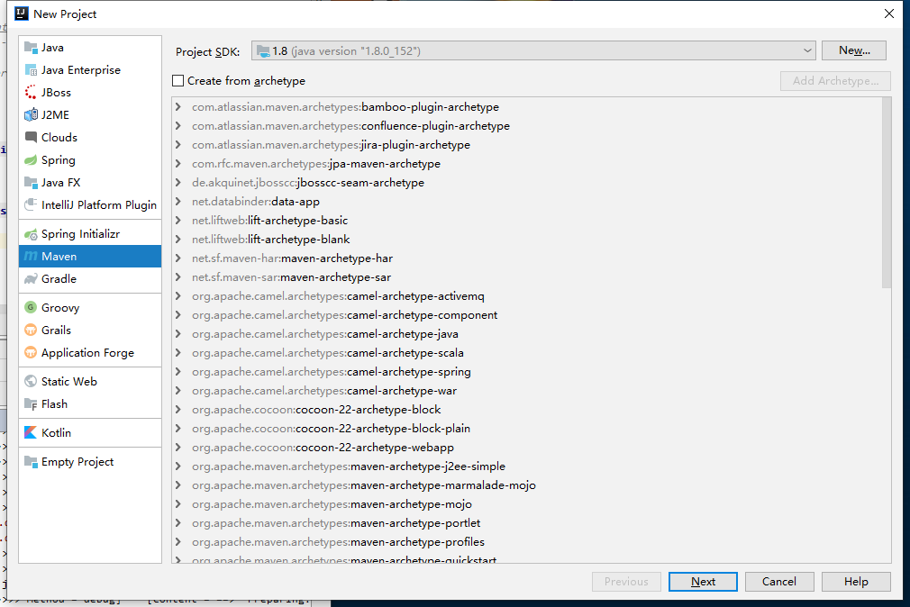

3.在GroupId和ArtifactId分别填写com.chanchifeng和demo，如下图所示：

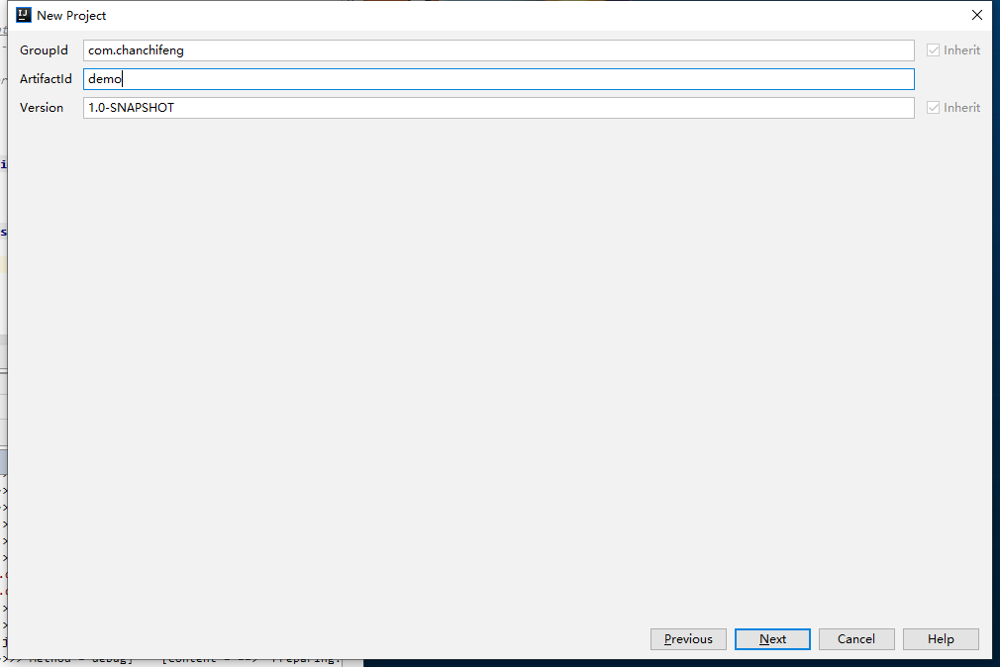

4.在Project name和Project location中分别填写demo和对于的项目路径，如下图所示：

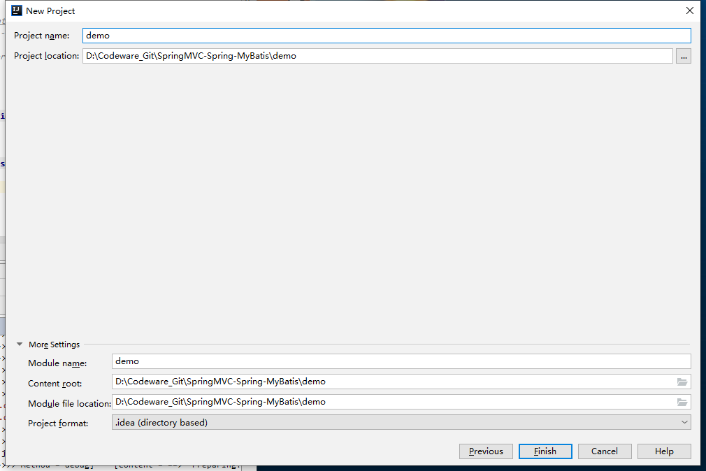

5.新建一个web目录，命名为webapp，操作如下图所示：

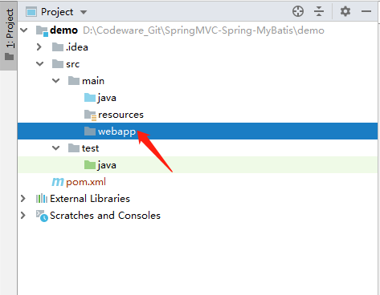

6.设置目录并让IDEA生成WEB-INF文件夹和web.xml，如下图所示：

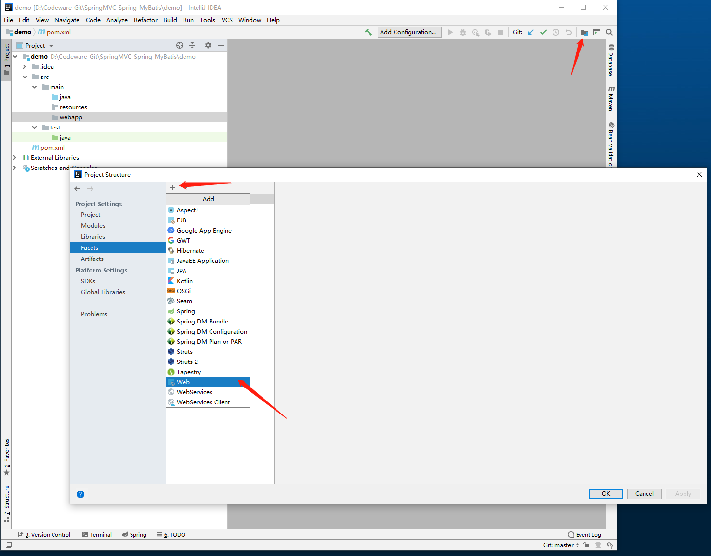

7.选择webapp的目录，操作如下图所示：

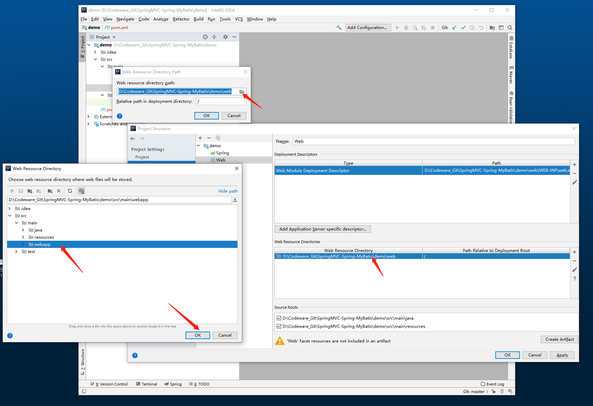

8.设置web.xml的位置，注意，这里必须要以webapp的目录位置为准，如下图所示：

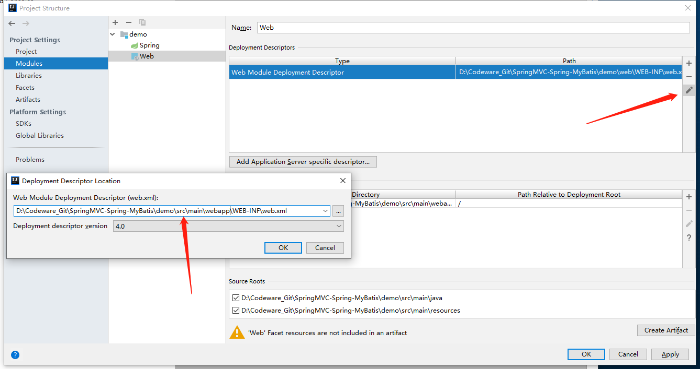

9.下图即生成后的项目结构，如下图：

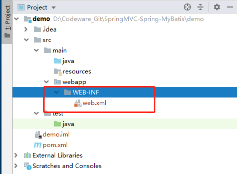

10.创建一下目录的结构

- com.chanchifeng.generator.mapper
- com.chanchifeng.generator.pojo
- com.chanchifeng.generator.map
- com.chanchifeng.module.user.controller
- com.chanchifeng.module.user.mapper
- com.chanchifeng.module.user.pojo
- com.chanchifeng.module.user.service.impl
- 测试 ：com.chanchifeng.module.user
- 测试资源：resources

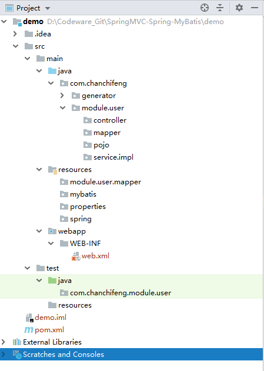

11.设置测试资源，操作如下图：

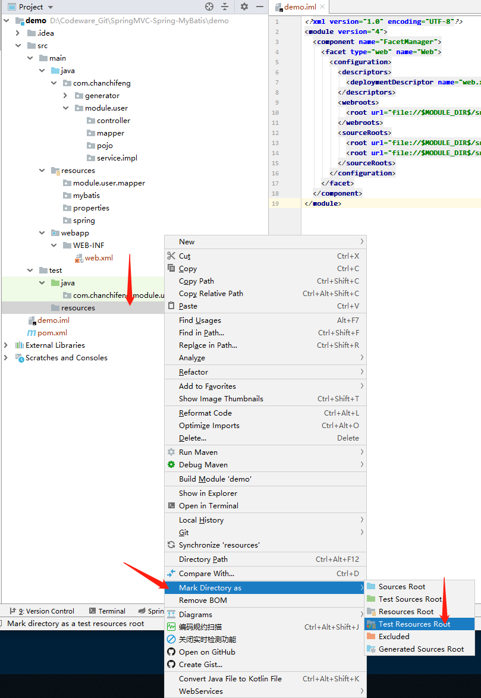

12.创建必须的配置文件，设置完成后的结构图如下：

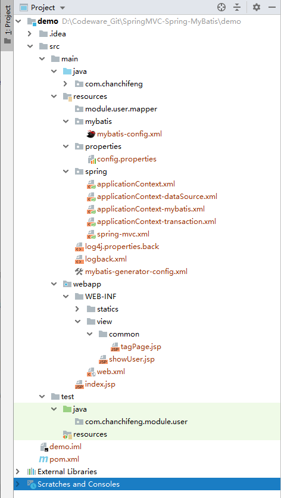

13.mybatis-config.xml

```xml
<?xml version="1.0" encoding="UTF-8"?>
<!DOCTYPE configuration PUBLIC "-//mybatis.org//DTD Config 3.0//EN" "http://mybatis.org/dtd/mybatis-3-config.dtd">
<configuration>

    <settings>
        <!-- 开启mybatis缓存设置,一般都是true -->
        <!-- Globally enables or disables any caches configured in any mapper under this configuration -->
        <setting name="cacheEnabled" value="true"/>

        <!--延迟加载的全局开关-->
        <setting name="lazyLoadingEnabled" value="false"/>

        <!--设置超时时间-->
        <!-- Sets the number of seconds the driver will wait for a response from the database -->
        <setting name="defaultStatementTimeout" value="5"/>

        <!--本地缓存机制-->
        <setting name="localCacheScope" value="STATEMENT"/>

        <setting name="defaultExecutorType" value="SIMPLE"/>

        <!-- Enables automatic mapping from classic database column names A_COLUMN to camel case classic Java property names aColumn -->
        <setting name="mapUnderscoreToCamelCase" value="true"/>

        <!--允许JDBC支持自动生成主键,需要驱动的兼容-->
        <!-- Allows JDBC support for generated keys. A compatible driver is required.
        This setting forces generated keys to be used if set to true,
         as some drivers deny compatibility but still work -->
        <setting name="useGeneratedKeys" value="true"/>
    </settings>

    <!-- Continue editing here -->

</configuration>
```

14.config.properties

```properties
validation_query=SELECT 1
data_source_url=jdbc:mysql://localhost:3306/ssmdemo?useUnicode=true&characterEncoding=utf-8&autoReconnect=true&allowMultiQueries=true
data_source_username=root
data_source_password=1qaz2wsx
```

15.applicationContext.xml

```xml
<?xml version="1.0" encoding="UTF-8"?>
<beans xmlns="http://www.springframework.org/schema/beans"
       xmlns:xsi="http://www.w3.org/2001/XMLSchema-instance"
       xmlns:context="http://www.springframework.org/schema/context"
       xsi:schemaLocation="http://www.springframework.org/schema/beans  
http://www.springframework.org/schema/beans/spring-beans-3.2.xsd  
http://www.springframework.org/schema/context  
http://www.springframework.org/schema/context/spring-context-3.2.xsd">

    <!--上面的xsd最好和当前使用的Spring版本号一致,如果换了Spring版本,这个最好也跟着改-->

    <!-- 引入属性文件 放在最开头,在使用spring之前就引入,里面的变量才能被引用-->
    <context:property-placeholder location="classpath*:properties/*.properties"/>
    <!--
    引入属性文件也可以用这种写法
    <bean id="propertyConfigurer" class="org.springframework.beans.factory.config.PropertyPlaceholderConfigurer">
        <property name="location" value="classpath:config.properties" />
    </bean>
    -->

    <!-- 自动扫描(需要自动注入的类，对于那些类上有注解：@Repository、@Service、@Controller、@Component都进行注入) -->
    <!--因为 Spring MVC 是 Spring 的子容器，所以我们在 Spring MVC 的配置中再指定扫描 Controller 的注解，这里是父容器的配置地方-->
    <!--注解注入的相关材料可以看：-->
    <!--http://blog.csdn.net/u012763117/article/details/17253849-->
    <!--http://casheen.iteye.com/blog/295348-->
    <!--http://blog.csdn.net/zhang854429783/article/details/6785574-->
    <context:component-scan base-package="com.chanchifeng.**.service,com.chanchifeng.**.mapper"/>

</beans>
```

16.applicationContext-dataSource.xml

```xml
<?xml version="1.0" encoding="UTF-8"?>
<beans xmlns="http://www.springframework.org/schema/beans"
       xmlns:xsi="http://www.w3.org/2001/XMLSchema-instance"
       xsi:schemaLocation="http://www.springframework.org/schema/beans  
http://www.springframework.org/schema/beans/spring-beans-3.2.xsd">
    
    <!--上面的xsd最好和当前使用的Spring版本号一致,如果换了Spring版本,这个最好也跟着改-->

    <!--
    使用dbcp连接方式,需要导入commons-dbcp的架包(版本:1.2.2)
    <bean id="dataSource" class="org.apache.commons.dbcp.BasicDataSource"
        destroy-method="close">
        <property name="driverClassName" value="com.mysql.jdbc.Driver" />
        <property name="url" value="${data_source_url}" />
        <property name="username" value="${data_source_username}" />
        <property name="password" value="${data_source_passworddata_source_password}" />
        &lt;!&ndash; 初始化连接大小 &ndash;&gt;
        <property name="initialSize" value="0"></property>
        &lt;!&ndash; 连接池最大数量 &ndash;&gt;
        <property name="maxActive" value="20"></property>
        &lt;!&ndash; 连接池最大空闲 &ndash;&gt;
        <property name="maxIdle" value="20"></property>
        &lt;!&ndash; 连接池最小空闲 &ndash;&gt;
        <property name="minIdle" value="1"></property>
        &lt;!&ndash; 获取连接最大等待时间 &ndash;&gt;
        <property name="maxWait" value="60000"></property>
    </bean>
    -->

    <!-- 使用阿里的druid配置数据源 start-->
    <!--具体查看官网信息：https://github.com/alibaba/druid/wiki/%E9%85%8D%E7%BD%AE_DruidDataSource%E5%8F%82%E8%80%83%E9%85%8D%E7%BD%AE-->
    <bean id="dataSource" class="com.alibaba.druid.pool.DruidDataSource" init-method="init" destroy-method="close">
        <!--这三个变量读取config.properties的-->
        <property name="url" value="${data_source_url}"/>
        <property name="username" value="${data_source_username}"/>
        <property name="password" value="${data_source_password}"/>

        <!-- 初始化连接大小 -->
        <property name="initialSize" value="1"/>
        <!-- 初始化连接池最大使用连接数量 -->
        <property name="maxActive" value="20"/>
        <!-- 初始化连接池最小空闲 -->
        <property name="minIdle" value="1"/>
        
        <!-- 获取连接最大等待时间，单位毫秒-->
        <property name="maxWait" value="60000"/>

        <!-- 配置间隔多久才进行一次检测，检测需要关闭的空闲连接，单位是毫秒 -->
        <property name="timeBetweenEvictionRunsMillis" value="60000"/>
        <!-- 配置一个连接在池中最小生存的时间，单位是毫秒 -->
        <property name="minEvictableIdleTimeMillis" value="25200000"/>

        <!-- 打开PSCache，并且指定每个连接上PSCache的大小 -->
        <!--如果用Oracle，则把poolPreparedStatements配置为true，mysql可以配置为false。分库分表较多的数据库，建议配置为false。-->
        <property name="poolPreparedStatements" value="false" />
        <property name="maxPoolPreparedStatementPerConnectionSize" value="20" />

        <property name="validationQuery" value="${validation_query}"/>
        <property name="testWhileIdle" value="true"/>
        <property name="testOnBorrow" value="false"/>
        <property name="testOnReturn" value="false"/>


        <!--当程序存在缺陷时，申请的连接忘记关闭，这时候，就存在连接泄漏了。Druid提供了RemoveAbandanded相关配置，用来关闭长时间不使用的连接-->
        <!--配置removeAbandoned对性能会有一些影响，建议怀疑存在泄漏之后再打开。在上面的配置中，如果连接超过30分钟未关闭，就会被强行回收，并且日志记录连接申请时的调用堆栈。-->
        <!--具体查看官网信息：https://github.com/alibaba/druid/wiki/%E8%BF%9E%E6%8E%A5%E6%B3%84%E6%BC%8F%E7%9B%91%E6%B5%8B-->
        <!-- 打开removeAbandoned功能 -->
        <property name="removeAbandoned" value="true"/>
        <!-- 1800秒，也就是30分钟 -->
        <property name="removeAbandonedTimeout" value="1800"/>
        <!-- 关闭abanded连接时输出错误日志 -->
        <property name="logAbandoned" value="true"/>

        <!-- 配置监控统计拦截的filters-->
        <!--官网信息：https://github.com/alibaba/druid/wiki/%E9%85%8D%E7%BD%AE_StatFilter-->
        <!--mergeSql可以合并输出的sql，方便查看，但是在mybatis框架中使用这个则无法监控sql,需要用stat-->
        <!--<property name="filters" value="mergeSql,log4j"/>-->
        <!--<property name="filters" value="mergeSql,wall"/>-->
        <!--<property name="filters" value="stat"/>-->
        <!--<property name="filters" value="mergeSql"/>-->
        <property name="filters" value="stat,log4j"/>
    </bean>
    <!-- 使用阿里的druid配置数据源 end-->


</beans>
```

17.applicationContext-mybatis.xml

```xml
<?xml version="1.0" encoding="UTF-8"?>
<beans xmlns="http://www.springframework.org/schema/beans"
       xmlns:xsi="http://www.w3.org/2001/XMLSchema-instance"
       xsi:schemaLocation="http://www.springframework.org/schema/beans  
http://www.springframework.org/schema/beans/spring-beans-3.2.xsd">
    
    <!--上面的xsd最好和当前使用的Spring版本号一致,如果换了Spring版本,这个最好也跟着改-->


    <!-- spring和MyBatis整合，不需要mybatis的配置映射文件 -->
    <bean id="sqlSessionFactory" class="org.mybatis.spring.SqlSessionFactoryBean">
        <property name="dataSource" ref="dataSource"/>
        <!-- 自动扫描 mapper.xml文件(读取的是编译出来的classes目录下的module目录下的具体模块的mapping目录下的任意xml文件) -->
        <property name="mapperLocations" value="classpath:module/*/mapper/*.xml"></property>
        <!--最新mybatis的配置文件位置-->
        <property name="configLocation" value="classpath:mybatis/mybatis-config.xml"></property>
    </bean>

    <!-- mapper 接口所在包名，Spring会自动查找其下的类 -->
    <bean class="org.mybatis.spring.mapper.MapperScannerConfigurer">
        <property name="basePackage" value="com.chanchifeng.module.*.mapper"/>
        <property name="sqlSessionFactoryBeanName" value="sqlSessionFactory"></property>
    </bean>


</beans>
```

18.applicationContext-transaction.xml

```xml
<?xml version="1.0" encoding="UTF-8"?>
<beans xmlns="http://www.springframework.org/schema/beans"
       xmlns:xsi="http://www.w3.org/2001/XMLSchema-instance"
       xmlns:tx="http://www.springframework.org/schema/tx"
       xmlns:aop="http://www.springframework.org/schema/aop"
       xsi:schemaLocation="http://www.springframework.org/schema/beans  
http://www.springframework.org/schema/beans/spring-beans-3.2.xsd  
http://www.springframework.org/schema/tx 
http://www.springframework.org/schema/tx/spring-tx-3.2.xsd
http://www.springframework.org/schema/aop 
http://www.springframework.org/schema/aop/spring-aop-3.2.xsd">

    <!--上面的xsd最好和当前使用的Spring版本号一致,如果换了Spring版本,这个最好也跟着改-->

    <!-- Druid 和 Spring 关联监控配置 start-->
    <!-- 具体可以查阅官网：https://github.com/alibaba/druid/wiki/%E9%85%8D%E7%BD%AE_Druid%E5%92%8CSpring%E5%85%B3%E8%81%94%E7%9B%91%E6%8E%A7%E9%85%8D%E7%BD%AE-->
    <bean id="druid-stat-interceptor" class="com.alibaba.druid.support.spring.stat.DruidStatInterceptor" />
    <bean id="druid-stat-pointcut" class="org.springframework.aop.support.JdkRegexpMethodPointcut" scope="prototype">
        <property name="patterns">
            <list>
                <value>com.youmeek.ssm.module.*.service.*</value>
                <!--如果使用的是 hibernate 则这里也要扫描路径，但是 mybatis 不需要-->
                <!--<value>com.youmeek.ssm.module.*.dao.*</value>-->
            </list>
        </property>
    </bean>

    <aop:config proxy-target-class="true">
        <!-- pointcut-ref="druid-stat-pointcut" 这个报红没事-->
        <aop:advisor advice-ref="druid-stat-interceptor" pointcut-ref="druid-stat-pointcut" />
    </aop:config>
    <!-- Druid 和 Spring 关联监控配置 end-->


    <!-- (事务管理器)transaction manager, use JtaTransactionManager for global tx -->
    <!--http://www.mybatis.org/spring/zh/transactions.html-->
    <bean id="transactionManager" class="org.springframework.jdbc.datasource.DataSourceTransactionManager">
        <property name="dataSource" ref="dataSource" />
    </bean>
    
    
    <!-- 一种方式:注解方式配置事物,扫描@Transactional注解的类定义事务，配置上service实现类(下面还有一个方法名拦截方式,两个同时配置也是可以使用的，但是不建议两者一起使用) -->
    <!--<tx:annotation-driven transaction-manager="transactionManager" proxy-target-class="true"/>-->

    <!-- 一种方式:拦截器方式配置事物start 配置了该方式之后,在方法里面使用注解方式配置事务也是没有作用的 -->
    <tx:advice id="transactionAdvice" transaction-manager="transactionManager">
        <tx:attributes>
            <!--以这些单词开头的方法自动加入事务-->
            <!--更多参数和使用方法可以参考:-->
            <!--http://wuhenjia.blog.163.com/blog/static/93469449201123010594395-->
            <!--http://baobao707.iteye.com/blog/415446-->
            <!--http://jinnianshilongnian.iteye.com/blog/1442376-->
            <!--http://winters1224.blog.51cto.com/3021203/807500-->
            <!--如果是方法中直接抛顶层Exception异常的话,propagation="REQUIRED"是不顶用的,还需要配置rollback-for属性-->


            <!--<tx:method name="delete*" propagation="REQUIRED" read-only="false" rollback-for="java.lang.Exception" no-rollback-for="java.lang.RuntimeException"/>-->
            <!--<tx:method name="insert*" propagation="REQUIRED" read-only="false" rollback-for="java.lang.RuntimeException" />-->
            <!--<tx:method name="update*" propagation="REQUIRED" read-only="false" rollback-for="java.lang.Exception" /> -->

            <tx:method name="add*" propagation="REQUIRED"/>
            <tx:method name="save*" propagation="REQUIRED"/>
            <tx:method name="insert*" propagation="REQUIRED"/>
            <tx:method name="register*" propagation="REQUIRED"/>
            <tx:method name="update*" propagation="REQUIRED"/>
            <tx:method name="modify*" propagation="REQUIRED"/>
            <tx:method name="edit*" propagation="REQUIRED"/>
            <tx:method name="batch*"  propagation="REQUIRED"/>
            <tx:method name="delete*" propagation="REQUIRED"/>
            <tx:method name="remove*" propagation="REQUIRED"/>
            <tx:method name="time*" propagation="REQUIRED"/><!--定时器方法-->
            <tx:method name="repair" propagation="REQUIRED"/>
            <tx:method name="deleteAndRepair" propagation="REQUIRED"/>

            <!--以这些单词开头的方法不加入事务-->
            <tx:method name="get*" propagation="SUPPORTS" read-only="true"/>
            <tx:method name="find*" propagation="SUPPORTS" read-only="true"/>
            <tx:method name="select*" propagation="SUPPORTS" read-only="true"/>
            <tx:method name="load*" propagation="SUPPORTS" read-only="true"/>
            <tx:method name="search*" propagation="SUPPORTS" read-only="true"/>
            <tx:method name="datagrid*" propagation="SUPPORTS" read-only="true"/>

            <tx:method name="*" propagation="SUPPORTS"/>
        </tx:attributes>
    </tx:advice>
    
    
    <aop:config>
        <!--把这个拦截器配置到com.youmeek.ssh.service下(包括子包)下的以impl目录下类的,任意方法-->
        <!--
        execution的语法表示:在impl包中定义的任意方法的执行，更多方式可以参考：
        http://lavasoft.blog.51cto.com/62575/172292/
        http://blog.csdn.net/partner4java/article/details/7015946
        -->
        <aop:pointcut id="transactionPointcut" expression="execution(* com.chanchifeng.module.*.service.impl.*.*(..) )"/>
        <!--<aop:pointcut id="transactionPointcut" expression="execution(* *..*Service*.*(..))"/>-->
        <aop:advisor pointcut-ref="transactionPointcut" advice-ref="transactionAdvice"/>
    </aop:config>
    <!--一种方式:拦截器方式配置事物end-->

</beans>
```

19.spring-mvc.xml

```xml
<?xml version="1.0" encoding="UTF-8"?>
<beans xmlns="http://www.springframework.org/schema/beans"
       xmlns:xsi="http://www.w3.org/2001/XMLSchema-instance"
       xmlns:context="http://www.springframework.org/schema/context" xmlns:mvc="http://www.springframework.org/schema/mvc"
       xsi:schemaLocation="http://www.springframework.org/schema/beans  
                        http://www.springframework.org/schema/beans/spring-beans-3.2.xsd  
                        http://www.springframework.org/schema/context  
                        http://www.springframework.org/schema/context/spring-context-3.2.xsd http://www.springframework.org/schema/mvc 
                        http://www.springframework.org/schema/mvc/spring-mvc.xsd">


    <!--上面的xsd最好和当前使用的Spring版本号一致,如果换了Spring版本,这个最好也跟着改-->


    <!-- 自动扫描该包，使SpringMVC认为包下用了@controller注解的类是控制器 -->
    <context:component-scan base-package="com.chanchifeng.**.controller"/>

    <!-- 配置注解驱动 -->
    <mvc:annotation-driven/>

    <!--静态资源映射-->
    <!--
    http://perfy315.iteye.com/blog/2008763
    mapping="/js/**"
    表示当浏览器有静态资源请求的时候，并且请求url路径中带有：/js/，则这个资源跑到webapp目录下的/WEB-INF/statics/js/去找
    比如我们在 JSP 中引入一个 js 文件：src="${webRoot}/js/jQuery-core/jquery-1.6.1.min.js
    -->
    <mvc:resources mapping="/css/**" location="/WEB-INF/statics/css/"/>
    <mvc:resources mapping="/js/**" location="/WEB-INF/statics/js/"/>
    <mvc:resources mapping="/images/**" location="/WEB-INF/statics/images/"/>


    <!-- 对模型视图名称的解析，即在模型视图名称添加前后缀(如果最后一个还是表示文件夹,则最后的斜杠不要漏了) 使用JSP-->
    <!-- 默认的视图解析器 在上边的解析错误时使用 (默认使用html)- -->
    <bean id="defaultViewResolver" class="org.springframework.web.servlet.view.InternalResourceViewResolver">
        <property name="viewClass" value="org.springframework.web.servlet.view.JstlView"/>
        <property name="prefix" value="/WEB-INF/view/"/><!--设置JSP文件的目录位置-->
        <property name="suffix" value=".jsp"/>
    </bean>


    <!-- 文件上传 start 配置文件上传，如果没有使用文件上传可以不用配置，当然如果不配，那么配置文件中也不必引入上传组件包 -->
    <bean id="multipartResolver" class="org.springframework.web.multipart.commons.CommonsMultipartResolver">
        <!-- 默认编码 -->
        <property name="defaultEncoding" value="UTF-8"/>
        <!-- 文件大小最大值 上传文件大小限制为10M，10*1024*1024 -->
        <property name="maxUploadSize" value="10485760"/>
        <!-- 内存中的最大值 -->
        <property name="maxInMemorySize" value="4096"/>
    </bean>
    <!--文件上传 end-->

</beans>
```

20.log4j.properties.back

```xml

#\u672C\u5C5E\u6027\u6587\u4EF6\u53EA\u80FD\u653E\u5728 resources \u6839\u76EE\u5F55\u4E0B

#\u540C\u65F6\u4F7F\u7528\u4E24\u79CD\u8BB0\u5F55,\u4E00\u79CD\u63A7\u5236\u53F0,\u4E00\u79CD\u6587\u4EF6\u65B9\u5F0F\uFF08\u6587\u4EF6\u5927\u5C0F\u5230\u8FBE\u6307\u5B9A\u5C3A\u5BF8\u7684\u65F6\u5019\u4EA7\u751F\u4E00\u4E2A\u65B0\u7684\u6587\u4EF6\uFF09
#log4j.rootLogger=trace,appenderNameConsole,appenderNameRollingFile

#\u53EA\u8F93\u51FA\u5230\u63A7\u5236\u53F0\uFF0C\u4E0D\u8F93\u51FA\u5230\u6587\u4EF6\uFF0C\u7EA7\u522B\uFF1Aall > trace > debug > info > warn > error
log4j.rootLogger=info,appenderNameConsole

#\u63A7\u5236\u53F0\u8F93\u51FA
log4j.appender.appenderNameConsole=org.apache.log4j.ConsoleAppender
log4j.appender.appenderNameConsole.Target=System.out
log4j.appender.appenderNameConsole.layout=org.apache.log4j.PatternLayout
log4j.appender.appenderNameConsole.layout.ConversionPattern=[%d{yyyy-MM-dd HH:mm:ss:SSS}] --- [%p] --- [%F:%L] --- [%m] --- %n

#\u8FD9\u4E2A\u7528\u6765\u8F93\u51FAmybatis\u6267\u884Csql\u8BED\u53E5.\u5176\u4E2D com.youmeek.ssm.manage.mapper \u8868\u793Amapper.xml\u4E2D\u7684namespace,\u8FD9\u91CC\u53EA\u662F\u524D\u7F00\u8868\u793A\u6240\u6709\u8FD9\u4E2A\u524D\u7F00\u4E0B\u7684\u90FD\u8F93\u51FA,\u4E5F\u53EF\u4EE5\u5199\u5B8C\u6574namespace.
log4j.logger.com.youmeek.ssm.manage.mapper=debug

#======================================================
#\u8F93\u51FA\u65E5\u5FD7\u5230\u786C\u76D8\uFF0C\u6587\u4EF6\u5927\u5C0F\u5230\u8FBE\u6307\u5B9A\u5C3A\u5BF8\u7684\u65F6\u5019\u4EA7\u751F\u4E00\u4E2A\u65B0\u7684\u6587\u4EF6
#log4j.appender.appenderNameRollingFile=org.apache.log4j.RollingFileAppender
#log4j.appender.appenderNameRollingFile.File=log4j-log-out-file/ssm.log
#log4j.appender.appenderNameRollingFile.MaxFileSize=50MB
#log4j.appender.appenderNameRollingFile.Threshold=ALL
#log4j.appender.appenderNameRollingFile.layout=org.apache.log4j.PatternLayout
#log4j.appender.appenderNameRollingFile.layout.ConversionPattern=[%d{yyyy-MM-dd HH:mm:ss:SSS}] --- [%p] --- [%F:%L] --- [%m] --- %n

```

21.logback.xml

```xml
<?xml version="1.0" encoding="UTF-8"?>
<configuration>

    <!--参考文章：-->
    <!--http://blog.csdn.net/wangjunjun2008/article/details/18732019-->
    <!--http://blog.csdn.net/evankaka/article/details/50637994-->


    <!--======================================================-->


    <!--定义日志文件的存储地址 勿在 LogBack 的配置中使用相对路径-->
    <!--Windows 可以使用类似：D:/log-->
    <!--Linux 可以使用类似：/opt/tomcat/logs-->
    <property name="LOG_HOME" value="D:/" />

    <!--======================================================-->


    <!--输出到控制台的设置-->
    <appender name="STDOUT" class="ch.qos.logback.core.ConsoleAppender">
        <layout class="ch.qos.logback.classic.PatternLayout">
            <Pattern>[%d{yyyy-MM-dd HH:mm:ss.SSS}] -- [%p] -- [%thread >>>> %F:%L >>>> Method = %M] -- [Content = %m]%n</Pattern>
        </layout>
    </appender>


    <!-- 按照每天生成日志文件 -->
    <appender name="FILE"  class="ch.qos.logback.core.rolling.RollingFileAppender">
        <rollingPolicy class="ch.qos.logback.core.rolling.TimeBasedRollingPolicy">
            <!--日志文件输出的路径+文件名-->
            <FileNamePattern>${LOG_HOME}/logbackOutFile.log.%d{yyyy-MM-dd}.log</FileNamePattern>
            <!--日志文件保留天数-->
            <MaxHistory>30</MaxHistory>
        </rollingPolicy>
        <encoder class="ch.qos.logback.classic.encoder.PatternLayoutEncoder">
            <pattern>[%d{yyyy-MM-dd HH:mm:ss.SSS}] -- [%p] -- [%thread >>>> %F:%L >>>> Method = %M] -- [Content = %m]%n</pattern>
        </encoder>
        <!--日志文件最大的大小-->
        <triggeringPolicy class="ch.qos.logback.core.rolling.SizeBasedTriggeringPolicy">
            <MaxFileSize>10MB</MaxFileSize>
        </triggeringPolicy>
    </appender>

    <!--======================================================-->

    <!--级别：ALL > TRACE > DEBUG > INFO > WARN > ERROR-->
    <!--对特定目录或是类进行指定级别输出，而不使用root的级别-->
    <logger name="com.chanchifeng" level="TRACE"/>

    <!--myibatis log configure-->
    <logger name="com.apache.ibatis" level="TRACE"/>
    <logger name="java.sql.Connection" level="DEBUG"/>
    <logger name="java.sql.Statement" level="DEBUG"/>
    <logger name="java.sql.PreparedStatement" level="DEBUG"/>


    <!-- show parameters for hibernate sql 专为 Hibernate 定制 -->
    <!--
    <logger name="org.hibernate.type.descriptor.sql.BasicBinder"  level="TRACE" />
    <logger name="org.hibernate.type.descriptor.sql.BasicExtractor"  level="DEBUG" />
    <logger name="org.hibernate.SQL" level="DEBUG" />
    <logger name="org.hibernate.engine.QueryParameters" level="DEBUG" />
    <logger name="org.hibernate.engine.query.HQLQueryPlan" level="DEBUG" />
    -->

    <!--======================================================-->

    <!--默认所有级别是 debug，使用控制台和文件两种类型都进行输出输出，如果只要使用一种控制台输出的话，则下面把FILE那一行去掉即可-->
    <root level="TRACE">
        <appender-ref ref="STDOUT" />
        <appender-ref ref="FILE" />
    </root>

</configuration>
```

22.mybatis-generator-config.xml

```xml
<?xml version="1.0" encoding="UTF-8" ?>
<!DOCTYPE generatorConfiguration PUBLIC
        "-//mybatis.org//DTD MyBatis Generator Configuration 1.0//EN"
        "http://mybatis.org/dtd/mybatis-generator-config_1_0.dtd" >
<generatorConfiguration>

    <!--mybatis生成工具的帮助文档可以看：-->
    <!--英文：http://www.mybatis.org/generator/usage/mysql.html-->
    <!--中文：http://www.mybatis.tk/-->
    <!--中文：http://mbg.cndocs.tk/-->


    <!--添加你本地的驱动jar-->
    <!--    <classPathEntry location="D:\maven\my_local_repository\mysql\mysql-connector-java\5.1.21\mysql-connector-java-5.1.21.jar"/>-->
    <classPathEntry location="C:\Software\maven_repository\mysql\mysql-connector-java\5.1.21\mysql-connector-java-5.1.21.jar"/>

    <context id="context" targetRuntime="MyBatis3">

        <!--设置编码格式-->
        <property name="javaFileEncoding" value="UTF-8"/>

        <commentGenerator>
            <property name="suppressAllComments" value="false"/>
            <property name="suppressDate" value="true"/>
        </commentGenerator>

        <!--添加你的 JDBC 连接信息-->
        <jdbcConnection driverClass="com.mysql.jdbc.Driver" connectionURL="jdbc:mysql://127.0.0.1:3306/ssmdemo" userId="root" password="1qaz2wsx"/>

        <javaTypeResolver>
            <property name="forceBigDecimals" value="false"/>
        </javaTypeResolver>

        <!--要生成的 pojo 模块位置-->
        <javaModelGenerator targetPackage="com.chanchifeng.generator.pojo" targetProject="THIS_CONFIGURATION_IS_NOT_REQUIRED">
            <property name="enableSubPackages" value="false"/>
            <property name="trimStrings" value="true"/>
        </javaModelGenerator>

        <!--要生成的 Mapper.xml 文件位置-->
        <sqlMapGenerator targetPackage="com.chanchifeng.generator.mapper" targetProject="THIS_CONFIGURATION_IS_NOT_REQUIRED">
            <property name="enableSubPackages" value="false"/>
        </sqlMapGenerator>

        <!--要生成的 Mapper 接口类-->
        <javaClientGenerator targetPackage="com.chanchifeng.generator.mapper" targetProject="THIS_CONFIGURATION_IS_NOT_REQUIRED" type="XMLMAPPER">
            <property name="enableSubPackages" value="false"/>
        </javaClientGenerator>


        <!--要根据哪张表生成，要在这里配置-->
        <!--用百分号表示生成所有表,可以直接省去一个一个写 <table tableName="%" /> -->
        <table tableName="sys_user" enableCountByExample="false" enableDeleteByExample="false" enableSelectByExample="false" enableUpdateByExample="false"/>


    </context>
</generatorConfiguration>
```

23.web.xml

```xml
<?xml version="1.0" encoding="UTF-8"?>
<web-app xmlns="http://xmlns.jcp.org/xml/ns/javaee"
         xmlns:xsi="http://www.w3.org/2001/XMLSchema-instance"
         xsi:schemaLocation="http://xmlns.jcp.org/xml/ns/javaee http://xmlns.jcp.org/xml/ns/javaee/web-app_4_0.xsd"
         version="4.0">

    <welcome-file-list>
        <welcome-file>index.jsp</welcome-file>
    </welcome-file-list>


    <!-- Spring和mybatis的配置文件 -->
    <context-param>
        <param-name>contextConfigLocation</param-name>
        <param-value>classpath*:spring/applicationContext*.xml</param-value>
    </context-param>

    <!-- Spring监听器 -->
    <listener>
        <listener-class>org.springframework.web.context.ContextLoaderListener</listener-class>
    </listener>
    <!-- 防止Spring内存溢出监听器 -->
    <listener>
        <listener-class>org.springframework.web.util.IntrospectorCleanupListener</listener-class>
    </listener>

    <!-- 配置SESSION超时，单位是分钟 -->
    <session-config>
        <session-timeout>15</session-timeout>
    </session-config>

    <!-- ############################################ filter start  ############################################ -->
    <!-- 编码过滤器 -->
    <filter>
        <filter-name>encodingFilter</filter-name>
        <filter-class>org.springframework.web.filter.CharacterEncodingFilter</filter-class>
        <async-supported>true</async-supported>
        <init-param>
            <param-name>encoding</param-name>
            <param-value>UTF-8</param-value>
        </init-param>
    </filter>
    <filter-mapping>
        <filter-name>encodingFilter</filter-name>
        <url-pattern>/*</url-pattern>
    </filter-mapping>

    <!-- druid 数据源，用于采集 web-jdbc 关联监控的数据 -->
    <!-- 具体参考官网：https://github.com/alibaba/druid/wiki/%E9%85%8D%E7%BD%AE_%E9%85%8D%E7%BD%AEWebStatFilter-->
    <filter>
        <filter-name>DruidWebStatFilter</filter-name>
        <filter-class>com.alibaba.druid.support.http.WebStatFilter</filter-class>
        <init-param>
            <param-name>exclusions</param-name>
            <param-value>*.js,*.gif,*.jpg,*.png,*.css,*.ico,/druid/*</param-value>
        </init-param>
        <init-param>
            <param-name>profileEnable</param-name>
            <param-value>true</param-value>
        </init-param>
    </filter>
    <filter-mapping>
        <filter-name>DruidWebStatFilter</filter-name>
        <url-pattern>/*</url-pattern>
    </filter-mapping>


    <!-- ############################################ filter end  ############################################ -->


    <!-- ############################################ servlet start  ############################################ -->


    <!-- Spring MVC servlet -->
    <servlet>
        <servlet-name>SpringMVC</servlet-name>
        <servlet-class>org.springframework.web.servlet.DispatcherServlet</servlet-class>
        <init-param>
            <param-name>contextConfigLocation</param-name>
            <param-value>classpath:spring/spring-mvc.xml</param-value>
        </init-param>
        <load-on-startup>1</load-on-startup>
        <async-supported>true</async-supported>
    </servlet>
    <servlet-mapping>
        <servlet-name>SpringMVC</servlet-name>
        <!-- 此处可以可以配置成 *.do ，对应struts的后缀习惯 -->
        <url-pattern>/</url-pattern>
    </servlet-mapping>
    <welcome-file-list>
        <welcome-file>/index.jsp</welcome-file>
    </welcome-file-list>


    <!--展示Druid的统计信息-->
    <!--具体可以看官网信息：https://github.com/alibaba/druid/wiki/%E9%85%8D%E7%BD%AE_StatViewServlet%E9%85%8D%E7%BD%AE-->
    <servlet>
        <servlet-name>DruidStatView</servlet-name>
        <servlet-class>com.alibaba.druid.support.http.StatViewServlet</servlet-class>
    </servlet>
    <servlet-mapping>
        <servlet-name>DruidStatView</servlet-name>
        <!--访问路径eg：http://localhost:8080/druid/index.html -->
        <url-pattern>/druid/*</url-pattern>
    </servlet-mapping>


    <!-- ############################################ servlet end  ############################################ -->


</web-app>
```

24.WEB-INF中的statics中的静态文件，请在文章的最下提供的Github中获取并放入项目中。

25.初始化数据，代码如下：

```sql
# 创建数据库，并创建权限用户
# CREATE DATABASE 'ssm' CHARACTER SET utf8;
CREATE DATABASE ssm CHARACTER SET utf8 COLLATE utf8_general_ci;
CREATE USER 'ssm'@'%' IDENTIFIED BY 'ssm';
GRANT ALL PRIVILEGES ON ssm.* TO 'ssm'@'%';
FLUSH PRIVILEGES;


# 创建表
USE ssm;
CREATE TABLE `sys_user` (
  `sys_user_id` bigint(20) NOT NULL,
  `sys_user_login_name` varchar(50) NOT NULL,
  `sys_user_login_password` varchar(50) NOT NULL,
  `sys_user_status` varchar(1) NOT NULL,
  `sys_user_is_delete` varchar(1) NOT NULL,
  `sys_user_register_datetime` datetime NOT NULL,
  `sys_user_register_source` varchar(1) NOT NULL,
  `sys_user_type` varchar(1) NOT NULL,
  `sys_user_sex` varchar(1) NOT NULL,
  `sys_user_is_email_active` varchar(1) NOT NULL,
  `sys_user_is_mobile_active` varchar(1) NOT NULL,
  `sys_user_register_type` varchar(1) NOT NULL,
  `sys_user_pay_passwrod` varchar(50) DEFAULT NULL,
  `sys_user_icon` varchar(100) DEFAULT NULL,
  `sys_user_real_name` varchar(20) DEFAULT NULL,
  `sys_user_email` varchar(50) DEFAULT NULL,
  `sys_user_mobile` varchar(20) DEFAULT NULL,
  `sys_user_weibo_id` varchar(36) DEFAULT NULL,
  `sys_user_qq_id` varchar(36) DEFAULT NULL,
  PRIMARY KEY (`sys_user_id`)
) ENGINE=InnoDB DEFAULT CHARSET=utf8;


# 创建表数据
USE ssm;
insert  into `sys_user`(`sys_user_id`,`sys_user_login_name`,`sys_user_login_password`,`sys_user_status`,`sys_user_is_delete`,`sys_user_register_datetime`,`sys_user_register_source`,`sys_user_type`,`sys_user_sex`,`sys_user_is_email_active`,`sys_user_is_mobile_active`,`sys_user_register_type`,`sys_user_pay_passwrod`,`sys_user_icon`,`sys_user_real_name`,`sys_user_email`,`sys_user_mobile`,`sys_user_weibo_id`,`sys_user_qq_id`) values (1,'YouMeek1','e10adc3949ba59abbe56e057f20f883e','0','N','2016-02-24 00:12:23','0','0','0','Y','Y','0','e10adc3949ba59abbe56e057f20f883e','','张觉恩1','363379441@qq.com','13800000001','','');
insert  into `sys_user`(`sys_user_id`,`sys_user_login_name`,`sys_user_login_password`,`sys_user_status`,`sys_user_is_delete`,`sys_user_register_datetime`,`sys_user_register_source`,`sys_user_type`,`sys_user_sex`,`sys_user_is_email_active`,`sys_user_is_mobile_active`,`sys_user_register_type`,`sys_user_pay_passwrod`,`sys_user_icon`,`sys_user_real_name`,`sys_user_email`,`sys_user_mobile`,`sys_user_weibo_id`,`sys_user_qq_id`) values (2,'YouMeek2','e10adc3949ba59abbe56e057f20f883e','0','N','2016-02-24 00:12:23','0','0','0','Y','Y','0','e10adc3949ba59abbe56e057f20f883e','','张觉恩2','363379442@qq.com','13800000002','','');
insert  into `sys_user`(`sys_user_id`,`sys_user_login_name`,`sys_user_login_password`,`sys_user_status`,`sys_user_is_delete`,`sys_user_register_datetime`,`sys_user_register_source`,`sys_user_type`,`sys_user_sex`,`sys_user_is_email_active`,`sys_user_is_mobile_active`,`sys_user_register_type`,`sys_user_pay_passwrod`,`sys_user_icon`,`sys_user_real_name`,`sys_user_email`,`sys_user_mobile`,`sys_user_weibo_id`,`sys_user_qq_id`) values (3,'YouMeek3','e10adc3949ba59abbe56e057f20f883e','0','N','2016-02-24 00:12:23','0','0','0','Y','Y','0','e10adc3949ba59abbe56e057f20f883e','','张觉恩3','363379443@qq.com','13800000003','','');
insert  into `sys_user`(`sys_user_id`,`sys_user_login_name`,`sys_user_login_password`,`sys_user_status`,`sys_user_is_delete`,`sys_user_register_datetime`,`sys_user_register_source`,`sys_user_type`,`sys_user_sex`,`sys_user_is_email_active`,`sys_user_is_mobile_active`,`sys_user_register_type`,`sys_user_pay_passwrod`,`sys_user_icon`,`sys_user_real_name`,`sys_user_email`,`sys_user_mobile`,`sys_user_weibo_id`,`sys_user_qq_id`) values (4,'YouMeek4','e10adc3949ba59abbe56e057f20f883e','0','N','2016-02-24 00:12:23','0','0','0','Y','Y','0','e10adc3949ba59abbe56e057f20f883e','','张觉恩4','363379444@qq.com','13800000004','','');
insert  into `sys_user`(`sys_user_id`,`sys_user_login_name`,`sys_user_login_password`,`sys_user_status`,`sys_user_is_delete`,`sys_user_register_datetime`,`sys_user_register_source`,`sys_user_type`,`sys_user_sex`,`sys_user_is_email_active`,`sys_user_is_mobile_active`,`sys_user_register_type`,`sys_user_pay_passwrod`,`sys_user_icon`,`sys_user_real_name`,`sys_user_email`,`sys_user_mobile`,`sys_user_weibo_id`,`sys_user_qq_id`) values (5,'YouMeek5','e10adc3949ba59abbe56e057f20f883e','0','N','2016-02-24 00:12:23','0','0','0','Y','Y','0','e10adc3949ba59abbe56e057f20f883e','','张觉恩5','363379445@qq.com','13800000005','','');

```

26.修改对应的数据库信息，并使用Mybatis生成Mapper和pojo，操作如下图：

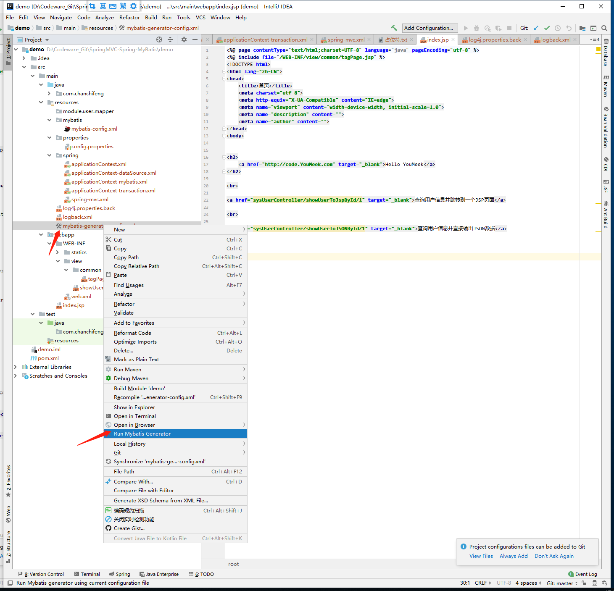

27.由于设置了生成Mapper和Pojo的指定路径在generator，生成的文件如下图所示：

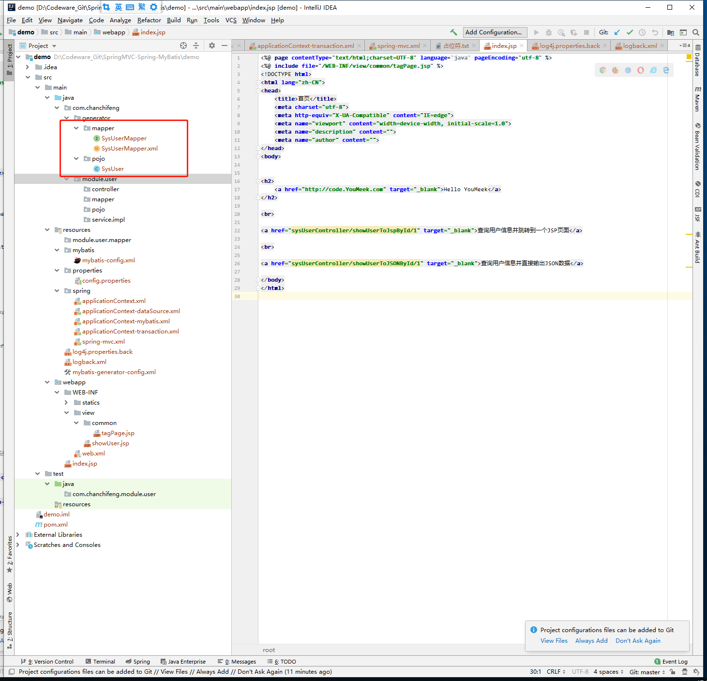

28.我们将SysUserMapper.java、SysUserMapper.xml和SysUser修改路径和内容如下操作，最后的结构图如下：

- [ ] 将SysUserMapper移动至com.chanchifeng.module.user.mapper
- [ ] 将SysUser移动至com.chanchifeng.module.user.pojo
- [ ] 将SysUserMapper.xml移动至resources下的module.user.mapper
- [ ] 确保将移动的文件内容对应的路径进行修改（com.chanchifeng.generator.pojo.SysUser修改为com.chanchifeng.module.user.pojo.SysUser）

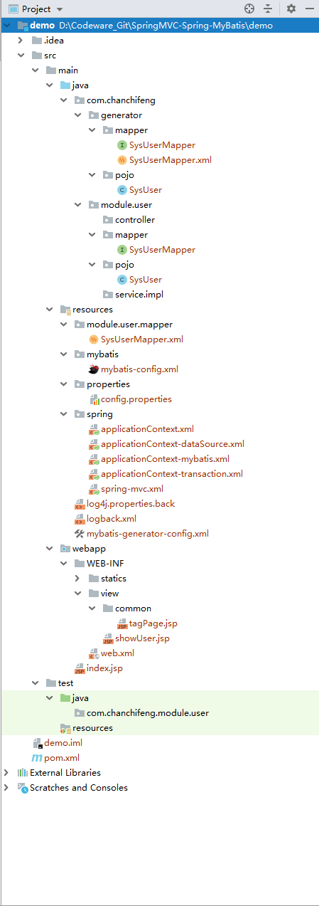

29.最后补全Java代码和页面代码，结构图如下：

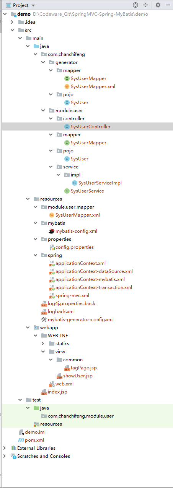

30.SysUserController

```java
import com.chanchifeng.module.user.pojo.SysUser;
import com.chanchifeng.module.user.service.SysUserService;
import org.slf4j.Logger;
import org.slf4j.LoggerFactory;
import org.springframework.stereotype.Controller;
import org.springframework.ui.Model;
import org.springframework.web.bind.annotation.PathVariable;
import org.springframework.web.bind.annotation.RequestMapping;
import org.springframework.web.bind.annotation.ResponseBody;

import javax.annotation.Resource;
import java.util.Date;

@Controller
@RequestMapping("/sysUserController")
public class SysUserController {

    private static final Logger LOG = LoggerFactory.getLogger(SysUserController.class);

    @Resource
    private SysUserService sysUserService;

    @RequestMapping("/showUserToJspById/{userId}")
    public String showUser(Model model,@PathVariable("userId") Long userId){
        System.out.println("this?" + userId);
        SysUser user = this.sysUserService.getById(userId);
        model.addAttribute("user", user);
        return "showUser";
    }

    @RequestMapping("/showUserToJSONById/{userId}")
    @ResponseBody
    public SysUser showUser(@PathVariable("userId") Long userId){
        SysUser user = sysUserService.getById(userId);
        return user;
    }


    @RequestMapping("/test-logback")
    @ResponseBody
    public Date testLogback(){
        LOG.trace("-----------------------------------trace");
        LOG.debug("-----------------------------------debug");
        LOG.info("-----------------------------------info");
        LOG.warn("-----------------------------------warn");
        LOG.error("-----------------------------------error");
        return new Date();
    }
}
```

31.SysUserMapper

```java
import com.chanchifeng.module.user.pojo.SysUser;

public interface SysUserMapper {
    /**
     * This method was generated by MyBatis Generator.
     * This method corresponds to the database table sys_user
     *
     * @mbg.generated
     */
    int deleteByPrimaryKey(Long sysUserId);

    /**
     * This method was generated by MyBatis Generator.
     * This method corresponds to the database table sys_user
     *
     * @mbg.generated
     */
    int insert(SysUser record);

    /**
     * This method was generated by MyBatis Generator.
     * This method corresponds to the database table sys_user
     *
     * @mbg.generated
     */
    int insertSelective(SysUser record);

    /**
     * This method was generated by MyBatis Generator.
     * This method corresponds to the database table sys_user
     *
     * @mbg.generated
     */
    SysUser selectByPrimaryKey(Long sysUserId);

    /**
     * This method was generated by MyBatis Generator.
     * This method corresponds to the database table sys_user
     *
     * @mbg.generated
     */
    int updateByPrimaryKeySelective(SysUser record);

    /**
     * This method was generated by MyBatis Generator.
     * This method corresponds to the database table sys_user
     *
     * @mbg.generated
     */
    int updateByPrimaryKey(SysUser record);
}
```

32.SysUser

```java
import java.util.Date;

public class SysUser {
    /**
     *
     * This field was generated by MyBatis Generator.
     * This field corresponds to the database column sys_user.sys_user_id
     *
     * @mbg.generated
     */
    private Long sysUserId;

    /**
     *
     * This field was generated by MyBatis Generator.
     * This field corresponds to the database column sys_user.sys_user_login_name
     *
     * @mbg.generated
     */
    private String sysUserLoginName;

    /**
     *
     * This field was generated by MyBatis Generator.
     * This field corresponds to the database column sys_user.sys_user_login_password
     *
     * @mbg.generated
     */
    private String sysUserLoginPassword;

    /**
     *
     * This field was generated by MyBatis Generator.
     * This field corresponds to the database column sys_user.sys_user_status
     *
     * @mbg.generated
     */
    private String sysUserStatus;

    /**
     *
     * This field was generated by MyBatis Generator.
     * This field corresponds to the database column sys_user.sys_user_is_delete
     *
     * @mbg.generated
     */
    private String sysUserIsDelete;

    /**
     *
     * This field was generated by MyBatis Generator.
     * This field corresponds to the database column sys_user.sys_user_register_datetime
     *
     * @mbg.generated
     */
    private Date sysUserRegisterDatetime;

    /**
     *
     * This field was generated by MyBatis Generator.
     * This field corresponds to the database column sys_user.sys_user_register_source
     *
     * @mbg.generated
     */
    private String sysUserRegisterSource;

    /**
     *
     * This field was generated by MyBatis Generator.
     * This field corresponds to the database column sys_user.sys_user_type
     *
     * @mbg.generated
     */
    private String sysUserType;

    /**
     *
     * This field was generated by MyBatis Generator.
     * This field corresponds to the database column sys_user.sys_user_sex
     *
     * @mbg.generated
     */
    private String sysUserSex;

    /**
     *
     * This field was generated by MyBatis Generator.
     * This field corresponds to the database column sys_user.sys_user_is_email_active
     *
     * @mbg.generated
     */
    private String sysUserIsEmailActive;

    /**
     *
     * This field was generated by MyBatis Generator.
     * This field corresponds to the database column sys_user.sys_user_is_mobile_active
     *
     * @mbg.generated
     */
    private String sysUserIsMobileActive;

    /**
     *
     * This field was generated by MyBatis Generator.
     * This field corresponds to the database column sys_user.sys_user_register_type
     *
     * @mbg.generated
     */
    private String sysUserRegisterType;

    /**
     *
     * This field was generated by MyBatis Generator.
     * This field corresponds to the database column sys_user.sys_user_pay_passwrod
     *
     * @mbg.generated
     */
    private String sysUserPayPasswrod;

    /**
     *
     * This field was generated by MyBatis Generator.
     * This field corresponds to the database column sys_user.sys_user_icon
     *
     * @mbg.generated
     */
    private String sysUserIcon;

    /**
     *
     * This field was generated by MyBatis Generator.
     * This field corresponds to the database column sys_user.sys_user_real_name
     *
     * @mbg.generated
     */
    private String sysUserRealName;

    /**
     *
     * This field was generated by MyBatis Generator.
     * This field corresponds to the database column sys_user.sys_user_email
     *
     * @mbg.generated
     */
    private String sysUserEmail;

    /**
     *
     * This field was generated by MyBatis Generator.
     * This field corresponds to the database column sys_user.sys_user_mobile
     *
     * @mbg.generated
     */
    private String sysUserMobile;

    /**
     *
     * This field was generated by MyBatis Generator.
     * This field corresponds to the database column sys_user.sys_user_weibo_id
     *
     * @mbg.generated
     */
    private String sysUserWeiboId;

    /**
     *
     * This field was generated by MyBatis Generator.
     * This field corresponds to the database column sys_user.sys_user_qq_id
     *
     * @mbg.generated
     */
    private String sysUserQqId;

    /**
     * This method was generated by MyBatis Generator.
     * This method returns the value of the database column sys_user.sys_user_id
     *
     * @return the value of sys_user.sys_user_id
     *
     * @mbg.generated
     */
    public Long getSysUserId() {
        return sysUserId;
    }

    /**
     * This method was generated by MyBatis Generator.
     * This method sets the value of the database column sys_user.sys_user_id
     *
     * @param sysUserId the value for sys_user.sys_user_id
     *
     * @mbg.generated
     */
    public void setSysUserId(Long sysUserId) {
        this.sysUserId = sysUserId;
    }

    /**
     * This method was generated by MyBatis Generator.
     * This method returns the value of the database column sys_user.sys_user_login_name
     *
     * @return the value of sys_user.sys_user_login_name
     *
     * @mbg.generated
     */
    public String getSysUserLoginName() {
        return sysUserLoginName;
    }

    /**
     * This method was generated by MyBatis Generator.
     * This method sets the value of the database column sys_user.sys_user_login_name
     *
     * @param sysUserLoginName the value for sys_user.sys_user_login_name
     *
     * @mbg.generated
     */
    public void setSysUserLoginName(String sysUserLoginName) {
        this.sysUserLoginName = sysUserLoginName == null ? null : sysUserLoginName.trim();
    }

    /**
     * This method was generated by MyBatis Generator.
     * This method returns the value of the database column sys_user.sys_user_login_password
     *
     * @return the value of sys_user.sys_user_login_password
     *
     * @mbg.generated
     */
    public String getSysUserLoginPassword() {
        return sysUserLoginPassword;
    }

    /**
     * This method was generated by MyBatis Generator.
     * This method sets the value of the database column sys_user.sys_user_login_password
     *
     * @param sysUserLoginPassword the value for sys_user.sys_user_login_password
     *
     * @mbg.generated
     */
    public void setSysUserLoginPassword(String sysUserLoginPassword) {
        this.sysUserLoginPassword = sysUserLoginPassword == null ? null : sysUserLoginPassword.trim();
    }

    /**
     * This method was generated by MyBatis Generator.
     * This method returns the value of the database column sys_user.sys_user_status
     *
     * @return the value of sys_user.sys_user_status
     *
     * @mbg.generated
     */
    public String getSysUserStatus() {
        return sysUserStatus;
    }

    /**
     * This method was generated by MyBatis Generator.
     * This method sets the value of the database column sys_user.sys_user_status
     *
     * @param sysUserStatus the value for sys_user.sys_user_status
     *
     * @mbg.generated
     */
    public void setSysUserStatus(String sysUserStatus) {
        this.sysUserStatus = sysUserStatus == null ? null : sysUserStatus.trim();
    }

    /**
     * This method was generated by MyBatis Generator.
     * This method returns the value of the database column sys_user.sys_user_is_delete
     *
     * @return the value of sys_user.sys_user_is_delete
     *
     * @mbg.generated
     */
    public String getSysUserIsDelete() {
        return sysUserIsDelete;
    }

    /**
     * This method was generated by MyBatis Generator.
     * This method sets the value of the database column sys_user.sys_user_is_delete
     *
     * @param sysUserIsDelete the value for sys_user.sys_user_is_delete
     *
     * @mbg.generated
     */
    public void setSysUserIsDelete(String sysUserIsDelete) {
        this.sysUserIsDelete = sysUserIsDelete == null ? null : sysUserIsDelete.trim();
    }

    /**
     * This method was generated by MyBatis Generator.
     * This method returns the value of the database column sys_user.sys_user_register_datetime
     *
     * @return the value of sys_user.sys_user_register_datetime
     *
     * @mbg.generated
     */
    public Date getSysUserRegisterDatetime() {
        return sysUserRegisterDatetime;
    }

    /**
     * This method was generated by MyBatis Generator.
     * This method sets the value of the database column sys_user.sys_user_register_datetime
     *
     * @param sysUserRegisterDatetime the value for sys_user.sys_user_register_datetime
     *
     * @mbg.generated
     */
    public void setSysUserRegisterDatetime(Date sysUserRegisterDatetime) {
        this.sysUserRegisterDatetime = sysUserRegisterDatetime;
    }

    /**
     * This method was generated by MyBatis Generator.
     * This method returns the value of the database column sys_user.sys_user_register_source
     *
     * @return the value of sys_user.sys_user_register_source
     *
     * @mbg.generated
     */
    public String getSysUserRegisterSource() {
        return sysUserRegisterSource;
    }

    /**
     * This method was generated by MyBatis Generator.
     * This method sets the value of the database column sys_user.sys_user_register_source
     *
     * @param sysUserRegisterSource the value for sys_user.sys_user_register_source
     *
     * @mbg.generated
     */
    public void setSysUserRegisterSource(String sysUserRegisterSource) {
        this.sysUserRegisterSource = sysUserRegisterSource == null ? null : sysUserRegisterSource.trim();
    }

    /**
     * This method was generated by MyBatis Generator.
     * This method returns the value of the database column sys_user.sys_user_type
     *
     * @return the value of sys_user.sys_user_type
     *
     * @mbg.generated
     */
    public String getSysUserType() {
        return sysUserType;
    }

    /**
     * This method was generated by MyBatis Generator.
     * This method sets the value of the database column sys_user.sys_user_type
     *
     * @param sysUserType the value for sys_user.sys_user_type
     *
     * @mbg.generated
     */
    public void setSysUserType(String sysUserType) {
        this.sysUserType = sysUserType == null ? null : sysUserType.trim();
    }

    /**
     * This method was generated by MyBatis Generator.
     * This method returns the value of the database column sys_user.sys_user_sex
     *
     * @return the value of sys_user.sys_user_sex
     *
     * @mbg.generated
     */
    public String getSysUserSex() {
        return sysUserSex;
    }

    /**
     * This method was generated by MyBatis Generator.
     * This method sets the value of the database column sys_user.sys_user_sex
     *
     * @param sysUserSex the value for sys_user.sys_user_sex
     *
     * @mbg.generated
     */
    public void setSysUserSex(String sysUserSex) {
        this.sysUserSex = sysUserSex == null ? null : sysUserSex.trim();
    }

    /**
     * This method was generated by MyBatis Generator.
     * This method returns the value of the database column sys_user.sys_user_is_email_active
     *
     * @return the value of sys_user.sys_user_is_email_active
     *
     * @mbg.generated
     */
    public String getSysUserIsEmailActive() {
        return sysUserIsEmailActive;
    }

    /**
     * This method was generated by MyBatis Generator.
     * This method sets the value of the database column sys_user.sys_user_is_email_active
     *
     * @param sysUserIsEmailActive the value for sys_user.sys_user_is_email_active
     *
     * @mbg.generated
     */
    public void setSysUserIsEmailActive(String sysUserIsEmailActive) {
        this.sysUserIsEmailActive = sysUserIsEmailActive == null ? null : sysUserIsEmailActive.trim();
    }

    /**
     * This method was generated by MyBatis Generator.
     * This method returns the value of the database column sys_user.sys_user_is_mobile_active
     *
     * @return the value of sys_user.sys_user_is_mobile_active
     *
     * @mbg.generated
     */
    public String getSysUserIsMobileActive() {
        return sysUserIsMobileActive;
    }

    /**
     * This method was generated by MyBatis Generator.
     * This method sets the value of the database column sys_user.sys_user_is_mobile_active
     *
     * @param sysUserIsMobileActive the value for sys_user.sys_user_is_mobile_active
     *
     * @mbg.generated
     */
    public void setSysUserIsMobileActive(String sysUserIsMobileActive) {
        this.sysUserIsMobileActive = sysUserIsMobileActive == null ? null : sysUserIsMobileActive.trim();
    }

    /**
     * This method was generated by MyBatis Generator.
     * This method returns the value of the database column sys_user.sys_user_register_type
     *
     * @return the value of sys_user.sys_user_register_type
     *
     * @mbg.generated
     */
    public String getSysUserRegisterType() {
        return sysUserRegisterType;
    }

    /**
     * This method was generated by MyBatis Generator.
     * This method sets the value of the database column sys_user.sys_user_register_type
     *
     * @param sysUserRegisterType the value for sys_user.sys_user_register_type
     *
     * @mbg.generated
     */
    public void setSysUserRegisterType(String sysUserRegisterType) {
        this.sysUserRegisterType = sysUserRegisterType == null ? null : sysUserRegisterType.trim();
    }

    /**
     * This method was generated by MyBatis Generator.
     * This method returns the value of the database column sys_user.sys_user_pay_passwrod
     *
     * @return the value of sys_user.sys_user_pay_passwrod
     *
     * @mbg.generated
     */
    public String getSysUserPayPasswrod() {
        return sysUserPayPasswrod;
    }

    /**
     * This method was generated by MyBatis Generator.
     * This method sets the value of the database column sys_user.sys_user_pay_passwrod
     *
     * @param sysUserPayPasswrod the value for sys_user.sys_user_pay_passwrod
     *
     * @mbg.generated
     */
    public void setSysUserPayPasswrod(String sysUserPayPasswrod) {
        this.sysUserPayPasswrod = sysUserPayPasswrod == null ? null : sysUserPayPasswrod.trim();
    }

    /**
     * This method was generated by MyBatis Generator.
     * This method returns the value of the database column sys_user.sys_user_icon
     *
     * @return the value of sys_user.sys_user_icon
     *
     * @mbg.generated
     */
    public String getSysUserIcon() {
        return sysUserIcon;
    }

    /**
     * This method was generated by MyBatis Generator.
     * This method sets the value of the database column sys_user.sys_user_icon
     *
     * @param sysUserIcon the value for sys_user.sys_user_icon
     *
     * @mbg.generated
     */
    public void setSysUserIcon(String sysUserIcon) {
        this.sysUserIcon = sysUserIcon == null ? null : sysUserIcon.trim();
    }

    /**
     * This method was generated by MyBatis Generator.
     * This method returns the value of the database column sys_user.sys_user_real_name
     *
     * @return the value of sys_user.sys_user_real_name
     *
     * @mbg.generated
     */
    public String getSysUserRealName() {
        return sysUserRealName;
    }

    /**
     * This method was generated by MyBatis Generator.
     * This method sets the value of the database column sys_user.sys_user_real_name
     *
     * @param sysUserRealName the value for sys_user.sys_user_real_name
     *
     * @mbg.generated
     */
    public void setSysUserRealName(String sysUserRealName) {
        this.sysUserRealName = sysUserRealName == null ? null : sysUserRealName.trim();
    }

    /**
     * This method was generated by MyBatis Generator.
     * This method returns the value of the database column sys_user.sys_user_email
     *
     * @return the value of sys_user.sys_user_email
     *
     * @mbg.generated
     */
    public String getSysUserEmail() {
        return sysUserEmail;
    }

    /**
     * This method was generated by MyBatis Generator.
     * This method sets the value of the database column sys_user.sys_user_email
     *
     * @param sysUserEmail the value for sys_user.sys_user_email
     *
     * @mbg.generated
     */
    public void setSysUserEmail(String sysUserEmail) {
        this.sysUserEmail = sysUserEmail == null ? null : sysUserEmail.trim();
    }

    /**
     * This method was generated by MyBatis Generator.
     * This method returns the value of the database column sys_user.sys_user_mobile
     *
     * @return the value of sys_user.sys_user_mobile
     *
     * @mbg.generated
     */
    public String getSysUserMobile() {
        return sysUserMobile;
    }

    /**
     * This method was generated by MyBatis Generator.
     * This method sets the value of the database column sys_user.sys_user_mobile
     *
     * @param sysUserMobile the value for sys_user.sys_user_mobile
     *
     * @mbg.generated
     */
    public void setSysUserMobile(String sysUserMobile) {
        this.sysUserMobile = sysUserMobile == null ? null : sysUserMobile.trim();
    }

    /**
     * This method was generated by MyBatis Generator.
     * This method returns the value of the database column sys_user.sys_user_weibo_id
     *
     * @return the value of sys_user.sys_user_weibo_id
     *
     * @mbg.generated
     */
    public String getSysUserWeiboId() {
        return sysUserWeiboId;
    }

    /**
     * This method was generated by MyBatis Generator.
     * This method sets the value of the database column sys_user.sys_user_weibo_id
     *
     * @param sysUserWeiboId the value for sys_user.sys_user_weibo_id
     *
     * @mbg.generated
     */
    public void setSysUserWeiboId(String sysUserWeiboId) {
        this.sysUserWeiboId = sysUserWeiboId == null ? null : sysUserWeiboId.trim();
    }

    /**
     * This method was generated by MyBatis Generator.
     * This method returns the value of the database column sys_user.sys_user_qq_id
     *
     * @return the value of sys_user.sys_user_qq_id
     *
     * @mbg.generated
     */
    public String getSysUserQqId() {
        return sysUserQqId;
    }

    /**
     * This method was generated by MyBatis Generator.
     * This method sets the value of the database column sys_user.sys_user_qq_id
     *
     * @param sysUserQqId the value for sys_user.sys_user_qq_id
     *
     * @mbg.generated
     */
    public void setSysUserQqId(String sysUserQqId) {
        this.sysUserQqId = sysUserQqId == null ? null : sysUserQqId.trim();
    }
}
```

33.SysUserServiceImpl

```java
import com.chanchifeng.module.user.mapper.SysUserMapper;
import com.chanchifeng.module.user.pojo.SysUser;
import com.chanchifeng.module.user.service.SysUserService;
import org.springframework.stereotype.Service;

import javax.annotation.Resource;

@Service
public class SysUserServiceImpl implements SysUserService {

    @Resource
    private SysUserMapper sysUserMapper;

    @Override
    public SysUser getById(Long id) {
        return sysUserMapper.selectByPrimaryKey(id);
    }
}
```

34.SysUserService

```java
import com.chanchifeng.module.user.pojo.SysUser;

public interface SysUserService {
    SysUser getById(Long id);
}
```

35.WEB-INF/view/common/tagPage.jsp

```html
<%@taglib uri="http://java.sun.com/jsp/jstl/core" prefix="c" %>
<%@taglib uri="http://java.sun.com/jsp/jstl/fmt" prefix="fmt" %>
<%@taglib uri="http://java.sun.com/jsp/jstl/functions" prefix="fn" %>
<%@ page trimDirectiveWhitespaces="true" %>
<%
    response.setHeader("cache-control", "max-age=5,public,must-revalidate"); //one day
    response.setDateHeader("expires", -1);
    String cdntime = String.valueOf(System.currentTimeMillis());
    request.setAttribute("cdntime",cdntime);
%>
<%--<c:set value="${pageContext.request.contextPath}" var="webRoot" />--%>
<%
    String webRoot = "http://" + request.getServerName() + ":" + request.getServerPort();
    request.setAttribute("webRoot",webRoot);
%>
```

36.WEB-INF/view/showUser.jsp

```html
<%@ page contentType="text/html;charset=UTF-8" language="java" pageEncoding="utf-8" %>
<%@ include file="/WEB-INF/view/common/tagPage.jsp" %>
<!DOCTYPE html>
<html lang="zh-CN">
<head>
    <meta charset="utf-8">
    <title>显示结果</title>
    <meta http-equiv="X-UA-Compatible" content="IE=edge">
    <meta name="viewport" content="width=device-width, initial-scale=1.0">
    <meta name="description" content="">
    <meta name="author" content="">
    <script type="text/javascript" src="${webRoot}/js/jQuery-core/jquery-1.6.1.min.js?cdntime=${cdntime}"></script>
    <script type="text/javascript">
        $(function () {
            alert("测试静态资源加载");
        });
    </script>
</head>
<body>

登录名：${user.sysUserLoginName}

<br>

真实姓名：${user.sysUserRealName}

</body>
</html>
```

37.index.jsp

```html
<%@ page contentType="text/html;charset=UTF-8" language="java" pageEncoding="utf-8" %>
<%@ include file="/WEB-INF/view/common/tagPage.jsp" %>
<!DOCTYPE html>
<html lang="zh-CN">
<head>
    <title>首页</title>
    <meta charset="utf-8">
    <meta http-equiv="X-UA-Compatible" content="IE=edge">
    <meta name="viewport" content="width=device-width, initial-scale=1.0">
    <meta name="description" content="">
    <meta name="author" content="">
</head>
<body>


<h2>
    <a href="http://code.YouMeek.com" target="_blank">Hello YouMeek</a>
</h2>

<br>

<a href="sysUserController/showUserToJspById/1" target="_blank">查询用户信息并跳转到一个JSP页面</a>

<br>

<a href="sysUserController/showUserToJSONById/1" target="_blank">查询用户信息并直接输出JSON数据</a>

</body>
</html>
```

38.我们可以使用maven进行编译WEB项目，操作如下图所示：

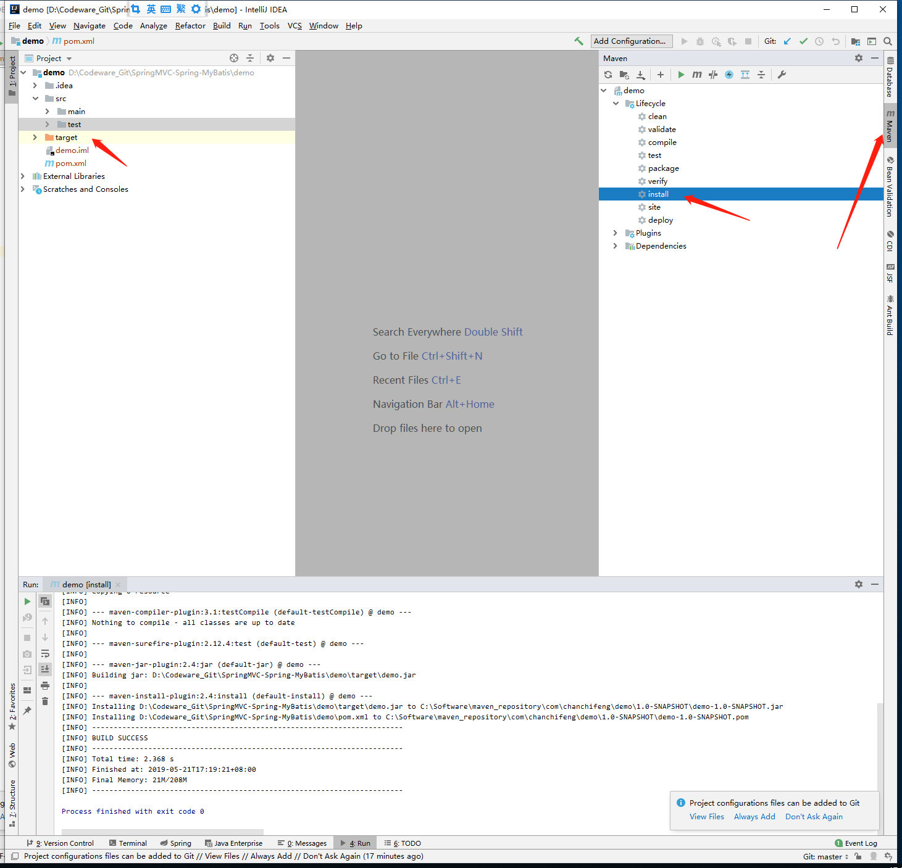

39.设置WEB项目编译信息，操作如下图：

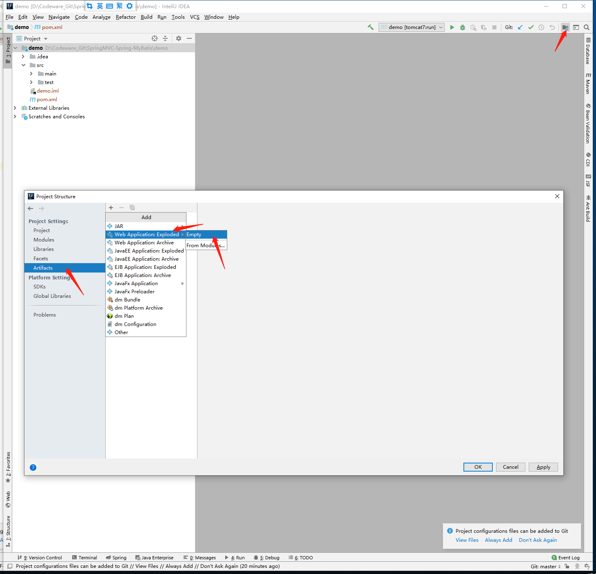

40.添加本地web容器，操作如下：

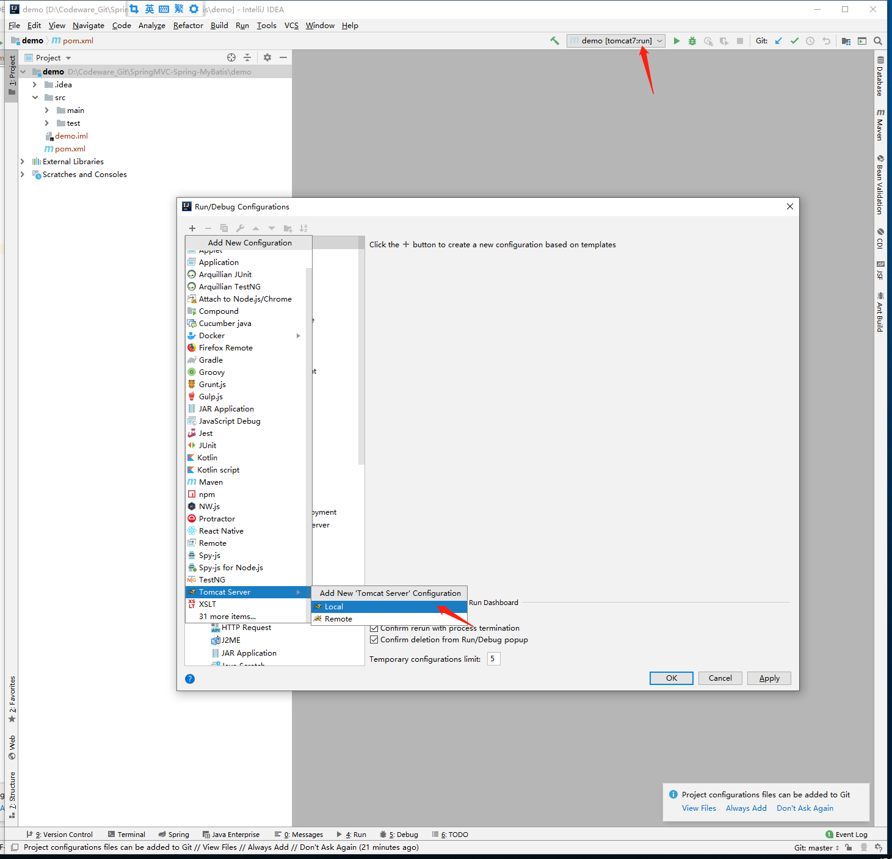

41.点击Fix，选择对于的编译选择，操作如下图：

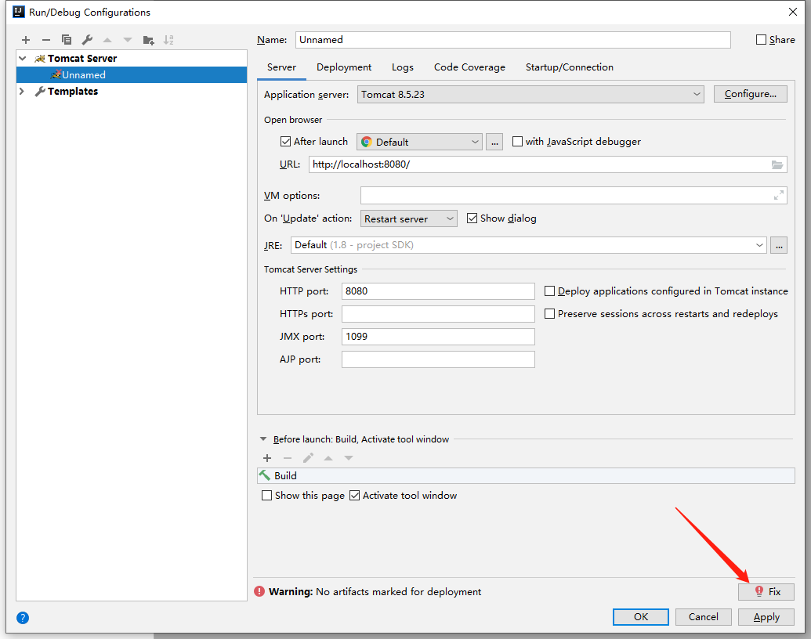

42.编辑项目的访问路径，操作如下图所示：

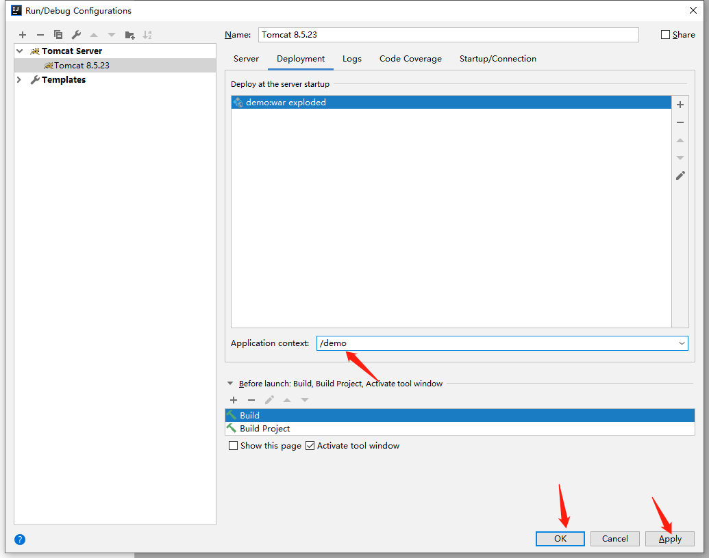

43.在浏览器中输入<http://localhost:8080/demo/>，效果图如下图所示：

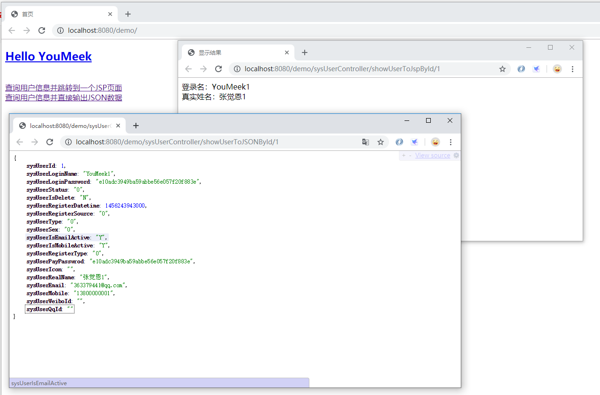

44.最后可以使用测试类继续测试，在com.chanchifeng.module.user.SSMTest编写以下代码：

```java
import com.chanchifeng.module.user.pojo.SysUser;
import com.chanchifeng.module.user.service.SysUserService;
import org.junit.Test;
import org.junit.runner.RunWith;
import org.springframework.test.context.ContextConfiguration;
import org.springframework.test.context.junit4.SpringJUnit4ClassRunner;

import javax.annotation.Resource;

@RunWith(SpringJUnit4ClassRunner.class)
@ContextConfiguration(locations = {"classpath*:spring/applicationContext*.xml"})
public class SSMTest {


    @Resource
    private SysUserService sysUserService;

    @Test
    public void test1() {
        SysUser sysUser = sysUserService.getById(1L);
        System.out.println("--------------------------------" + sysUser.getSysUserLoginName());
    }
}
```

45.在resources中编写log4j.properties，代码如下：

```properties

#\u672C\u5C5E\u6027\u6587\u4EF6\u53EA\u80FD\u653E\u5728 resources \u6839\u76EE\u5F55\u4E0B

#\u540C\u65F6\u4F7F\u7528\u4E24\u79CD\u8BB0\u5F55,\u4E00\u79CD\u63A7\u5236\u53F0,\u4E00\u79CD\u6587\u4EF6\u65B9\u5F0F\uFF08\u6587\u4EF6\u5927\u5C0F\u5230\u8FBE\u6307\u5B9A\u5C3A\u5BF8\u7684\u65F6\u5019\u4EA7\u751F\u4E00\u4E2A\u65B0\u7684\u6587\u4EF6\uFF09
#log4j.rootLogger=trace,appenderNameConsole,appenderNameRollingFile

#\u53EA\u8F93\u51FA\u5230\u63A7\u5236\u53F0\uFF0C\u4E0D\u8F93\u51FA\u5230\u6587\u4EF6\uFF0C\u7EA7\u522B\uFF1Aall > trace > debug > info > warn > error
log4j.rootLogger=info,appenderNameConsole

#\u63A7\u5236\u53F0\u8F93\u51FA
log4j.appender.appenderNameConsole=org.apache.log4j.ConsoleAppender
log4j.appender.appenderNameConsole.Target=System.out
log4j.appender.appenderNameConsole.layout=org.apache.log4j.PatternLayout
log4j.appender.appenderNameConsole.layout.ConversionPattern=[%d{yyyy-MM-dd HH:mm:ss:SSS}] --- [%p] --- [%F:%L] --- [%m] --- %n

#\u8FD9\u4E2A\u7528\u6765\u8F93\u51FAmybatis\u6267\u884Csql\u8BED\u53E5.\u5176\u4E2D com.youmeek.ssm.manage.mapper \u8868\u793Amapper.xml\u4E2D\u7684namespace,\u8FD9\u91CC\u53EA\u662F\u524D\u7F00\u8868\u793A\u6240\u6709\u8FD9\u4E2A\u524D\u7F00\u4E0B\u7684\u90FD\u8F93\u51FA,\u4E5F\u53EF\u4EE5\u5199\u5B8C\u6574namespace.
log4j.logger.com.youmeek.ssm.manage.mapper=debug

#======================================================
#\u8F93\u51FA\u65E5\u5FD7\u5230\u786C\u76D8\uFF0C\u6587\u4EF6\u5927\u5C0F\u5230\u8FBE\u6307\u5B9A\u5C3A\u5BF8\u7684\u65F6\u5019\u4EA7\u751F\u4E00\u4E2A\u65B0\u7684\u6587\u4EF6
#log4j.appender.appenderNameRollingFile=org.apache.log4j.RollingFileAppender
#log4j.appender.appenderNameRollingFile.File=log4j-log-out-file/ssm.log
#log4j.appender.appenderNameRollingFile.MaxFileSize=50MB
#log4j.appender.appenderNameRollingFile.Threshold=ALL
#log4j.appender.appenderNameRollingFile.layout=org.apache.log4j.PatternLayout
#log4j.appender.appenderNameRollingFile.layout.ConversionPattern=[%d{yyyy-MM-dd HH:mm:ss:SSS}] --- [%p] --- [%F:%L] --- [%m] --- %n

```

46.测试结果如下图所示：

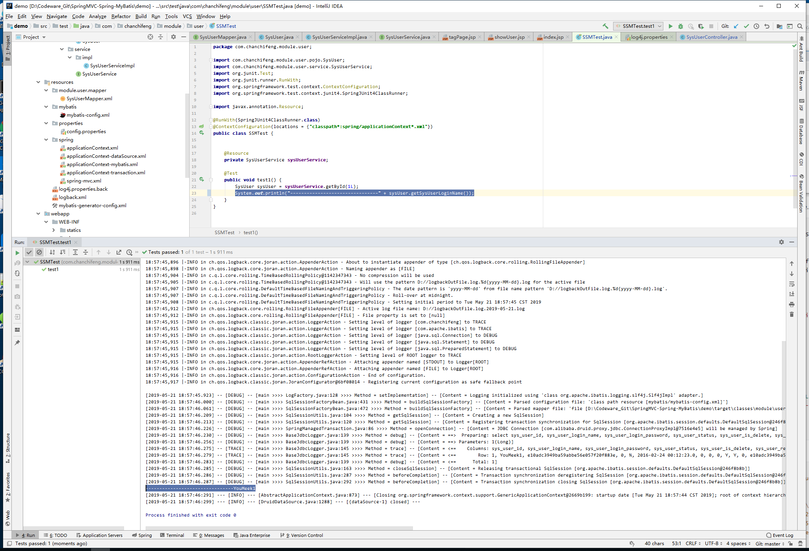

> Github：[SpringMVC-Spring-MyBatis/demo](https://github.com/porschan/SpringMVC-Spring-MyBatis)