<div class="tip">

	重点参考了sxjlinux的博客《idea使用Maven创建web服务，并搭建ssh框架使用tomcat运行》搭建，[https://blog.csdn.net/sunxiaoju/article/details/81007709](https://blog.csdn.net/sunxiaoju/article/details/81007709 "https://blog.csdn.net/sunxiaoju/article/details/81007709")
		
</div>

1.我们创建一个新的项目，选择Maven，并使用Maven搭建一个web的项目，如下图：

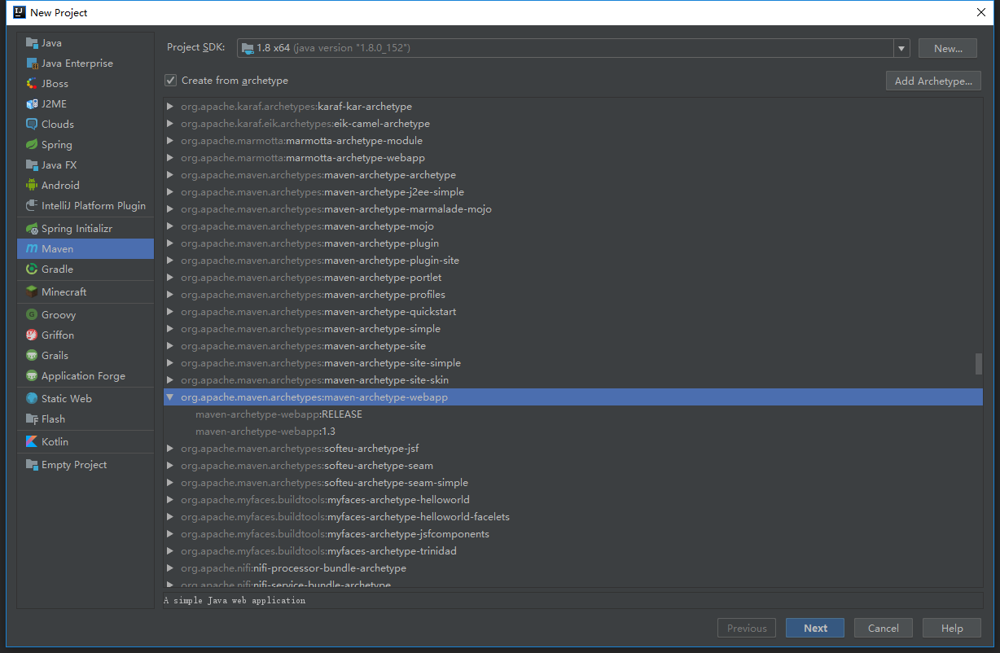

2.在GroupId填写com.chanchifeng,在ArtifactId填写ssh-webapp,如下图：

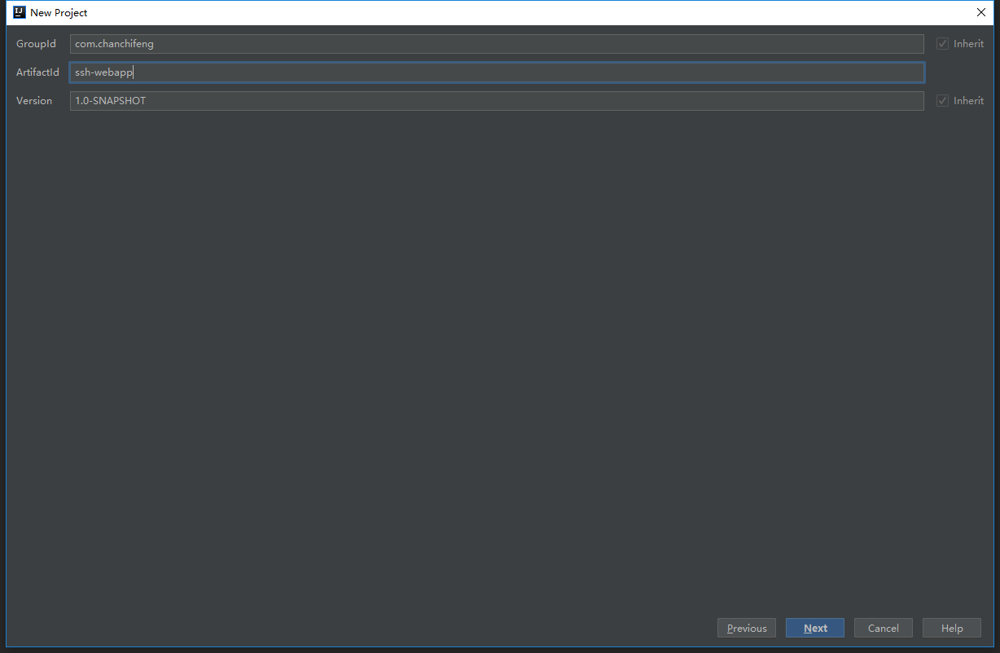

3.默认选择已经配置完成的idea中的maven，如下图：

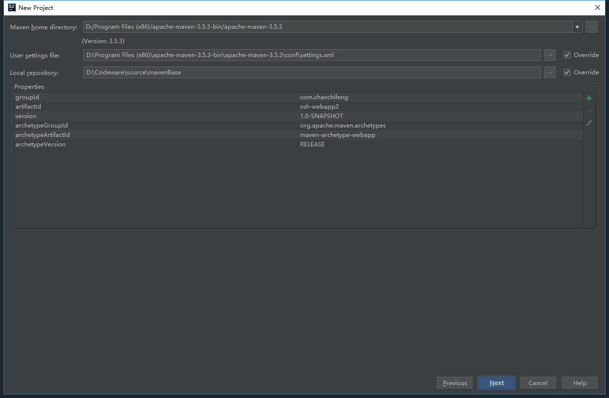

4.在Project name填写ssh-webapp2,选择适合的项目路径，如下图：

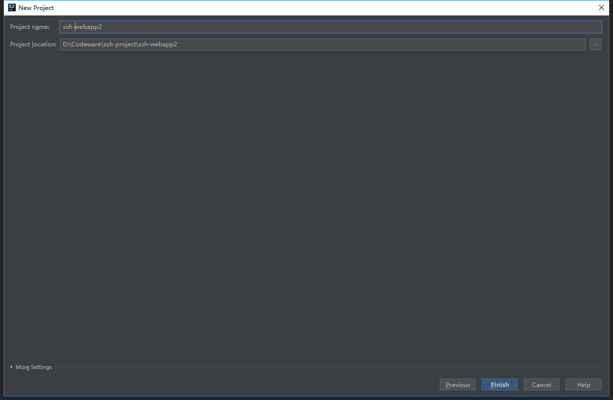

5.在使用Maven创建项目的时候，idea会提醒是否自动下载Maven中的依赖，点击Enable Auto-Import,如下图：

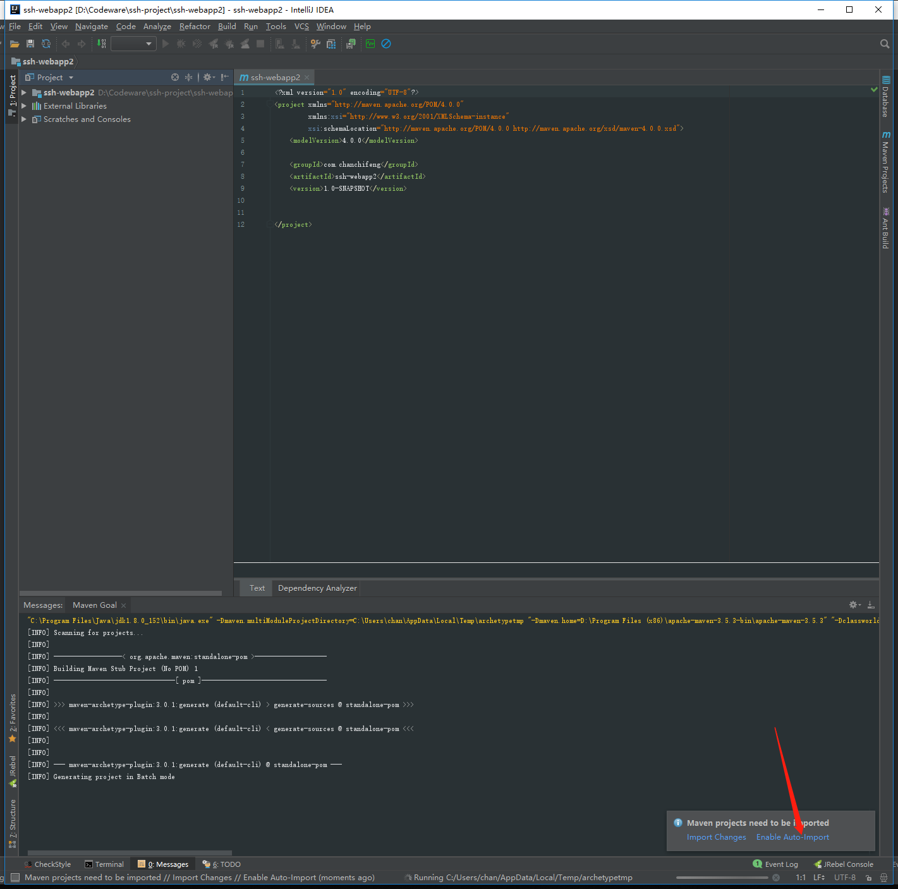

6.在src中，创建一个文件夹为java，并使文件夹为Sources Root 类型，如下图：

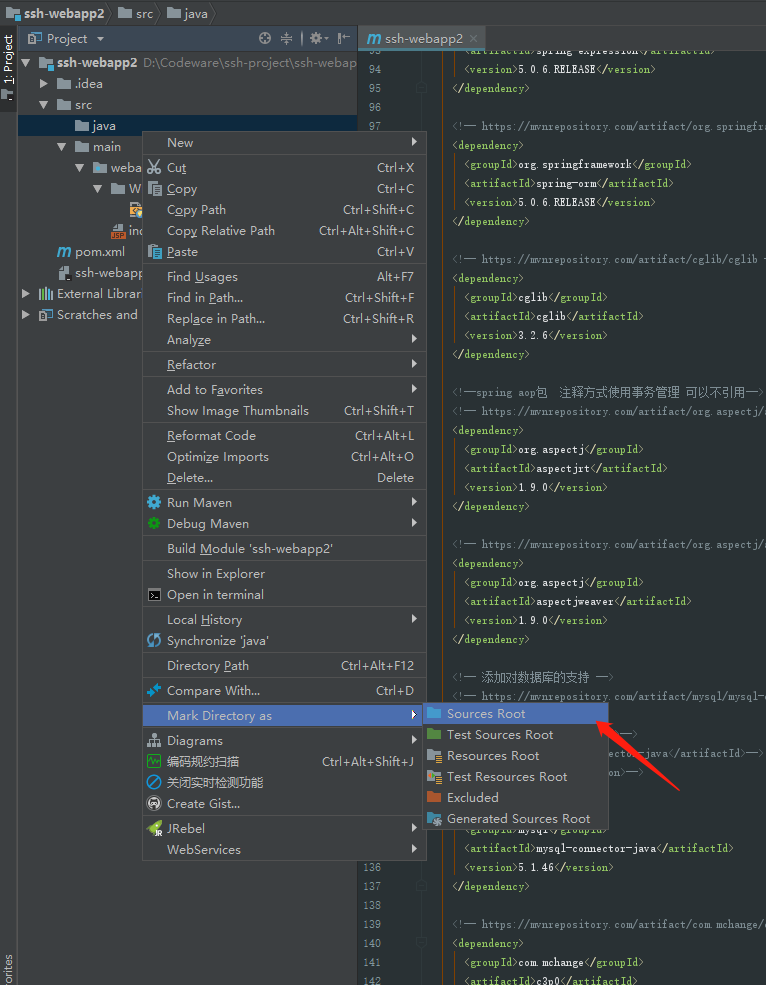

7.在main中，创建一个文件夹为resources,并使文件夹为Resources Root 类型，如下图：

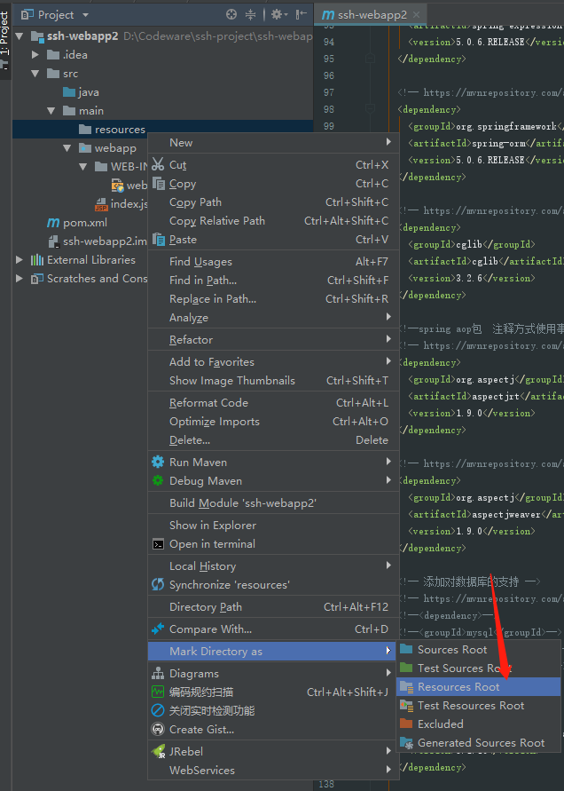

8.在resources中创建jdbc.properties,如下图：

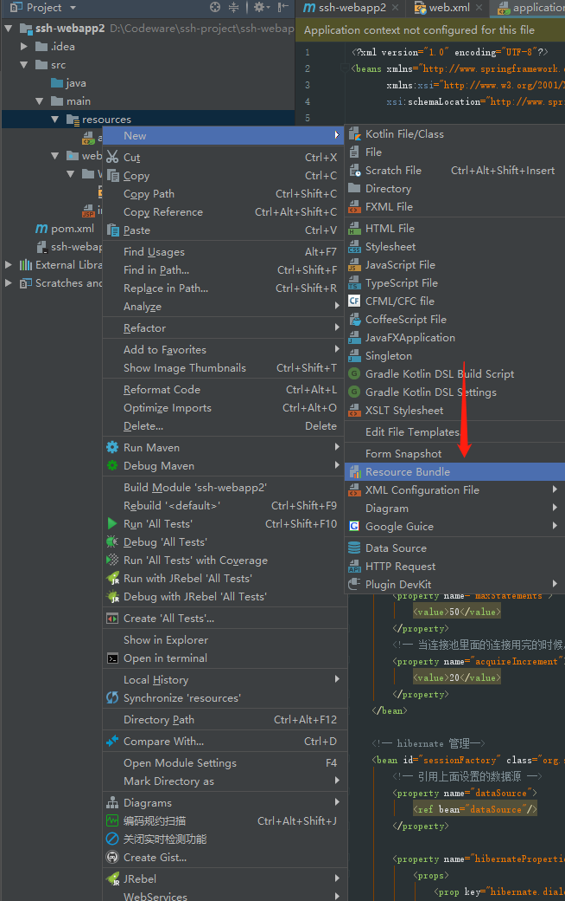

9.在resources中创建jdbc.properties,如下图：

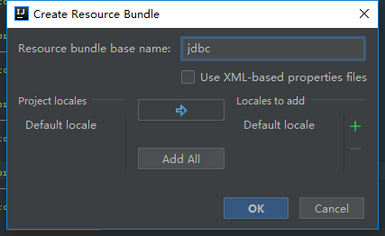

10.在resource中创建applicationContext.xml，代码如下：

```
	<?xml version="1.0" encoding="UTF-8"?>
	<beans xmlns="http://www.springframework.org/schema/beans"
	       xmlns:xsi="http://www.w3.org/2001/XMLSchema-instance" xmlns:tx="http://www.springframework.org/schema/tx"
	       xmlns:context="http://www.springframework.org/schema/context"
	       xsi:schemaLocation="http://www.springframework.org/schema/beans http://www.springframework.org/schema/beans/spring-beans.xsd http://www.springframework.org/schema/tx http://www.springframework.org/schema/tx/spring-tx.xsd http://www.springframework.org/schema/context http://www.springframework.org/schema/context/spring-context.xsd">
	
	    <context:component-scan base-package="com.chanchifeng.action"></context:component-scan>
	    <context:component-scan base-package="com.chanchifeng.service"></context:component-scan>
	    <context:component-scan base-package="com.chanchifeng.dao"></context:component-scan>
	
	    <!--配置使springframwork引入jdbc.properties文件，然后就可以通过${mysql.driverClassName}来得到jdbc.properties文件中对应的值了-->
	    <bean id="propertyConfigurer" class="org.springframework.beans.factory.config.PropertyPlaceholderConfigurer">
	        <property name="location" value="classpath:jdbc.properties"/>
	    </bean>
	
	    <!-- 设置数据源连接字符串 -->
	    <bean id="dataSource" class="com.mchange.v2.c3p0.ComboPooledDataSource">
	        <property name="driverClass" value="${mysql.driverClassName}"></property>
	        <property name="jdbcUrl" value="${mysql.url}"></property>
	        <property name="user" value="${mysql.username}"></property>
	        <property name="password" value="${mysql.password}"></property>
	        <!-- 设置数据库连接池的最大连接数 -->
	        <property name="maxPoolSize">
	            <value>50</value>
	        </property>
	        <!-- 设置数据库连接池的最小连接数 -->
	        <property name="minPoolSize">
	            <value>5</value>
	        </property>
	        <!-- 设置数据库连接池的初始化连接数 -->
	        <property name="initialPoolSize">
	            <value>5</value>
	        </property>
	        <!-- 设置数据库连接池的连接最大空闲时间 -->
	        <property name="maxIdleTime">
	            <value>20</value>
	        </property>
	        <!-- c3p0缓存Statement的数量数 -->
	        <property name="maxStatements">
	            <value>50</value>
	        </property>
	        <!-- 当连接池里面的连接用完的时候,C3P0一下获取新的连接数 -->
	        <property name="acquireIncrement">
	            <value>20</value>
	        </property>
	    </bean>
	
	    <!-- hibernate 管理-->
	    <bean id="sessionFactory" class="org.springframework.orm.hibernate5.LocalSessionFactoryBean">
	        <!-- 引用上面设置的数据源 -->
	        <property name="dataSource">
	            <ref bean="dataSource"/>
	        </property>
	
	        <property name="hibernateProperties">
	            <props>
	                <prop key="hibernate.dialect">org.hibernate.dialect.MySQLDialect</prop>
	                <prop key="hibernate.autoReconnect">true</prop>
	                <prop key="hibernate.connection.autocommit">true</prop>
	                <prop key="hibernate.hbm2ddl.auto">update</prop>
	                <prop key="hibernate.show_sql">true</prop>
	                <prop key="hibernate.format_sql">true</prop>
	                <!-- 解决session关闭问题 -->
	                <prop key="hibernate.enable_lazy_load_no_trans">true</prop>
	                <!-- spring 和 hibernate 整合的时候默认就是使用线程的，下面这一行不用写，写了反而要报错，此外 sessionFaction，不能使用openSession
	                 既不能保存数据到数据库，还不能实现事务功能
	                 -->
	                <!--<prop key="current_session_context_class">thread</prop>-->
	
	                <prop key="hibernate.max_fetch_depth">3</prop>
	                <!--<prop key="hibernate.connection.url" >jdbc:mysql://localhost:3306/webapp</prop>-->
	                <prop key="hibernate.connection.url" >jdbc:mysql://localhost:3306/webapp</prop>
	                <!--<prop key="hibernate.connection.driver_class">com.mysql.jdbc.Driver</prop>-->
	                <prop key="hibernate.connection.driver_class">com.mysql.jdbc.Driver</prop>
	            </props>
	        </property>
	
	    </bean>
	
	    <!-- 用注解来实现事物管理 -->
	    <bean id="txManager" class="org.springframework.orm.hibernate5.HibernateTransactionManager">
	        <property name="sessionFactory" ref="sessionFactory"/>
	    </bean>
	
	    <tx:annotation-driven transaction-manager="txManager"/>
	
	</beans>

```

11.在resource中创建struts.xml，代码如下，如下图：

```
	<?xml version="1.0" encoding="UTF-8"?>

	<!DOCTYPE struts PUBLIC
	        "-//Apache Software Foundation//DTD Struts Configuration 2.5//EN"
	        "http://struts.apache.org/dtds/struts-2.5.dtd">
	
	<struts>
	
	    <!-- 修改常量管理struts 中的action的工程，这个常量的使用，必须引入 spring和struts的整合包，不然spring无法管理struts2 Action 中的实体类-->
	    <constant name="struts.objectFactory" value="spring" />
	
	    <package name="employee" extends="struts-default" namespace="/">
	        <action name="employee_*" class="employeeAction" method="{1}">
	            <result name="success">/index.jsp</result>
	            <allowed-methods>m1,saveUser</allowed-methods><!-- struts 2.5 之后，使用通配符必须加上这一行 ，否则无法使用通配符访问-->
	        </action>
	    </package>
	
	</struts>

```

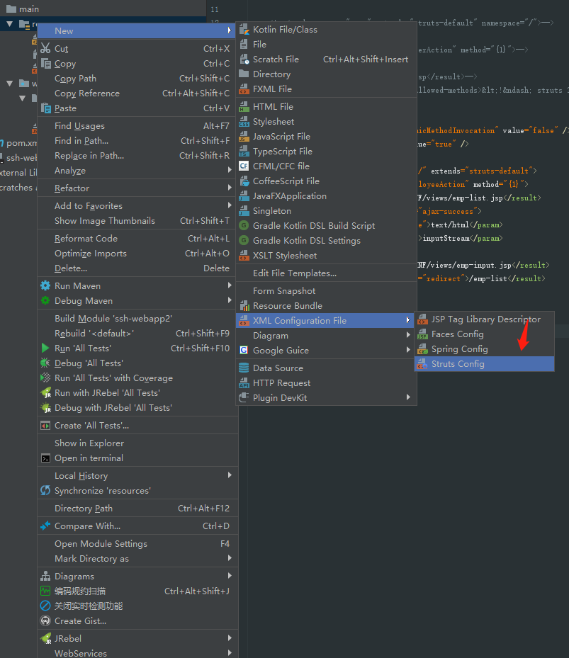

12.在java中，创建com.chanchifeng.action.EmployeeAction的java文件,代码如下：

```
	@Controller("employeeAction")
	@Scope("prototype")
	public class EmployeeAction extends ActionSupport {
	
	    private Employee employee;
	
	    @Resource
	    private EmployeeService employeeService;
	
	    public Employee getEmployee(){
	        return employee;
	    }
	
	    public String m1(){
	        System.out.println("in this");
	        employee = employeeService.getEmployee(1);
	        System.out.println(employee);
	        return SUCCESS;
	    }
	
	    public String saveEmployee(){
	        Employee employee = new Employee();
	        employee.setLastName("porschan");
	        employeeService.saveEmployee(employee);
	        return SUCCESS;
	    }
	
	}

```

13.在java中，创建com.chanchifeng.dao.impl.EmployeeDaoImpl的java文件，代码如下：

```
	@Repository("employeeDao")
	public class EmployeeDaoImpl implements EmployeeDao {
	
	    @Resource(name="sessionFactory")
	    private SessionFactory sessionFactory;
	
	    @Override
	    public Employee getEmployee(Integer id) {
	        Session session=sessionFactory.getCurrentSession();
	        return session.get(Employee.class,id);
	    }
	
	    @Override
	    public void saveEmployee(Employee employee) {
	        Session session=sessionFactory.getCurrentSession();
	        session.save(employee);
	        System.out.println("======="+employee.getLastName());
	    }
	}

```

14.在java中，创建com.chanchifeng.dao.EmployeeDao的java文件，代码如下：

```
	public interface EmployeeDao {
	    /**
	     *
	     * 获取雇员信息
	     *
	     * @param id
	     * @return
	     */
	    Employee getEmployee(Integer id);
	
	    /**
	     * 保存雇员信息
	     *
	     * @param employee
	     */
	    void saveEmployee(Employee employee);
	}

```

15.在java中，创建com.chanchifeng.model的包，代码如下：


16.在java中，创建com.chanchifeng.service.impl.EmployeeServiceImpl的java文件，代码如下：

```
	@Service("employeeService")
	public class EmployeeServiceImpl implements EmployeeService {
	
	    @Resource
	    private EmployeeDao employeeDao;
	
	    @Transactional(rollbackFor = {Exception.class,RuntimeException.class})
	    @Override
	    public Employee getEmployee(Integer id) {
	        return employeeDao.getEmployee(id);
	    }
	
	
	    @Transactional(rollbackFor = {Exception.class,RuntimeException.class})
	    @Override
	    public void saveEmployee(Employee employee) {
	        employeeDao.saveEmployee(employee);
	    }
	}

```

17.在java中，创建com.chanchifeng.service.EmployeeService的java文件，代码如下：

```
	public interface EmployeeService {
	    Employee getEmployee(Integer id);
	    void saveEmployee(Employee employee);
	}

```

18.创建Mysql的数据库，代码如下：

```
	CREATE DATABASE webapp;

	DROP TABLE IF EXISTS `department`;
	CREATE TABLE `department`  (
	  `id` int(11) NOT NULL AUTO_INCREMENT,
	  `departmentName` varchar(255) CHARACTER SET utf8 COLLATE utf8_general_ci NULL DEFAULT NULL,
	  PRIMARY KEY (`id`) USING BTREE
	)

	DROP TABLE IF EXISTS `employee`;
	CREATE TABLE `employee`  (
	  `id` int(11) NOT NULL AUTO_INCREMENT,
	  `lastName` varchar(255) CHARACTER SET utf8 COLLATE utf8_general_ci NULL DEFAULT NULL,
	  `email` varchar(255) CHARACTER SET utf8 COLLATE utf8_general_ci NULL DEFAULT NULL,
	  `birth` timestamp(0) NULL DEFAULT NULL,
	  `createTime` timestamp(0) NULL DEFAULT NULL,
	  `department_id` int(11) NULL DEFAULT NULL,
	  PRIMARY KEY (`id`) USING BTREE,
	  INDEX `FKbejtwvg9bxus2mffsm3swj3u9`(`department_id`) USING BTREE,
	  CONSTRAINT `FKbejtwvg9bxus2mffsm3swj3u9` FOREIGN KEY (`department_id`) REFERENCES `department` (`id`) ON DELETE RESTRICT ON UPDATE RESTRICT
	)

```

19.配置idea中的数据库信息，如下图：

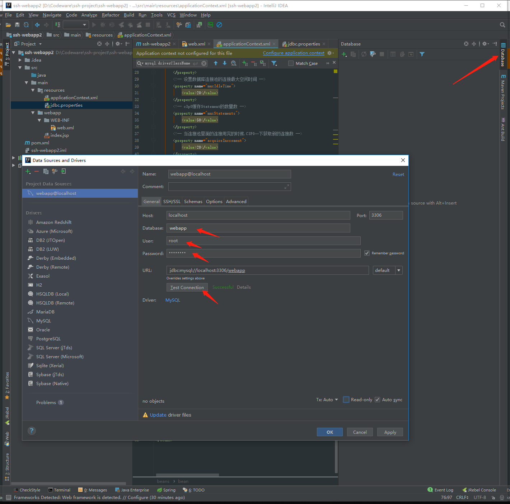

20.选择项目，点击键盘F4,弹出Project Structure，在Modules中，选择+，选择Hibernate,如下图：

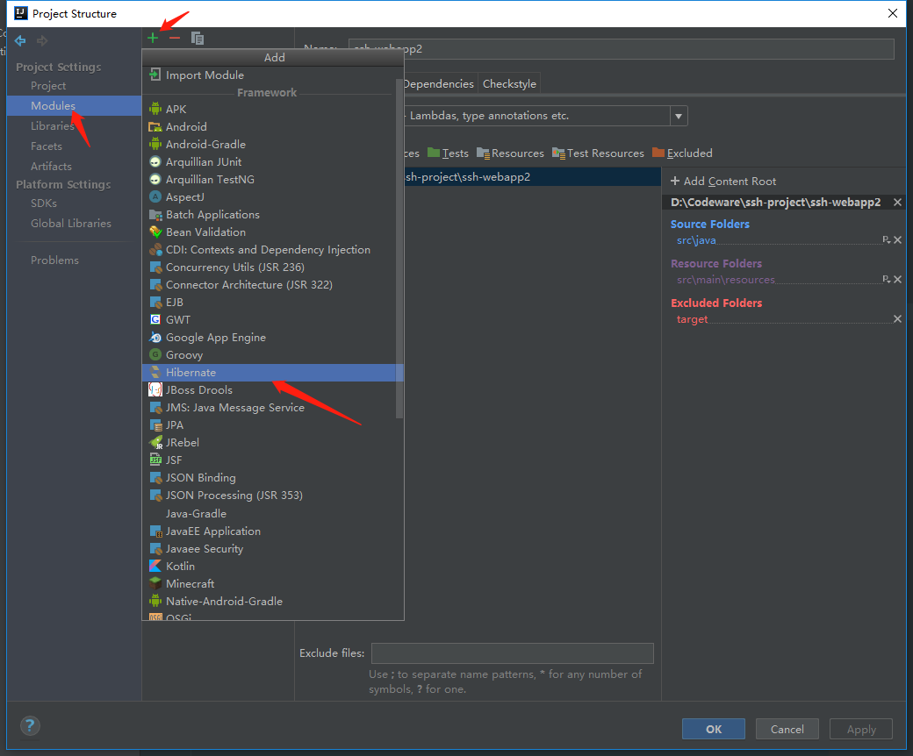

21.在弹出Project Structure，在Modules中，选择Spring，点击+号的按钮,如下图：

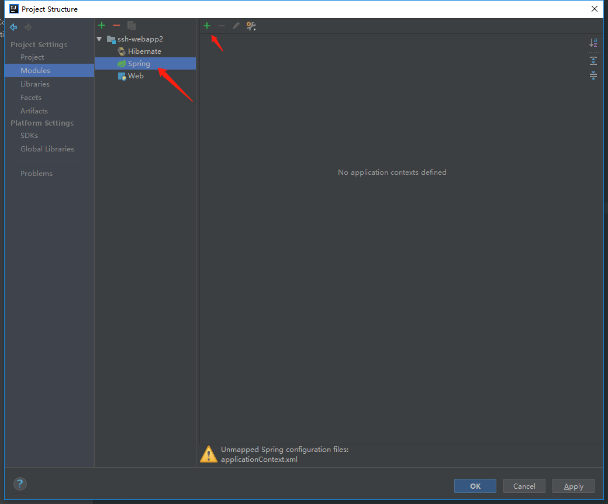

22.勾选applicationContext.xml文件，如下图：

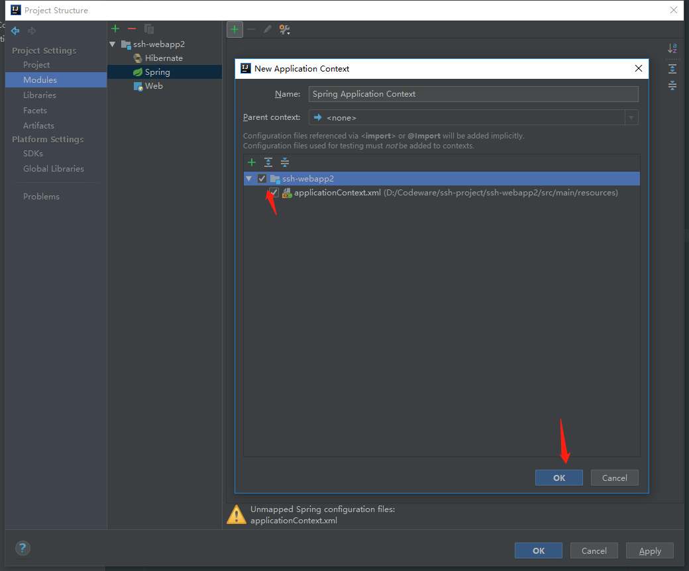

23.点击idea左侧的Persistence,如下图：

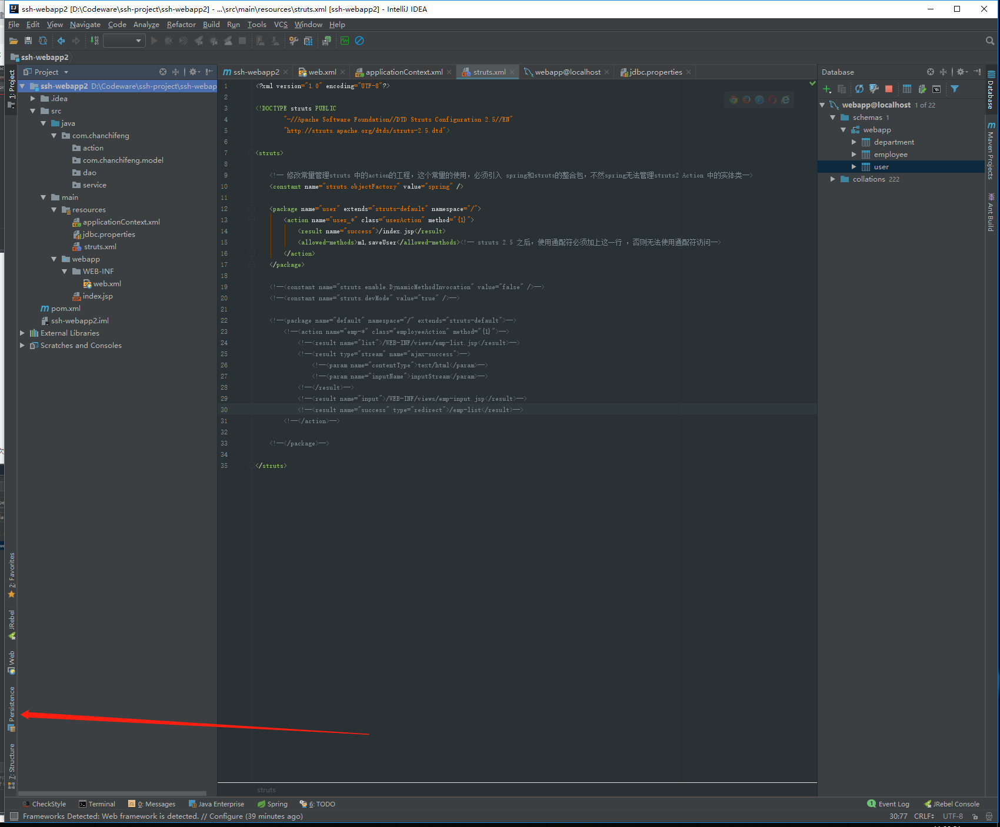

24.选中ssh webapp2，右击，选择Generate Persistence Mapping 的By Database Schema，如下图：

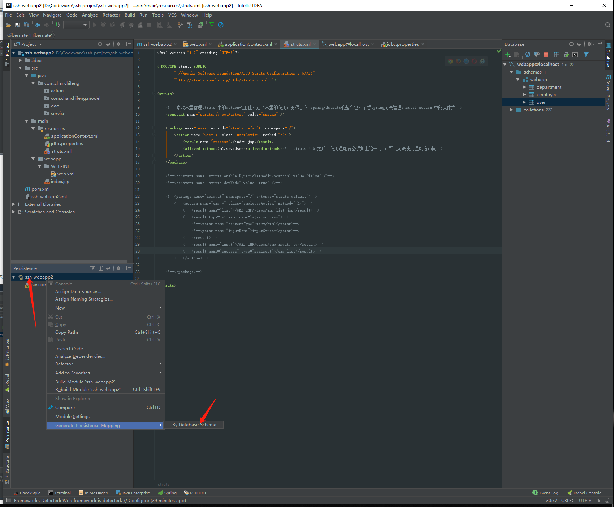

25.配置Hibernate对应model的信息，如下图：

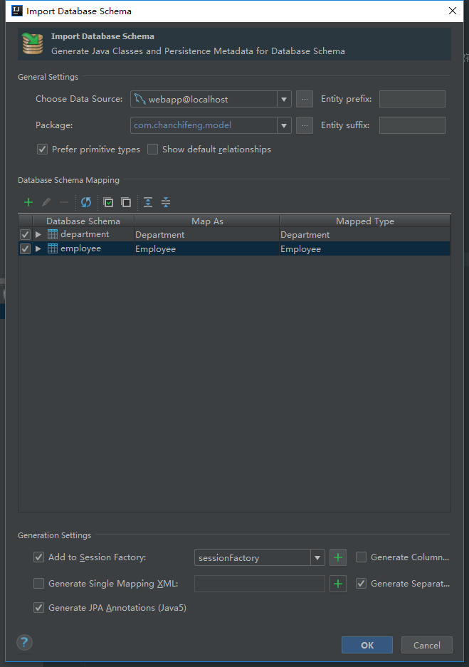

26.点击确认，如下图：

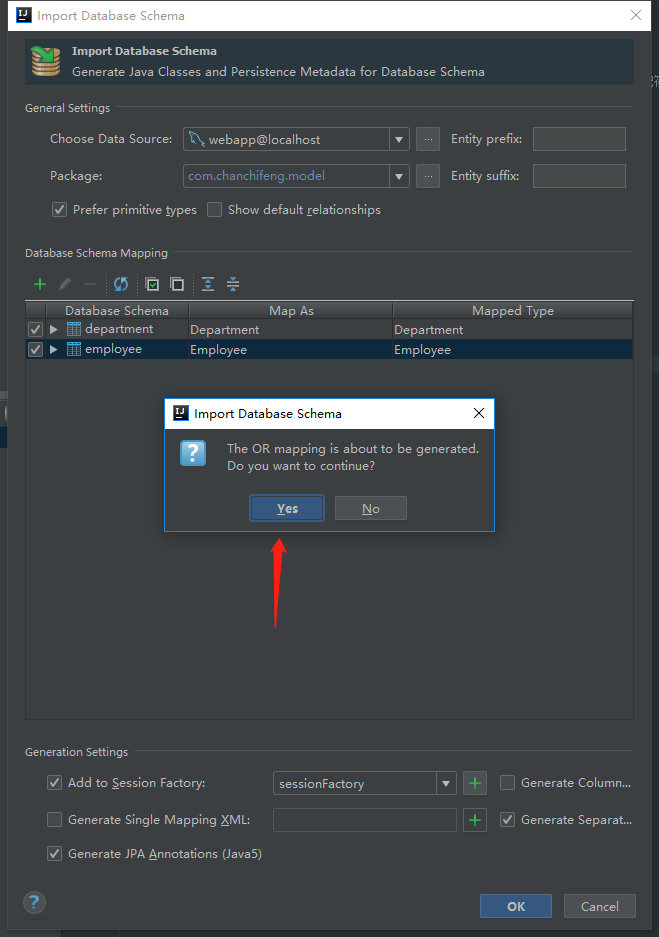

27.生成完毕，可以见如下图，出现hibernate映射的model和applicationContext.xml多了property的配置，如下图：

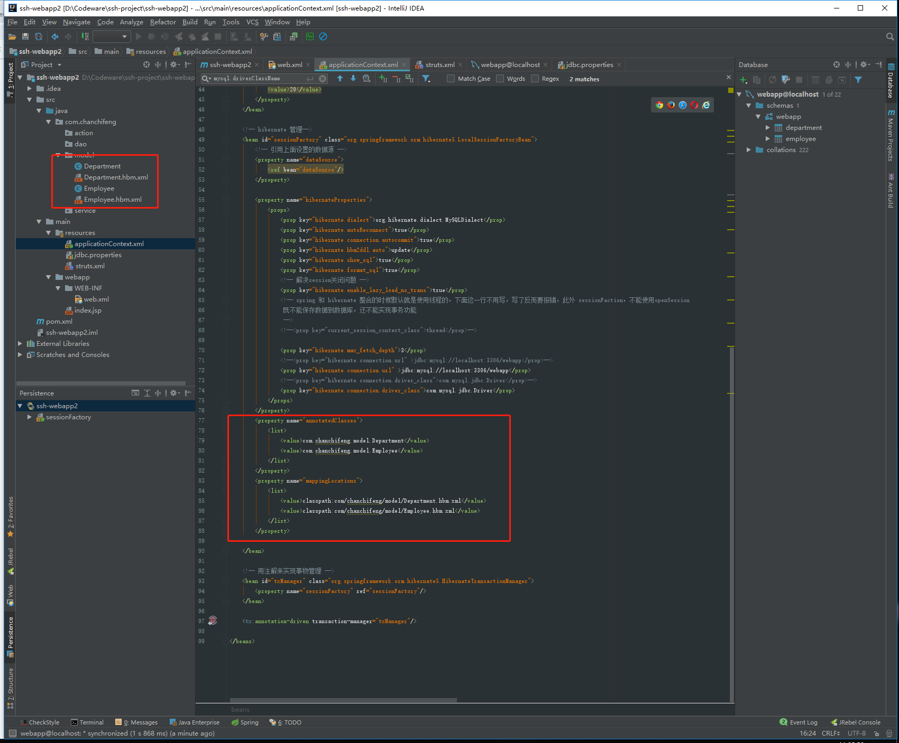

28.配置Tomcat，如下图：

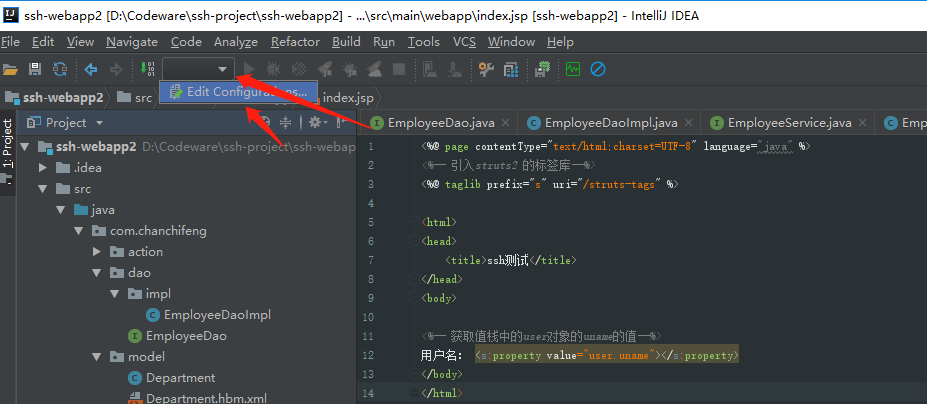

29.点击+号，选择Tomcat Server ，选择Local，如下图：

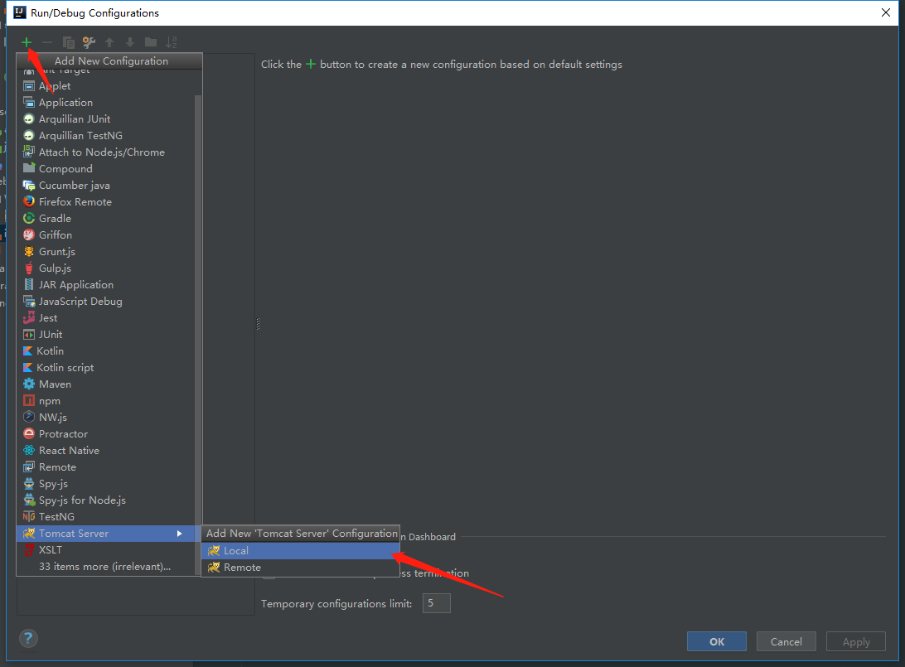

30.在Deployment中点击+号，选择ssh-webapp2:war，如下图：

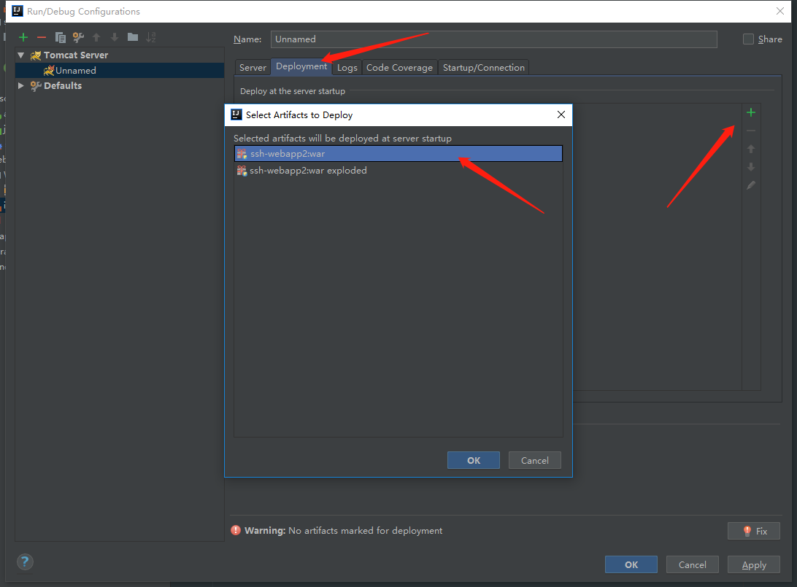

31.运行项目，在浏览器中输入：http://localhost:8080/ssh-webapp/employee_m1，如下图：

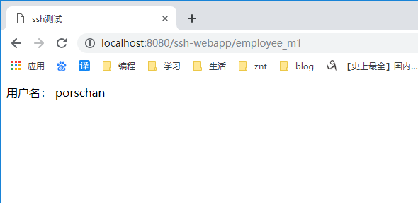