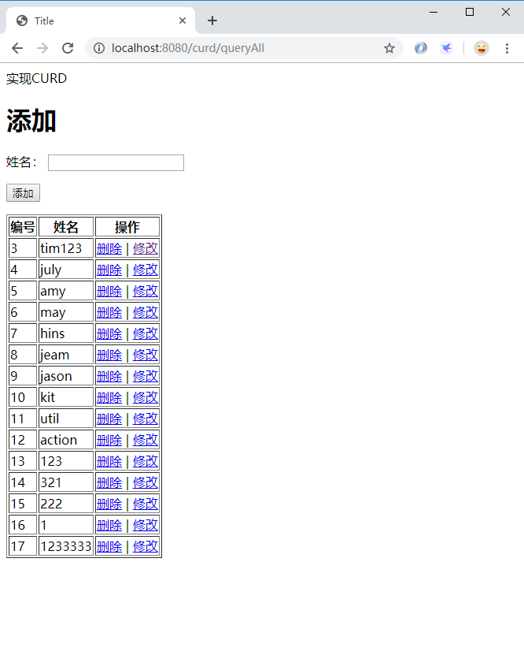

> 以下例子参考了话森林：[SSH（Spring+Struts+Hibernate）实现的简单CRUD案例](https://www.cnblogs.com/huasonglin/p/8316785.html)

> 项目的搭建以在上节完成：[使用 IDEA 中创建 Struts-Spring-Hibernate 的 web 项目](https://chanchifeng.com/2019/05/18/struts-spring-hibernate-demo/)

1.我们需要提前准备jquery和layer。

> jquery-3.4.1.min.js：[jquery-3.4.1.min.js](https://jquery.com/download/)
> layer：[layer](http://res.layui.com/static/download/layer/layer-v3.1.1.zip)

2.在webapp下，创建static文件夹，在其下放置上面的layer和jquery。

3.在WEB-INF中创建curd文件夹，在文件夹里创建index.jsp和update.jsp，index.jsp代码如下：

```html
<%@ page import="com.chanchifeng.model.User" %>
<%@ page import="java.util.List" %><%--
  Created by IntelliJ IDEA.
  User: porschan
  Date: 2019/5/19
  Time: 22:54
  To change this template use File | Settings | File Templates.
--%>
<%@ page contentType="text/html;charset=UTF-8" language="java" %>
<html>
<head>
    <title>Title</title>
</head>
<body>
实现CURD

<h1>添加</h1>
<form action="add.action" method="post">
    <p>
        <label>姓名：</label>
        <input type="text" name="uname" id="name"/>
    </p>
    <p>
        <input type="submit" value="添加">
    </p>
</form>

<table border="1">
    <tr>
        <th>编号</th>
        <th>姓名</th>
        <th>操作</th>
    </tr>
    <%
        for(User user:(List<User>) request.getAttribute("users")){
    %>

    <tr>
        <td><%= user.getUid()%></td>
        <td><%= user.getUname()%></td>
        <td>
            <a href="delete.action?uid=<%= user.getUid()%>">删除</a> |
            <a href="queryById.action?uid=<%= user.getUid()%>">修改</a>
        </td>
    </tr>

    <%
        }
    %>
</table>
</body>
</html>
```
4.update.jsp：

```html
<%@ page import="com.chanchifeng.model.User" %><%--
  Created by IntelliJ IDEA.
  User: porschan
  Date: 2019/5/19
  Time: 23:47
  To change this template use File | Settings | File Templates.
--%>
<%@ page contentType="text/html;charset=UTF-8" language="java" %>
<html>
<head>
    <title>update</title>
</head>
<body>
<form action="update.action" method="post">
    <%
        User user = (User) request.getAttribute("user");
    %>
    <p>
        <label>姓名：</label>
        <input type="text" name="uname" value="<%= user.getUname()%>" id="name"/>
    </p>
    <p>
        <input type="hidden" name="uid" value="<%= user.getUid()%>" id="id"/>
        <input type="submit" value="修改">
    </p>
</form>
</body>
</html>
```

5.修改在webapp下的index.jsp:

```html
<%@ page contentType="text/html;charset=UTF-8" language="java" %>
<%-- 引入struts2 的标签库--%>

<%@ taglib prefix="s" uri="/struts-tags" %>

<html>
<head>
    <title>ssh测试</title>
    <script src="${pageContext.request.contextPath}/static/javascript/jquery-3.4.1.min.js"></script><!-- 你必须先引入jQuery1.8或以上版本 -->
    <script src="${pageContext.request.contextPath}/static/common/layer/layer.js"></script>

</head>
<body>

${pageContext.request.contextPath}

<%-- 获取值栈中的user对象的uname的值--%>
用户名1： <s:property value="user.uname"></s:property>

<button id="test1">test</button>

<a href="curd" class="layui-btn">CURD</a>

<script>

</script>

</body>
</html>
```

6.编写struts.xml:

```xml
<?xml version="1.0" encoding="UTF-8"?>

<!DOCTYPE struts PUBLIC
        "-//Apache Software Foundation//DTD Struts Configuration 2.5//EN"
        "http://struts.apache.org/dtds/struts-2.5.dtd">

<struts>

    <!-- 修改常量管理struts 中的action的工程，这个常量的使用，必须引入 spring和struts的整合包，不然spring无法管理struts2 Action 中的实体类-->
    <constant name="struts.objectFactory" value="spring" />

    <package name="employee" extends="struts-default" namespace="/">
        <action name="user_*" class="userAction" method="{1}">
            <result name="success">/index.jsp</result>
            <allowed-methods>m1,saveUser</allowed-methods><!-- struts 2.5 之后，使用通配符必须加上这一行 ，否则无法使用通配符访问-->
        </action>
    </package>

    <package name="curd" extends="struts-default">
        <action name="add" class="curdAction" method="add">
            <result name="success" type="redirectAction">queryAll</result>
        </action>
        <action name="queryAll" class="curdAction" method="queryAll">
            <result name="success" type="dispatcher">/WEB-INF/curd/index.jsp</result>
        </action>
        <action name="delete" class="curdAction" method="delete">
            <result name="success" type="redirectAction">queryAll</result>
        </action>
        <action name="queryById" class="curdAction" method="queryById">
            <result name="success" type="dispatcher">/WEB-INF/curd/update.jsp</result>
        </action>
        <action name="update" class="curdAction" method="update">
            <result name="success" type="redirectAction">queryAll</result>
        </action>
    </package>

    <!-- 允许访问静态文件 -->
    <constant name="struts.action.excludePattern" value="/static/.*?"></constant>
    
</struts>
```

7.新增action，命名为CurdAction:

```java
import com.chanchifeng.model.User;
import com.chanchifeng.service.UserService;
import org.apache.struts2.ServletActionContext;
import org.springframework.context.annotation.Scope;
import org.springframework.stereotype.Controller;

import javax.annotation.Resource;
import javax.servlet.http.HttpServletRequest;
import java.util.List;

import static com.opensymphony.xwork2.Action.SUCCESS;

@Controller("curdAction")
@Scope("prototype")
public class CurdAction {

    private Integer uid;
    private String uname;

    private User user;

    public User getUser() {
        return user;
    }

    public void setUser(User user) {
        this.user = user;
    }

    public Integer getUid() {
        return uid;
    }

    public void setUid(Integer uid) {
        this.uid = uid;
    }

    public String getUname() {
        return uname;
    }

    public void setUname(String uname) {
        this.uname = uname;
    }

    public UserService getUserService() {
        return userService;
    }

    public void setUserService(UserService userService) {
        this.userService = userService;
    }

    @Resource
    private UserService userService;

    public String queryAll(){
        System.out.println("queryAll");
        List<User> users = userService.queryAll();
        HttpServletRequest httpServletRequest = ServletActionContext.getRequest();
        httpServletRequest.setAttribute("users",users);
        return SUCCESS;
    }

    public String delete(){
        userService.delete(uid);
        System.out.println("删除的uid:" + uid);
        return SUCCESS;
    }

    public String queryById(){
        User user = userService.queryById(uid);
        HttpServletRequest httpServletRequest = ServletActionContext.getRequest();
        httpServletRequest.setAttribute("user",user);
        return "success";
    }

    public String update(){
        user = new User();
        user.setUid(uid);
        user.setUname(uname);
        userService.update(user);
        return "success";
    }

    public String add(){
        user = new User();
        user.setUname(uname);
        System.out.println(user.toString() + "!!");
        userService.addUser(user);
        return "success";
    }

}
```

8.新增dao接口，命名为UserDao：

```java
import com.chanchifeng.model.User;

import java.util.List;

public interface UserDao {
    User getUser(Integer uid);
    void saveUser(User user);

    /*START CURD*/

    /**
     * 添加
     * @param user
     */
    void addUser(User user);


    /**
     * 查询全部
     * @return
     */
    List<User> queryAll();

    /**
     * 根据编号删除
     * @param id
     */
    void delete(int id);

    /**
     * 根据编号查询
     * @param id
     * @return
     */
    User queryById(int id);

    /**
     * 修改
     * @param user
     */
    void update(User user);

    /*END CURD*/

}
```

9.实现UserDao接口，命名为UserDaoImpl：

```java
import com.chanchifeng.dao.UserDao;
import com.chanchifeng.model.User;
import org.hibernate.Session;
import org.hibernate.SessionFactory;
import org.springframework.stereotype.Repository;

import javax.annotation.Resource;
import java.util.List;

@Repository("userDao")
public class UserDaoImpl implements UserDao {


    @Resource(name="sessionFactory")
    private SessionFactory sessionFactory;

    @Override
    public User getUser(Integer uid){
        Session session=sessionFactory.getCurrentSession();
        //当getCurrentSession所在的方法，或者调用该方法的方法绑定了事务之后，session就与当前线程绑定了，也就能通过currentSession来获取，否则就不能。
        User user=session.get(User.class,uid);
        return user;
    }

    @Override
    public void saveUser(User user){
        Session session=sessionFactory.getCurrentSession();
        session.save(user);
        System.out.println("======="+user.getUname());
        //使用getCurrentSession后，hibernate 自己维护session的关闭，写了反而会报错
    }

    /*START CURD*/

    /**
     * 增加数据
     * @param user
     */
    @Override
    public void addUser(User user) {
        Session session = sessionFactory.getCurrentSession();
//        Transaction transaction = session.beginTransaction();
        session.save(user);
//        transaction.commit();
//        session.close();
    }

    /**
     * 查询全部数据
     * @return
     */

    @Override
    public List<User> queryAll() {
        Session session = sessionFactory.getCurrentSession();
        List users = session.createQuery("FROM User").list();
        return users;
    }

    /**
     * 根据编号删除
     * @param id
     */
    @Override
    public void delete(int id) {
        Session session = sessionFactory.getCurrentSession();
        session.delete(session.get(User.class,id));
    }

    /**
     * 根据编号查询
     * @param id
     * @return
     */
    @Override
    public User queryById(int id) {
        Session session = sessionFactory.getCurrentSession();
        User user = session.get(User.class, id);
        return user;
    }

    /**
     * 修改
     * @param user
     */
    @Override
    public void update(User user) {
        Session session = sessionFactory.getCurrentSession();
        session.update(user);
    }

    /*END CURD*/
}
```

10.编写了User:

```java
import javax.persistence.*;

@Entity
public class User {
    private Integer uid;
    private String uname;

    @Id
    @Column(name = "uid")
    @GeneratedValue(strategy = GenerationType.AUTO)
    public Integer getUid() {
        return uid;
    }

    public void setUid(Integer uid) {
        this.uid = uid;
    }

    @Basic
    @Column(name = "uname")
    public String getUname() {
        return uname;
    }

    public void setUname(String uname) {
        this.uname = uname;
    }

    @Override
    public boolean equals(Object o) {
        if (this == o) {
            return true;
        }
        if (o == null || getClass() != o.getClass()) {
            return false;
        }

        User user = (User) o;

        if (uid != null ? !uid.equals(user.uid) : user.uid != null) {
            return false;
        }
        if (uname != null ? !uname.equals(user.uname) : user.uname != null) {
            return false;
        }

        return true;
    }

    @Override
    public int hashCode() {
        int result = uid != null ? uid.hashCode() : 0;
        result = 31 * result + (uname != null ? uname.hashCode() : 0);
        return result;
    }

    @Override
    public String toString() {
        return "User{" +
                "uid=" + uid +
                ", uname='" + uname + '\'' +
                '}';
    }
}
```

11.编写了service的接口，命名为UserService：

```java
import java.util.List;

public interface UserService {
    User getUser(Integer uid);
    void saveUser(User user);

    /*START CURD*/

    void addUser(User user);
    List<User> queryAll();
    void delete(int id);
    User queryById(int id);
    void update(User user);
    /*END CURD*/
}
```

12.实现UserService的接口，命名为UserServiceImpl:

```java
import com.chanchifeng.dao.UserDao;
import com.chanchifeng.model.User;
import com.chanchifeng.service.UserService;
import org.springframework.stereotype.Service;
import org.springframework.transaction.annotation.Transactional;

import javax.annotation.Resource;
import java.util.List;

@Service("userService")
public class UserServiceImpl implements UserService {

    /**
     * 依赖Dao
     */
    @Resource
    private UserDao userDao;

    @Transactional(rollbackFor = {Exception.class, RuntimeException.class})
    @Override
    public User getUser(Integer uid) {
        return userDao.getUser(uid);
    }

    /**
     * 注入事务管理
     * @param user
     */
    @Transactional(rollbackFor = {Exception.class, RuntimeException.class})
    @Override
    public void saveUser(User user) {
        userDao.saveUser(user);
    }

    /*START CURD*/

    @Transactional(rollbackFor = {Exception.class, RuntimeException.class})
    @Override
    public void addUser(User user) {
        userDao.addUser(user);
    }

    @Transactional(readOnly=true)
    @Override
    public List<User> queryAll() {
        return userDao.queryAll();
    }

    @Transactional(rollbackFor = {Exception.class, RuntimeException.class})
    @Override
    public void delete(int id) {
        userDao.delete(id);
    }

    @Transactional(readOnly=true)
    @Override
    public User queryById(int id) {
        return userDao.queryById(id);
    }

    @Transactional(rollbackFor = {Exception.class, RuntimeException.class})
    @Override
    public void update(User user) {
        userDao.update(user);
    }

    /*END CURD*/
}
```

13.启动Tomcat，在浏览器输入：http://localhost:8080/curd/queryAll，一个简单的curd就完成了。



> github：[Struts-Spring-Hibernate/curd](https://github.com/porschan/Struts-Spring-Hibernate)