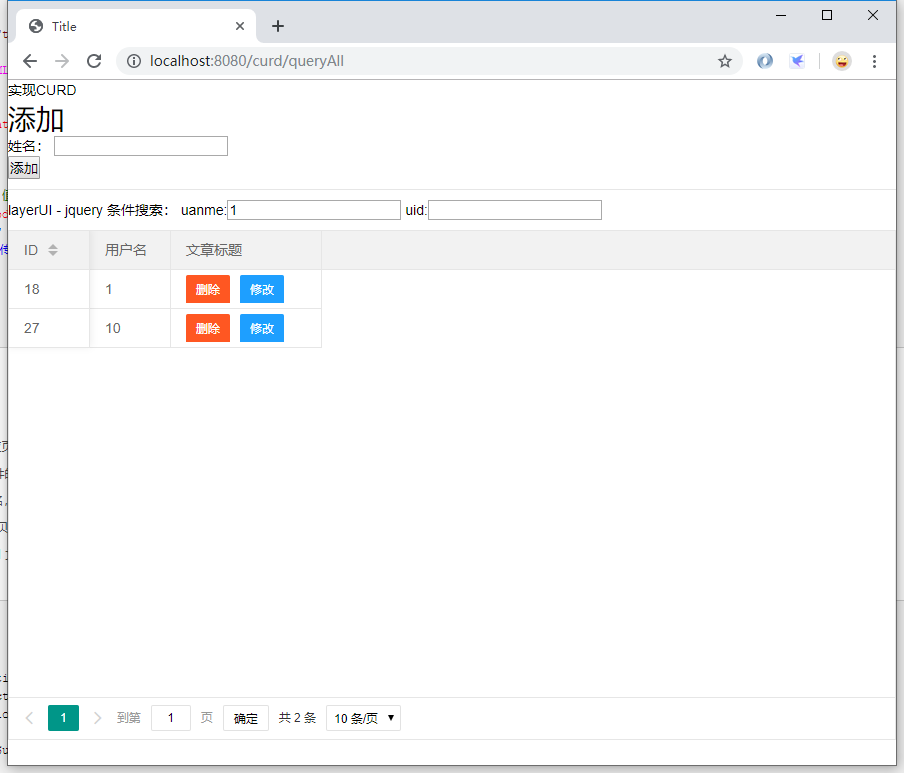
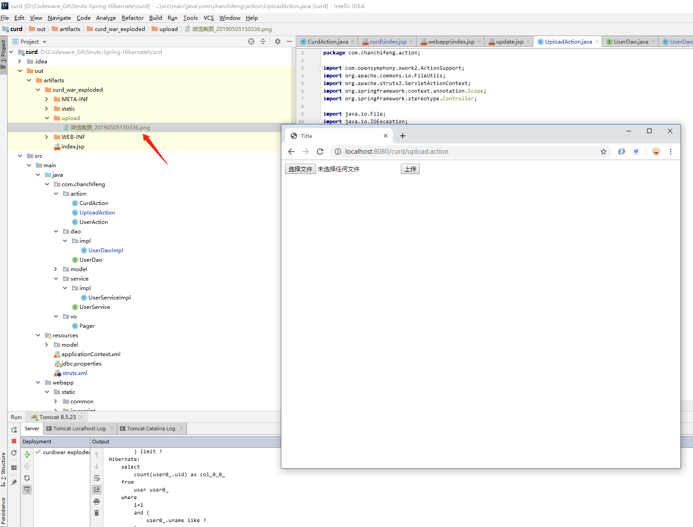

### 模糊搜索 和 分页

> 以下例子主要使用了旭旭同学在csdn上面的例子：[SSH框架下的条件查询及查询结果分页](https://blog.csdn.net/kaka0509/article/details/72597699)

1.先修改struts.xml：

```xml
<?xml version="1.0" encoding="UTF-8"?>

<!DOCTYPE struts PUBLIC
        "-//Apache Software Foundation//DTD Struts Configuration 2.5//EN"
        "http://struts.apache.org/dtds/struts-2.5.dtd">

<struts>

    <!-- 修改常量管理struts 中的action的工程，这个常量的使用，必须引入 spring和struts的整合包，不然spring无法管理struts2 Action 中的实体类-->
    <constant name="struts.objectFactory" value="spring" />

    <package name="employee" extends="struts-default" namespace="/">
        <action name="user_*" class="userAction" method="{1}">
            <result name="success">/index.jsp</result>
            <allowed-methods>m1,saveUser</allowed-methods><!-- struts 2.5 之后，使用通配符必须加上这一行 ，否则无法使用通配符访问-->
        </action>
    </package>

    <package name="curd" extends="struts-default">
        <action name="add" class="curdAction" method="add">
            <result name="success" type="redirectAction">queryAll</result>
        </action>
        <action name="queryAll" class="curdAction" method="queryAll">
            <result name="success" type="dispatcher">/WEB-INF/curd/index.jsp</result>
        </action>
        <action name="delete" class="curdAction" method="delete">
            <result name="success" type="redirectAction">queryAll</result>
        </action>
        <action name="queryById" class="curdAction" method="queryById">
            <result name="success" type="dispatcher">/WEB-INF/curd/update.jsp</result>
        </action>
        <action name="update" class="curdAction" method="update">
            <result name="success" type="redirectAction">queryAll</result>
        </action>

        <action name="curdPage" class="curdAction" method="queryAll">
            <result name="success" type="dispatcher">/WEB-INF/curd/index.jsp</result>
        </action>

        <action name="curd_*" class="curdAction" method="{1}">
<!--            <result name="NONE" type="dispatcher">/WEB-INF/curd/index.jsp</result>-->
            <allowed-methods>findAllJSON</allowed-methods>
        </action>
    </package>

    <package name="file" namespace="/" extends="struts-default">
        <action name="filePage" class="uploadAction" method="filePage">
            <result>/WEB-INF/file/index.jsp</result>
        </action>
        <action name="upload" class="uploadAction" method="execute">
            <result>/WEB-INF/file/index.jsp</result>
        </action>
    </package>

    <!-- 允许访问静态文件 -->
    <constant name="struts.action.excludePattern" value="/static/.*?"></constant>
    
</struts>
```

2.在创建com.chanchifeng.vo包，在该包下创建Page：

```java
import java.io.Serializable;
import java.util.List;

public class Pager<T> implements Serializable {

    private int pageSize; // 每页显示多少条记录

    private int currentPage; //当前第几页数据

    private int totalRecord; // 一共多少条记录

    private int totalPage; // 一共多少页记录

    private List<T> dataList; //要显示的数据

    private int status;

    public int getStatus() {
        return status;
    }

    public void setStatus(int status) {
        this.status = status;
    }

    public Pager(int pageNum, int pageSize, List<T> sourceList){
        if(sourceList == null || sourceList.isEmpty()){
            return;
        }

        // 总记录条数
        this.totalRecord = sourceList.size();

        // 每页显示多少条记录
        this.pageSize = pageSize;

        //获取总页数
        this.totalPage = this.totalRecord / this.pageSize;
        if(this.totalRecord % this.pageSize !=0){
            this.totalPage = this.totalPage + 1;
        }

        // 当前第几页数据
        this.currentPage = this.totalPage < pageNum ?  this.totalPage : pageNum;

        // 起始索引
        int fromIndex   = this.pageSize * (this.currentPage -1);

        // 结束索引
        int toIndex  = this.pageSize * this.currentPage > this.totalRecord ? this.totalRecord : this.pageSize * this.currentPage;

        this.dataList = sourceList.subList(fromIndex, toIndex);
    }

    public Pager(){

    }

    public Pager(int pageSize, int currentPage, int totalRecord, int totalPage,
                 List<T> dataList) {
        super();
        this.pageSize = pageSize;
        this.currentPage = currentPage;
        this.totalRecord = totalRecord;
        this.totalPage = totalPage;
        this.dataList = dataList;
    }

    public int getPageSize() {
        return pageSize;
    }

    public void setPageSize(int pageSize) {
        this.pageSize = pageSize;
    }

    public int getCurrentPage() {
        return currentPage;
    }

    public void setCurrentPage(int currentPage) {
        this.currentPage = currentPage;
    }

    public int getTotalRecord() {
        return totalRecord;
    }

    public void setTotalRecord(int totalRecord) {
        this.totalRecord = totalRecord;
    }

    public int getTotalPage() {
        return totalPage;
    }

    public void setTotalPage(int totalPage) {
        this.totalPage = totalPage;
    }

    public List<T> getDataList() {
        return dataList;
    }

    public void setDataList(List<T> dataList) {
        this.dataList = dataList;
    }

    @Override
    public String toString() {
        return "Pager [pageSize=" + pageSize + ", currentPage=" + currentPage + ", totalRecord=" + totalRecord
                + ", totalPage=" + totalPage + ", dataList=" + dataList + "]";
    }
}
```

3.在UserDao中添加方法：

```java
import com.chanchifeng.model.User;
import com.chanchifeng.vo.Pager;

import java.util.List;

public interface UserDao {
    User getUser(Integer uid);
    void saveUser(User user);

    /*START CURD*/

    /*..........*/

    /*END CURD*/

    /**
     * 根据查询条件，查询商品分页信息
     *
     * @param searchModel
     *            封装查询条件
     * @param pageNum
     *            查询第几页数据
     * @param pageSize
     *            每页显示多少条记录
     * @return 查询结果
     */
    Pager<User> findByPage(User searchModel, int pageNum, int pageSize);

}
```

4.实现在UserDao中的接口方法：

```java
import com.chanchifeng.dao.UserDao;
import com.chanchifeng.model.User;
import com.chanchifeng.vo.Pager;
import org.hibernate.Session;
import org.hibernate.SessionFactory;
import org.hibernate.query.Query;
import org.springframework.stereotype.Repository;

import javax.annotation.Resource;
import java.util.ArrayList;
import java.util.HashMap;
import java.util.List;
import java.util.Map;

@Repository("userDao")
public class UserDaoImpl implements UserDao {


    @Resource(name="sessionFactory")
    private SessionFactory sessionFactory;

    @Override
    public User getUser(Integer uid){
        Session session=sessionFactory.getCurrentSession();
        //当getCurrentSession所在的方法，或者调用该方法的方法绑定了事务之后，session就与当前线程绑定了，也就能通过currentSession来获取，否则就不能。
        User user=session.get(User.class,uid);
        return user;
    }

    @Override
    public void saveUser(User user){
        Session session=sessionFactory.getCurrentSession();
        session.save(user);
        System.out.println("======="+user.getUname());
        //使用getCurrentSession后，hibernate 自己维护session的关闭，写了反而会报错
    }

    /*START CURD*/

    /*..........*/

    /*END CURD*/

    /**
     * 分页
     * @param searchModel
     *            封装查询条件
     * @param pageNum
     *            查询第几页数据
     * @param pageSize
     *            每页显示多少条记录
     * @return
     */


    @Override
    public Pager<User> findByPage(User searchModel, int pageNum, int pageSize) {

        // 声明结果集
        Pager<User> result = null;

        // 存放查询参数
        Map<String, Object> paramMap = new HashMap<String, Object>();

        Integer uid = searchModel.getUid();
        String uname = searchModel.getUname();

        StringBuilder hql = new StringBuilder("FROM User WHERE 1=1");
        StringBuilder countHql = new StringBuilder("SELECT COUNT(uid) FROM User WHERE 1=1 ");


        if (uid != null && !uid.equals("")) {
            hql.append(" AND uid = :uid ");
            countHql.append("  AND uid = :uid ");
            paramMap.put("uid", uid);
        }

        if (uname != null && !uname.equals("")) {
            hql.append(" AND uname LIKE :uname ");
            countHql.append(" AND uname LIKE :uname ");
            paramMap.put("uname", "%" + uname + "%");
        }

        // 起始索引
        int fromIndex = pageSize * (pageNum - 1);

        // 存放所有查询出的商品对象
        List<User> productList = new ArrayList<User>();

        Session session = null;

        // 获取被Spring托管的session
        session = sessionFactory.getCurrentSession();

        // 获取query对象
        Query hqlQuery = session.createQuery(hql.toString());
        Query countHqlQuery = session.createQuery(countHql.toString());

        // 设置查询参数
        setQueryParams(hqlQuery, paramMap);
        setQueryParams(countHqlQuery, paramMap);

        // 从第几条记录开始查询
        hqlQuery.setFirstResult(fromIndex);

        // 一共查询多少条记录
        hqlQuery.setMaxResults(pageSize);

        // 获取查询的结果
        productList = hqlQuery.list();

        // 获取总记录数
        List<?> countResult = countHqlQuery.list();
        int totalRecord = ((Number) countResult.get(0)).intValue();

        // 获取总页数
        int totalPage = totalRecord / pageSize;
        if (totalRecord % pageSize != 0) {
            totalPage++;
        }

        // 组装pager对象
        result = new Pager<User>(pageSize, pageNum, totalRecord, totalPage, productList);

        return result;
    }

    /**
     * 设置查询的参数
     *
     * @param query
     * @param paramMap
     * @return
     */
    private Query setQueryParams(Query query, Map<String, Object> paramMap) {
        if (paramMap != null && !paramMap.isEmpty()) {
            for (Map.Entry<String, Object> param : paramMap.entrySet()) {
                query.setParameter(param.getKey(), param.getValue());
            }
        }
        return query;
    }

}
```

5.在UserService接口中创建一个方法：

```java
import com.chanchifeng.model.User;
import com.chanchifeng.vo.Pager;

import java.util.List;

public interface UserService {
    User getUser(Integer uid);
    void saveUser(User user);

    /*START CURD*/

    /*..........*/

    /*END CURD*/

    /**
     * 根据查询条件，查询商品分页信息
     *
     * @param searchModel
     *            封装查询条件
     * @param pageNum
     *            查询第几页数据
     * @param pageSize
     *            每页显示多少条记录
     * @return 查询结果
     */

    Pager<User> findByPage(User searchModel, int pageNum, int pageSize);
}
```

6.实现UserService中的方法：

```java
import com.chanchifeng.dao.UserDao;
import com.chanchifeng.model.User;
import com.chanchifeng.service.UserService;
import com.chanchifeng.vo.Pager;
import org.springframework.stereotype.Service;
import org.springframework.transaction.annotation.Transactional;

import javax.annotation.Resource;
import java.util.List;

@Service("userService")
public class UserServiceImpl implements UserService {

    /**
     * 依赖Dao
     */
    @Resource
    private UserDao userDao;

    @Transactional(rollbackFor = {Exception.class, RuntimeException.class})
    @Override
    public User getUser(Integer uid) {
        return userDao.getUser(uid);
    }

    /**
     * 注入事务管理
     * @param user
     */
    @Transactional(rollbackFor = {Exception.class, RuntimeException.class})
    @Override
    public void saveUser(User user) {
        userDao.saveUser(user);
    }

    /*START CURD*/

    /*..........*/

    /*END CURD*/

    /**
     * 根据查询条件，查询商品分页信息
     *
     * @param searchModel
     *            封装查询条件
     * @param pageNum
     *            查询第几页数据
     * @param pageSize
     *            每页显示多少条记录
     * @return 查询结果
     */
    @Transactional(readOnly=true)
    @Override
    public Pager<User> findByPage(User searchModel, int pageNum, int pageSize) {
        Pager<User> result = userDao.findByPage(searchModel, pageNum, pageSize);
        return result;
    }
}

```

7.在CurdAction添加findAllJSON方法，如下图：

```java
import com.alibaba.fastjson.JSONObject;
import com.chanchifeng.model.User;
import com.chanchifeng.service.UserService;
import com.chanchifeng.vo.Pager;
import org.apache.struts2.ServletActionContext;
import org.springframework.context.annotation.Scope;
import org.springframework.stereotype.Controller;

import javax.annotation.Resource;
import javax.servlet.http.HttpServletRequest;
import javax.servlet.http.HttpServletResponse;
import java.io.IOException;
import java.io.Writer;
import java.util.List;

import static com.opensymphony.xwork2.Action.SUCCESS;
import static org.apache.struts2.interceptor.MessageStoreInterceptor.NONE;

@Controller("curdAction")
@Scope("prototype")
public class CurdAction {

    private Integer uid;
    private String uname;

    private User user;

    public User getUser() {
        return user;
    }

    public void setUser(User user) {
        this.user = user;
    }

    public Integer getUid() {
        return uid;
    }

    public void setUid(Integer uid) {
        this.uid = uid;
    }

    public String getUname() {
        return uname;
    }

    public void setUname(String uname) {
        this.uname = uname;
    }

    public UserService getUserService() {
        return userService;
    }

    public void setUserService(UserService userService) {
        this.userService = userService;
    }

    @Resource
    private UserService userService;

    public String queryAll(){
        System.out.println("queryAll");
        List<User> users = userService.queryAll();
        HttpServletRequest httpServletRequest = ServletActionContext.getRequest();
        httpServletRequest.setAttribute("users",users);
        return SUCCESS;
    }

    public String delete(){
        userService.delete(uid);
        System.out.println("删除的uid:" + uid);
        return SUCCESS;
    }

    public String queryById(){
        User user = userService.queryById(uid);
        HttpServletRequest httpServletRequest = ServletActionContext.getRequest();
        httpServletRequest.setAttribute("user",user);
        return "success";
    }

    public String update(){
        user = new User();
        user.setUid(uid);
        user.setUname(uname);
        userService.update(user);
        return "success";
    }

    public String add(){
        user = new User();
        user.setUname(uname);
        System.out.println(user.toString() + "!!");
        userService.addUser(user);
        return "success";
    }

    /* 分页 */

    //返回前端的JSON字符串，需要提供get/set方法
    private String responseStr;

    public String getResponseStr() {
        return responseStr;
    }

    public void setResponseStr(String responseStr) {
        this.responseStr = responseStr;
    }

    //方式二：Ajax+JSON
    public String findAllJSON() {

        System.out.println("findAllJson");

        // 使用struts2的servlet接口，接收request里的参数
        // 商品名字参数
        HttpServletRequest request = ServletActionContext.getRequest();
        HttpServletResponse response = ServletActionContext.getResponse();
        String uname = request.getParameter("uname");
        String uidStr = request.getParameter("uid");
        Integer uid = null;
        if(uidStr != null && !"".equals(uidStr.trim())){
            uid = Integer.valueOf(uidStr);
        }
        // 取得页面索引
        String pageNumStr = request.getParameter("page");

        int pageNum = 1; // 默认显示第几页数据
        if (pageNumStr != null && !"".equals(pageNumStr.trim())) {
            pageNum = Integer.parseInt(pageNumStr);
        }

        int pageSize = 5; // 默认每页显示多少条记录
        String pageSizeStr = request.getParameter("limit");
        if (pageSizeStr != null && !"".equals(pageSizeStr.trim())) {
            pageSize = Integer.parseInt(pageSizeStr);
        }

        // 组装模糊查询条件
        User searchModel  = new User();
        searchModel.setUname(uname);
        searchModel.setUid(uid);

        // 调用service 获取查询结果
        Pager<User> result = userService.findByPage(searchModel, pageNum, pageSize);
        // 将查询结果封装成JSON字符串格式

        result.setStatus(0);

        responseStr = JSONObject.toJSONString(result);
        System.out.println(responseStr);
        // 利用response对象传回前端
        response.setHeader("Cache-Control", "no-cache");
        response.setHeader("Pragma", "no-cache");
        response.setDateHeader("Expires", 0);
        response.setContentType("text/html;charset=utf-8");
        try {
            Writer writer = response.getWriter();
            writer.write(responseStr);
            writer.flush();
            writer.close();
        } catch (IOException e) {
            e.printStackTrace();
        }

        return NONE;

//        return responseStr;
    }

}

```

8.重新编辑curd文件夹下的index.jsp

```html
<%@ page import="com.chanchifeng.model.User" %>
<%@ page import="java.util.List" %><%--
  Created by IntelliJ IDEA.
  User: porschan
  Date: 2019/5/19
  Time: 22:54
  To change this template use File | Settings | File Templates.
--%>
<%@ page contentType="text/html;charset=UTF-8" language="java" %>
<html>
<head>
    <title>Title</title>
    <link rel="stylesheet" href="${pageContext.request.contextPath}/static/common/layerui/css/layui.css" media="all">
</head>
<body>
实现CURD

<h1>添加</h1>
<form action="add.action" method="post">
    <p>
        <label>姓名：</label>
        <input type="text" name="uname" id="name"/>
    </p>
    <p>
        <input type="submit" value="添加">
    </p>
</form>

<%--<table border="1">--%>
<%--    <tr>--%>
<%--        <th>编号</th>--%>
<%--        <th>姓名</th>--%>
<%--        <th>操作</th>--%>
<%--    </tr>--%>
<%--    <%--%>
<%--        for(User user:(List<User>) request.getAttribute("users")){--%>
<%--    %>--%>

<%--    <tr>--%>
<%--        <td><%= user.getUid()%></td>--%>
<%--        <td><%= user.getUname()%></td>--%>
<%--        <td>--%>
<%--            <a href="delete.action?uid=<%= user.getUid()%>">删除</a> |--%>
<%--            <a href="queryById.action?uid=<%= user.getUid()%>">修改</a>--%>
<%--        </td>--%>
<%--    </tr>--%>

<%--    <%--%>
<%--        }--%>
<%--    %>--%>
<%--</table>--%>

<hr>
layerUI - jquery

条件搜索：
uanme:<input type="text" id="uname" value="">
uid:<input type="text" id="uid"  value="">

<table id="demo" lay-filter="test"></table>

<script src="${pageContext.request.contextPath}/static/javascript/jquery-3.4.1.min.js"></script><!-- 你必须先引入jQuery1.8或以上版本 -->
<script src="${pageContext.request.contextPath}/static/common/layerui/layui.js"></script>

<script>
    layui.use('table', function(){
        var table = layui.table;

        //第一个实例
        table.render({
            elem: '#demo'
            ,height:510
            ,url: 'curd_findAllJSON' //数据接口
            ,where:{
                uname:$("#uname").val()
                ,uid:$("#uid").val()
            }
            ,response: {
                countName:'totalRecord'
                ,dataName: 'dataList'
                ,statusName: 'status'
            }
            ,page: true //开启分页
            ,limit: 10
            ,cols: [[ //表头
                {field: 'uid', title: 'ID', width:80, sort: true, fixed: 'left'}
                ,{field: 'uname', title: '用户名', width:80}

                ,{field:'title', title: '文章标题', width: 150
                    ,templet: function(d){
                        return '<a class="layui-btn layui-btn-sm layui-btn-danger" href="delete.action?uid=' + d.uid + '">删除</a>' +
                            '<a class="layui-btn layui-btn-sm layui-btn-normal" href="queryById.action?uid=' + d.uid + '">修改</a>'
                    }
                }

                // ,{field: 'sex', title: '性别', width:80, sort: true}
                // ,{field: 'city', title: '城市', width:80}
                // ,{field: 'sign', title: '签名', width: 177}
                // ,{field: 'experience', title: '积分', width: 80, sort: true}
                // ,{field: 'score', title: '评分', width: 80, sort: true}
                // ,{field: 'classify', title: '职业', width: 80}
                // ,{field: 'wealth', title: '财富', width: 135, sort: true}
            ]]
        });

    });
</script>


</body>
</html>
```

9.在浏览器中输入http://localhost:8080/curd/queryAll，运行效果如下：



### 上传文件

> 以下例子主要使用了喜欢凯的蓝在博客园上面的例子：[Struts2 实现文件上传](https://www.cnblogs.com/likailan/p/3330465.html)

a.在curd文件夹内创建update.jsp:

```html
<%@ page import="com.chanchifeng.model.User" %><%--
  Created by IntelliJ IDEA.
  User: porschan
  Date: 2019/5/19
  Time: 23:47
  To change this template use File | Settings | File Templates.
--%>
<%@ page contentType="text/html;charset=UTF-8" language="java" %>
<html>
<head>
    <title>update</title>
</head>
<body>
<form action="update.action" method="post">
    <%
        User user = (User) request.getAttribute("user");
    %>
    <p>
        <label>姓名：</label>
        <input type="text" name="uname" value="<%= user.getUname()%>" id="name"/>
    </p>
    <p>
        <input type="hidden" name="uid" value="<%= user.getUid()%>" id="id"/>
        <input type="submit" value="修改">
    </p>
</form>
</body>
</html>
```

b.在action包中，创建UploadAction:

```java
package com.chanchifeng.action;

import com.opensymphony.xwork2.ActionSupport;
import org.apache.commons.io.FileUtils;
import org.apache.struts2.ServletActionContext;
import org.springframework.context.annotation.Scope;
import org.springframework.stereotype.Controller;

import java.io.File;
import java.io.IOException;

@Controller("uploadAction")
@Scope("prototype")
public class UploadAction extends ActionSupport {

    public String filePage(){
        return SUCCESS;
    }

    private File file;
    private String fileContentType;
    private String fileFileName;

    public File getFile() {
        return file;
    }

    public void setFile(File file) {
        this.file = file;
    }

    public String getFileContentType() {
        return fileContentType;
    }

    public void setFileContentType(String fileContentType) {
        this.fileContentType = fileContentType;
    }

    public String getFileFileName() {
        return fileFileName;
    }

    public void setFileFileName(String fileFileName) {
        this.fileFileName = fileFileName;
    }

    @Override
    public String execute() throws Exception {
        //得到上传文件在服务器的路径加文件名
        String target= ServletActionContext.getServletContext().getRealPath("/upload/"+fileFileName);
        //获得上传的文件
        File targetFile=new File(target);
        //通过struts2提供的FileUtils类拷贝
        try {
            FileUtils.copyFile(file, targetFile);
        } catch (IOException e) {
            e.printStackTrace();
        }
        return SUCCESS;
    }
}
```

9.在浏览器中输入http://localhost:8080/curd/filePage，运行效果如下：



> github：[Struts-Spring-Hibernate/curd](https://github.com/porschan/Struts-Spring-Hibernate)