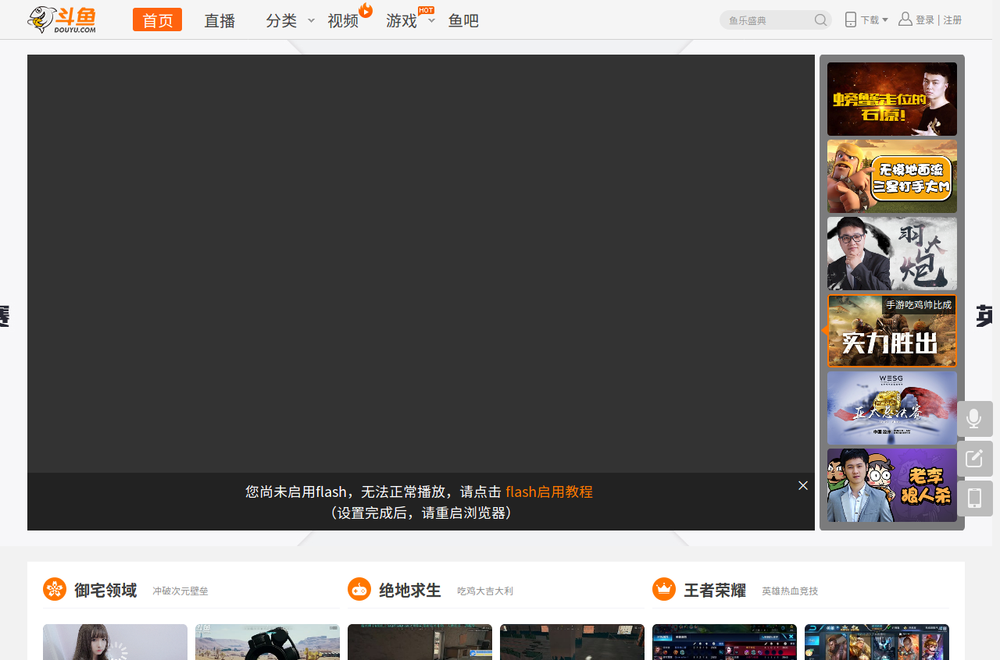
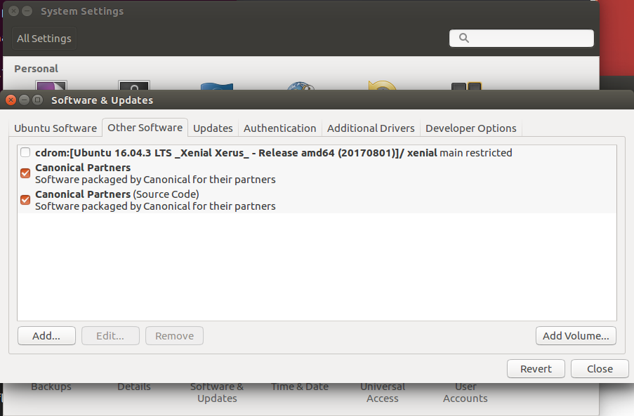
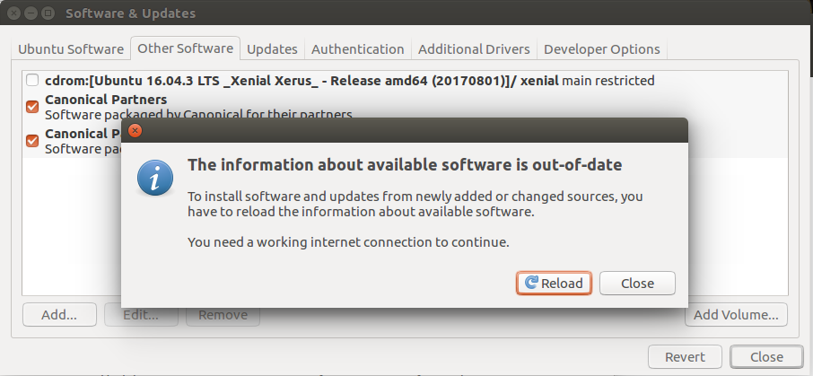
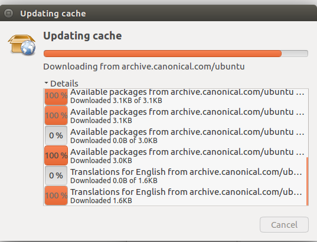
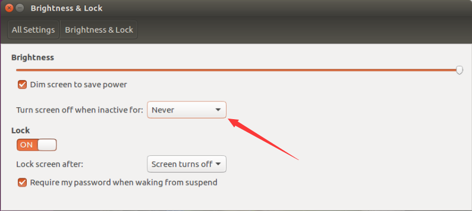

Ubuntu系统的一些技巧，后续会继续补充。

## 安装flash插件，让Firefox浏览器看视频

当你的Ubuntu系统是新安装的时候，flash的插件是未安装的，如下图：

### 设置系统设置

打开左边菜单 System Settings -> Software & Updates -> Other Software

勾选以下选项，勾选前需要输入密码：

点击Close,再点击Reload,等待安装完成及可。

## 关闭自动锁屏

今天发现Ubuntu系统不像windos系统一样，在观看视频（全屏）的时候，Ubuntu居然会自动锁屏，然后我就把他关闭，操作如下：

打开左边菜单 System Settings -> Brightness & Lock 

把上图中红色箭头选项选择Never就从不锁屏，若需要屏幕关闭，这win + L 快捷键锁屏，屏幕就会很快息屏。