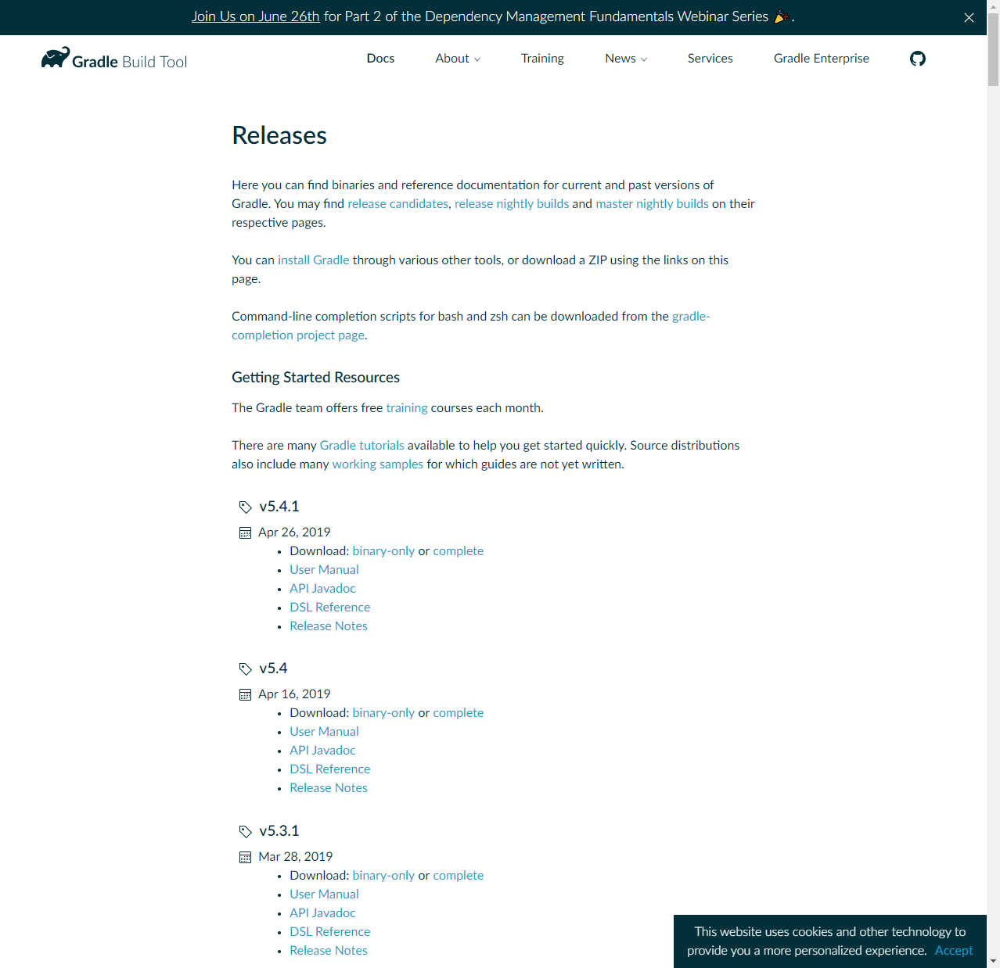
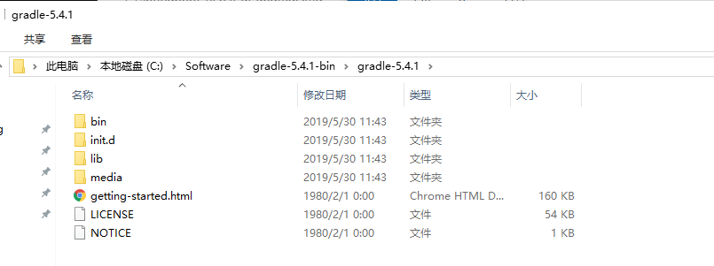
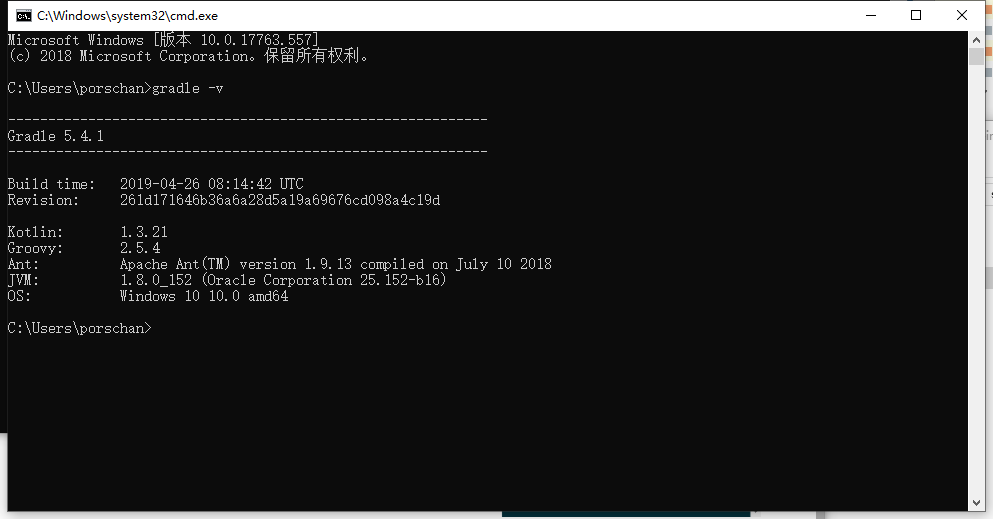
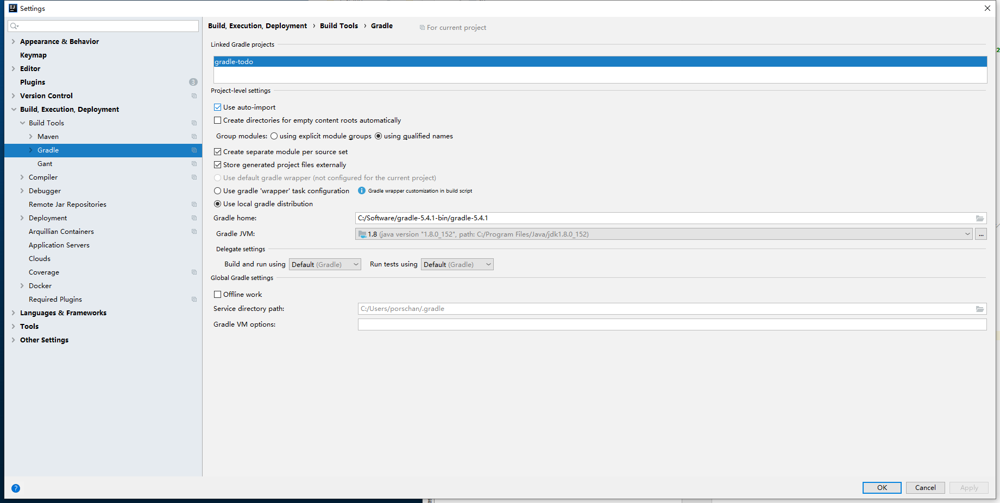

> 访问下载地址[https://gradle.org/releases/](https://gradle.org/releases/)

1.下载zip。



2.解压zip。



3.在windows中设置环境变量。

```
1）系统变量：
变量名：GRADLE_HOME
变量值：C:\Software\gradle-5.4.1-bin\gradle-5.4.1

2）在Path名中追加如下：
%GRADLE_HOME%\bin
```

4.检查，打开cmd:

```
gradle -v
```



5.在IDEA中配置，操作如下：



6.测试代码：

```groovy
plugins {
//    id 'java'
    id 'war'
}

//apply plugins: 'war'

group 'com.chanchifeng.gradle'
version '1.0-SNAPSHOT'

sourceCompatibility = 1.8

repositories {
    mavenLocal()
    mavenCentral()
}

dependencies {
    // https://mvnrepository.com/artifact/ch.qos.logback/logback-classic
    compile group: 'ch.qos.logback', name: 'logback-classic', version: '1.2.3'

    testCompile group: 'junit', name: 'junit', version: '4.12'
}

//编译JAVA文件时采用UTF-8
tasks.withType(JavaCompile) {
    options.encoding = "UTF-8"
}

//def createDir = {
//    path ->
//        File dir = new File(path);
//        if(!dir.exists()){
//            dir.mkdirs();
//        }
//}
//
//task makeJavaDir(){
//    def paths=['src/main/java','src/main/resources','src/test/java','src/test/resources']
//    doFirst{
//        paths.forEach(createDir);
//    }
//}
//
//task makeWebDir(){
//    dependsOn 'makeJavaDir'
//    def paths = ['src/main/webapp','src/test/webapp'];
//    doLast {
//        paths.forEach(createDir)
//    }
//}
```

