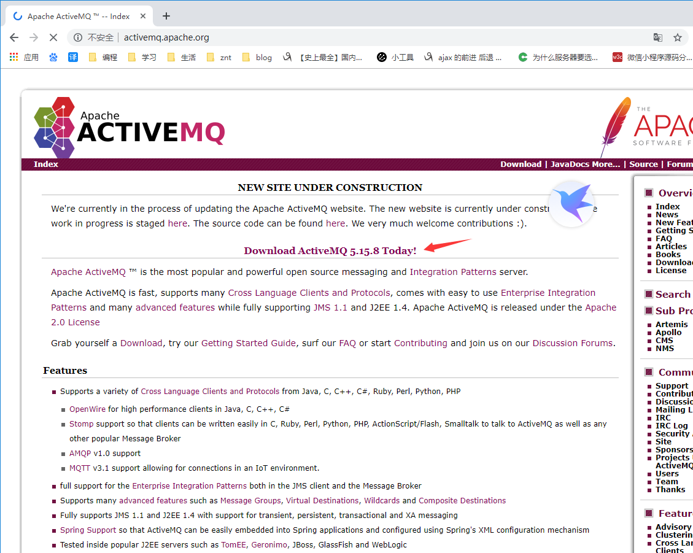
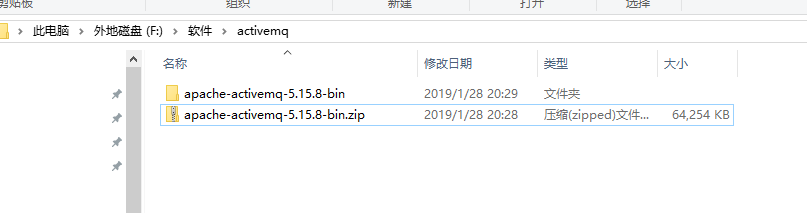
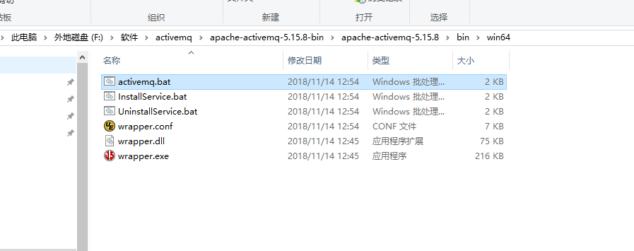
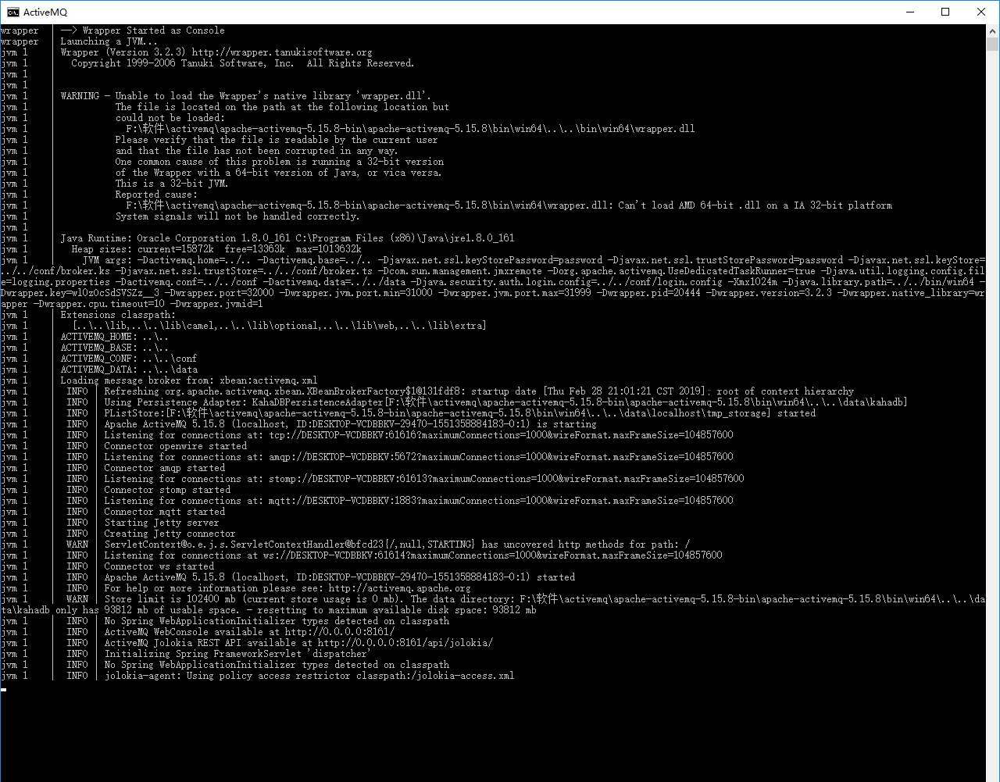
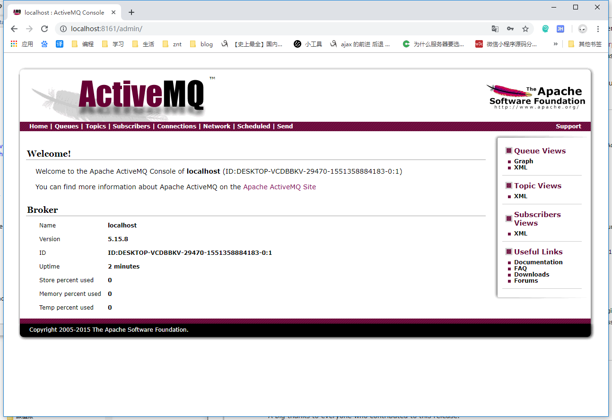

	来历：
				
	自身的特点：
		
	适合解决的问题：
		
	实际的应用场景：
		

1.在浏览器中输入：[http://activemq.apache.org/activemq-5158-release.html](http://activemq.apache.org/activemq-5158-release.html "http://activemq.apache.org/activemq-5158-release.html")

2.如上图，下载apache-activemq-5.15.8-bin.zip并解压，如下图：

3.进入解压文件夹下apache-activemq-5.15.8-bin\apache-activemq-5.15.8\bin\win64，运行activemq.bat，若计算机为32位则启动32位的，如下图：

4.运行成功的，如下图：

5.在浏览器输入http://localhost:8161/admin/，账号为admin，密码为admin，如下图：

	访问地址必须要加上http。
		

