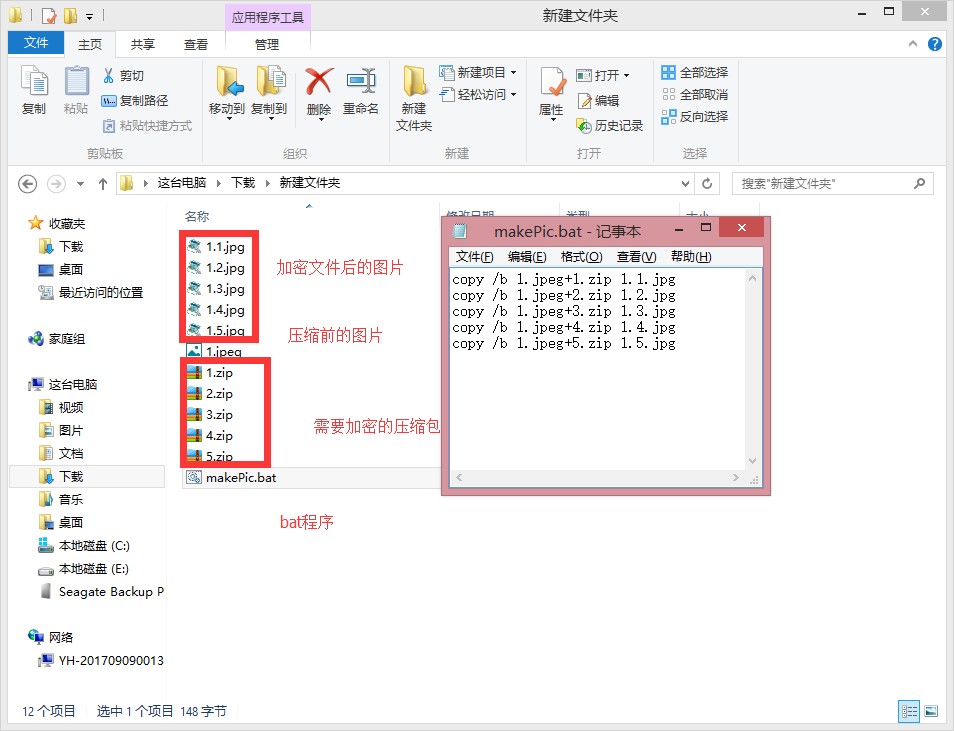

是日常生活中隐藏一些重要的文件的一个好方法。开门见山，看下面。

## 开始

### 阶段一，内容的准备

准备一张图片和需要加密的压缩包（注意，这里的压缩包你可以放入一些自己需要加密，不让别人看到的内容，可以加密码，设置分卷大小）

### 阶段二，bat程序的编写
在一个记事本或者任何一个文本编辑器中写入如下

`
copy /b 1.jpeg+1.zip 1.1.jpg
`

解析：

1.jpeg - 加密后看到的图片（其他图片格式也可以）

1.zip  - 需要加密的zip压缩包（可以rar，自行尝试）

1.1.jpg - 最后加密出来的图片名称+格式

### 阶段三，解密

解压出来的文件，需要修改该文件的扩展名就能恢复原来文件的功能。

材料展示：

### 小结
有些时候，你想将一些重要的资料文件存放在一个地方，当时有可能这些地方会被别人发现或者知道你的文件内容，此时，这种方法适合你，但是这里会发现一问题，就是加密后的图片或者文件，占用的空间都大于本事图片文件的空间，如果放在公用的空间，要注意大写，压缩包里面要放些什么需要自己衡量，例如中日交流学习的视频就注意最后存放的大小，解密的方法简单，适合日常适合使用。