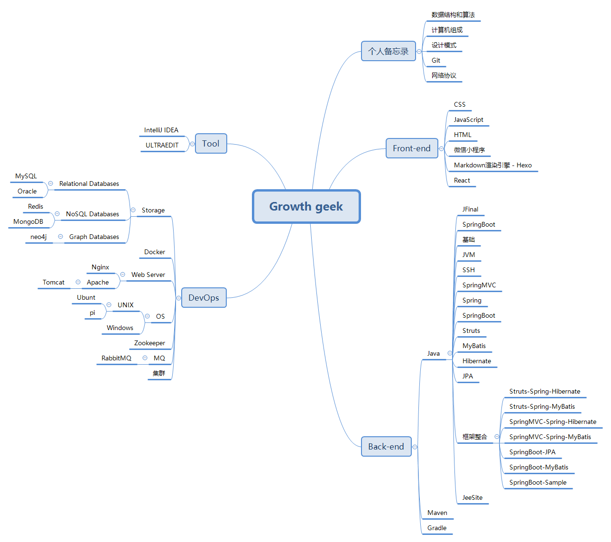

### 技术路线 ###

# Porschan #

## 个人备忘录 ##

- [CC许可协议](/2018/11/13/cc/ "CC许可协议")

- [MarkdownPad2 初使用](/2018/07/25/markdownPad/ "MARKDOWNPAD2 初使用")

- [BandwagonHost 切换 IP](/2019/04/22/Bandwagonhost-IP/ "BANDWAGONHOST 切换 IP")

- [Sourcetree 在Windows安装](/2019/04/22/SourceTree/ "SOURCETREE 在WINDOWS安装")

- [计算机硬货](/2019/04/22/computer/ "计算机硬货")

- [FRP初使用](/2019/04/22/frp/ "FRP初使用")

- [Hello World](/2019/04/22/hello-world/ "HELLO WORLD")

- [从HTTP 到 HTTPS](/2019/04/22/http-https/ "从HTTP 到 HTTPS")

- [Ngrok初使用](/2019/04/22/ngrok/ "NGROK初使用")

- [常用软件备忘录](/2019/04/22/note/ "常用软件备忘录")

- [梯子制造术 -  OpenVPN](/2019/04/22/openVpn/ "梯子制造术--OPENVPN")

----------

### 数据结构和算法 ###

- [您好，数据结构和算法](/2018/11/19/hello-algorithm/ "您好，数据结构和算法")

- [时间复杂度](/2018/11/21/algorithm-BigO/ "时间复杂度")

- [数据结构](/2018/12/06/algorithm-dataStructure/ "数据结构")

- [数据结构练习 - leetcode - 两数之和](/2018/12/24/leetcode-two-sum/ "数据结构练习 - leetcode - 两数之和")

- [数据结构练习 - leetcode - 反转链表](/2019/01/30/leetcode-reverseLinkedList/ "数据结构练习 - leetcode - 反转链表")

- [最大公约数 & 最少公倍数](/2019/06/05/algorithm-gcd/ "最大公约数 & 最少公倍数")

- [质数 & 素数](/2019/06/06/algorithm-prime-number/ "质数 & 素数")

- [杨辉三角](/2019/06/06/algorithm-yanghui/ "杨辉三角")

- [二分查找](/2019/06/07/algorithm-binary-search/ "二分查找")

- [冒泡排序 & 快速排序](/2019/06/07/algorithm-sort/ "冒泡排序")

- [稀疏数组](/2019/06/28/dataStructures-sparseArray/ "稀疏数组")

- [数组模拟环形队列](/2019/06/28/dataStructures-circleArray/ "数组模拟环形队列")

- [根据编号有序的单向链表](/2019/06/28/dataStructures-singleLinkedList/ "根据编号有序的单向链表")

----------

### 计算机组成 ###

- [计算机组成 - 计算机结构](/2018/12/31/ComputerComposition101/ "计算机组成 - 计算机结构")

- [计算机组成 - 冯·诺依曼结构](/2019/01/06/ComputerComposition102/ "计算机组成 - 冯·诺依曼结构")

### 设计模式 ###

- [软件设计原则及设计模式概述](/2019/05/16/designPattern-basic/ "软件设计原则及设计模式概述")

> 创建型模式

- [创建型模式 - 工厂模式](/2019/04/26/designPattern-factoryPattern/ "创建型模式 - 工厂模式")

- [创建型模式 - 单例模式](/2019/04/25/designPattern-singletonPattern/ "创建型模式 - 单例模式")

- [创建型模式 - 原型模式](/2019/05/16/designPattern-protoPattern/ "创建型模式 - 原型模式")

> 结构型模式

- [结构型模式 - 适配器模式](/2019/04/29/designPattern-adapterPattern/ "结构型模式 - 适配器模式")

- [结构型模式 - 代理模式](/2019/05/07/designPattern-agentmodePattern/ "结构型模式 - 代理模式")

> 行为型模式

- [行为型模式 - 策略模式](/2019/03/06/designPattern-strategyPattern/ "行为型模式 - 策略模式")

- [行为型模式 - 模板模式](/2019/05/04/designPattern-templatemodePattern/ "行为型模式 - 模板模式")

- [行为型模式 - 观察者模式](/2019/03/09/designPattern-observerPattern/ "行为型模式 - 观察者模式")

> 其他

- [设计模式 - 装饰者模式](/2019/04/25/designPattern-decoratorPattern/ "设计模式 - 装饰者模式")

- [设计模式 - 命令模式](/2019/04/27/designPattern-commandPattern/ "设计模式 - 命令模式")

- [设计模式 - 外观模式](/2019/05/04/designPattern-facadePattern/ "设计模式 - 外观模式")

- [设计模式 - 迭代器模式](/2019/05/04/designPattern-iteratormodePattern/ "设计模式 - 迭代器模式")

- [设计模式 - 组合模式](/2019/05/05/designPattern-composemodePattern/ "设计模式 - 组合模式")

- [设计模式 - 状态模式](/2019/05/06/designPattern-statemodePattern/ "设计模式 - 状态模式")

- [设计模式 - 复合模式](/2019/05/08/designPattern-compoundPattern/ "设计模式 - 复合模式")

- [设计模式 - 桥接模式](/2019/05/09/designPattern-bridgemsPattern/ "设计模式 - 桥接模式")

- [设计模式 - 生成器模式](/2019/05/12/designPattern-builderPattern/ "设计模式 - 生成器模式")

- [设计模式 - 责任链模式](/2019/05/12/designPattern-chainPattern/ "设计模式 - 责任链模式")

- [设计模式 - 蝇量模式](/2019/05/13/designPattern-flyweightPattern/ "设计模式 - 蝇量模式")

- [设计模式 - 解释器模式](/2019/05/13/designPattern-interpreterPattern/ "设计模式 - 解释器模式")

- [设计模式 - 中介者模式](/2019/05/15/designPattern-mediatorPattern/ "设计模式 - 中介者模式")

- [设计模式 - 备忘录模式](/2019/05/15/designPattern-mementoPattern/ "设计模式 - 备忘录模式")

- [设计模式 - 访问者模式](/2019/05/16/designPattern-visitorPattern/ "设计模式 - 访问者模式")

### Git ###

- [写个定时任务，从Github下载代码到阿里ECS服务器上](/2019/04/22/github-ecs/ "写个定时任务，从GITHUB下载代码到阿里ECS服务器上")

- [继上次GIT CLONE 下来ECS 服务器之后再优化](/2019/04/22/git_clone-CES/ "继上次GIT CLONE 下来ECS 服务器之后再优化")

- [使用Github 和 Github Desktop 协同开发](/2019/04/22/github-github_desktop/ "使用GITHUB 和 GITHUB DESKTOP 协同开发")

- [Github下载并搭建Hexo环境](/2018/11/11/github-hexo-windows10/ "github下载并搭建hexo环境")

- [Git - 基本配置](/2019/02/15/git-basic/ "Git - 基本配置")

### 网络协议 ###

- [网络协议 - 基础知识点](/2019/03/13/networkProtocol-basic/ "网络协议 - 基础知识点")

## Front-end ##

### HTML ###

- [在线检查网页的不同显示尺寸](/2018/10/24/ui/ "在线检查网页的不同显示尺寸")

- [记一次canvas的打印和下载](/2018/12/11/html-canvas/ "记一次canvas的打印和下载")

----------

### JavaScript ###

- [ Javascript- 对浏览器缓存的JS、CSS的思考](/2019/04/22/JavaScript-js-css/ "JAVASCRIPT - 对浏览器缓存的JS、CSS的思考")

- [打印及下载的js摘抄](/2019/01/25/html-print-down/ "打印及下载的js摘抄")

----------

### React ###

- [使用 VS 创建 React 的 Hello world项目](/2019/07/08/react-helloworld/ "使用 VS 创建 React 的 Hello world项目")

- [使用 React 的 定时器](/2019/07/08/reactTest-tick/ "使用 React 的 定时器")

- [使用 React 引入 Ant Design](/2019/07/08/react-antd/ "使用 React 引入 Ant Design")

----------

### 微信小程序 ###

- [微信公众平台JS-SDK的CONFIG接口注入权限验证配置](/2019/04/22/weChat-jssdk-config/ "微信公众平台JS-SDK的CONFIG接口注入权限验证配置")

----------

### Markdown渲染引擎 - Hexo ###

- [Hexo的常用命令](/2018/11/16/hexo-common/ "hexo的常用命令")

- [使用Hexo建立主题，并发布到Github](/2019/04/22/hexo-github/ "使用HEXO建立主题，并发布到GITHUB")

- [优化Hexo目录，使本地图片能显示出来](/2019/04/22/hexo-image/ "优化HEXO目录，使本地图片能显示出来")

- [Hexo常用命令](/2019/04/22/hexo-shell/ "HEXO常用命令")

----------

## DevOps ##

### Storage ###

#### Relational Databases ####

#### Oracle ####

- [Oracle - 资源正忙, 但指定以 NOWAIT 方式获取资源, 或者超时失效](/2019/07/11/oracle-nowait/ "Oracle - 资源正忙, 但指定以 NOWAIT 方式获取资源, 或者超时失效")

#### MySQL ####

- [Windows 下的 MySQL 即时打印 SQL 日志](/2019/04/22/windows-mysql-sql/ "WINDOWS 下的MYSQL即时打印SQL日志")

- [MySQL - 基础知识点](/2019/06/21/mysql-basic/ "MySQL - 基础知识点")

- [MySQL - 在 docker 中主从复制](/2019/06/24/mysql-docker-master-slave/ "MySQL - 在 docker 中主从复制")

#### NoSQL Databases ####

#### MongoDB ####

- [MongoDB - Windows系统安装](/2019/02/18/mongodb-install/ "MongoDB - windows系统安装")

#### Redis ####

- [Redis - Windows系统安装](/2019/02/16/redis-install/ "Redis - windows系统安装")

#### Graph Databases ####

#### neo4j ####

- [NEO4J - Windows系统安装](/2019/05/13/neo4j-install-windows/ "NEO4J - Windows系统安装")

### Docker ###

- [转 -  CentOS 6.5 安装Docker](/2018/07/26/centos-docker/ "转 -  CENTOS6.5 安装DOCKER")

- [转 - 使用 Docker 部署完成，连接MYSQL出现的乱码](/2018/07/27/docker-mysql-navicat/ "转 - 使用DOCKER部署完成，连接MYSQL出现的乱码")

----------

### Web Server ###

#### NGINX ####

- [静态网站和SpringBoot项目的配置](https://porschan.github.io/2018/11/15/nginx-staticWeb-springBoot/ "静态网站和SpringBoot项目的配置")

- [Nginx配置阿里云ssl证书使HTTPS生效](/2018/11/29/nginx-https-ali/ "Nginx配置阿里云ssl证书使HTTPS生效")

- [Nginx同时保持 HTTP 和 HTTPS](/2018/11/30/nginx-https-http/ "nginx同时保持http和https")

- [Nginx - 编译](/2019/02/25/nginx-install/ "nginx - 编译")

- [Nginx - 配置ssl证书](/2019/06/30/nginx-ssl/ "Nginx - 配置ssl证书")

- [Nginx - 部署 react 项目](/2019/07/24/nginx-react/ "Nginx - 部署 react 项目")

----------

#### Apache ####

#### Tomcat ####

- [Tomcat 启动之指定 JDK 版本](/2019/04/22/tomcat-jdk/ "Tomcat启动之指定jdk版本")

- [DOS Tomcat 操作](/2019/04/22/tomcat-server/ "DOS TOMCAT 操作")

- [启动多个Tomcat](/2018/11/29/Tomcat-much/ "启动多个Tomcat")

- [Tomcat安装服务之指定jdk版本](/2018/12/02/tomcat-server-install/ "Tomcat安装服务之指定jdk版本")

- [Tomcat 配置多端口](/2019/07/23/tomcat-multiple-ports/ "Tomcat 配置多端口")

### OS ###

#### UNIX ####

##### UBUNT #####

- [Ubuntu 安装 Java](/2018/08/03/ubuntu-java/ "UBUNTU 安装JAVA")

- [查看Ubuntu系统版本](/2018/10/21/ubunt-version/ "查看UBUNT系统版本")

- [Ubuntu 开启 SSH SERVER 的服务](/2018/10/24/ubunt-ssh-server/ "UBUNT开启SSH SERVER 的服务")

- [Ubuntu系统打开 FLASH 插件和关闭自动锁屏](/2019/04/22/ubuntu-flash/ "UBUNTU系统打开FLASH插件和关闭自动锁屏")

----------

##### PI #####

- [树莓派PasperryPI上配置GIT](/2019/04/22/raspberrypi-git/ "树莓派RASPBERRYPI上配置GIT")

----------

#### Windows ####

- [Windows 下的一个有用的BAT程序](/2019/04/22/windows-bat/ "WINDOWS 下的一个有用的BAT程序")

- [Windows 10任务栏上的时间显示秒操作](/2019/04/22/windows-second/ "WINDOWS10任务栏上的时间显示秒操作")

- [Windows上面的发音](/2019/04/22/windows-speak/ "WINDOWS上面的发音")

- [Windows 下面切换JDK版本](/2018/11/29/windows-jdks/ "WINDOWS下面切换jdk版本")

- [Windows中使用命令行关闭进程](/2018/12/01/windows-taskkill/ "WINDOWS中使用命令行关闭进程")

- [Windows下修改 hosts 文件，使 coursera 能正常学习](/2018/12/24/windows-coursera/ "windows下修改hosts文件，使coursera能正常学习")

- [Windows 下查看jdk版本](/2019/01/28/windows-jdk/ "windows下查看jdk版本")

- [在Windows 下使用bat文件跑命令](/2018/11/12/hexo-cmd-windows-bat/ "在windows下使用bat文件跑命令")

- [Windows - 虚拟机安装 ubunt](/2019/02/17/windows-install-ubunt-vm/ "windows - 虚拟机安装 ubunt")

- [JDK - Windows系统安装](/2019/04/23/windows-jdk-install/ "JDK - windows系统安装")

- [JDK - Windows系统安装](/2019/04/23/windows-jdk-install/ "JDK - windows系统安装")

- [在 Windows 下安装 VMware Workstation Pro](/2019/05/31/windows-VMwareWorkstationPro/ "在 Windows 下安装 VMware Workstation Pro")

- [在 VMware Workstation Pro 下安装 CentOS7](/2019/05/31/vmWare-centos7/ "在 VMware Workstation Pro 下安装 CentOS7")

- [在 Windows 下安装 Git](/2019/05/31/windows-git/ "在 Windows 下安装 Git")

- [在 Windows 下安装 Android Studio](/2019/05/31/windows-android-studio/ "在 Windows 下安装 Android Studio")

- [在 Windows 下安装 Intellij IDEA](/2019/05/31/windows-intellij-idea/ "在 Windows 下安装 Intellij IDEA")

- [在 Windows 下安装 Typora](/2019/05/31/windows-typora/ "在 Windows 下安装 Typora")

- [在 Windows 下安装 nvm](/2019/06/23/windows-nvm/ "在 Windows 下安装 nvm")

- [在 Windows 下安装 NodeJS](/2019/06/23/windows-NodeJS/ "在 Windows 下安装 NodeJS")

- [在 Windows 下安装 MySQL](/2019/06/23/windows-MySQL/ "在 Windows 下安装 MySQL")

- [在 Windows 下安装 Navicat](/2019/06/23/windows-Navicat/ "在 Windows 下安装 Navicat")

- [在 Windows 下安装 Weex](/2019/06/23/windows-Weex/ "在 Windows 下安装 Weex")

- [在 Windows 下安装 Maven](/2019/06/23/windows-Maven/ "在 Windows 下安装 Maven")

- [在 Windows 下安装 SVN](/2019/07/12/windows-SVN/ "在 Windows 下安装 SVN")

### Zookeeper

### MQ

#### RabbitMQ

- [RabbitMQ - CentOS系统安装](/2019/06/19/centos-RabbitMQ-install/ "RabbitMQ - CentOS系统安装")

#### ActiveMQ

- [ActiveMQ - Windows系统安装](/2019/02/28/windows-activeMQ-install/ "activeMQ - windows系统安装")

### 集群

----------

## Back-end ##

### Maven ###

- [Maven - 单独下载pom.xml里的JAR包](/2019/03/05/maven-down/ "Maven - 单独下载pom.xml里的Jar包")

- [Maven本地jar包部署与安装](/2019/05/28/maven-add-location/ "Maven本地jar包部署与安装")

### Gradle ###

- [Gradle - Windows系统安装](/2019/06/19/windows-Gradle-install/ "Gradle - windows系统安装")

### Java ###

#### 基础 ####

- [JAVA - Windows安装](/2019/02/16/java-install/ "java - windows安装")

- [HttpURLConnection 的工具类](/2019/11/18/java-httpUtil/ "HttpURLConnection 的工具类")

- [使用IDEA生成javadoc](/2019/05/10/java-idea-javadoc/ "使用IDEA生成javadoc")

- [Java - 基础知识点](/2019/06/10/java-basic/ "Java - 基础知识点")

#### JVM ####

- [JVM - 基础知识点](/2019/03/03/jvm-basic/ "JVM - 基础知识点")

- [JVM - JVM内存管理机制](/2019/06/17/jvm-model/ "JVM - JVM内存管理机制")

#### JFinal ####

- [JFINAL初使用](/2018/08/10/jfinal-jar-main/ "JFINAL初使用")

- [JFINAL 打完收枪 收集录](/2019/01/04/jfinal-bo/ "JFINAL 打完收枪 收集录")

#### SpringBoot ####

- [使用 IDEA 创建SpringBoot 项目](/2019/04/22/idea-springboot/ "使用IDEA创建SPRING BOOT 项目")

- [SpringBoot 开发中的热部署](/2018/12/08/springboot-devtools/ "SpringBoot开发中的热部署")

- [SpringBoot -Hello World](/2019/01/31/springboot-helloworld/ "SpringBoot - hello World")

- [SpringBoot - 连接MySQL](/2019/01/31/springboot-mysql/ "SpringBoot - 连接MySQL")

- [SpringBoot - 集合Druid](/2019/01/31/springboot-druid/ "SpringBoot - 集合druid")

- [SpringBoot - 使用JPA](/2019/01/31/springboot-jpa/ "SpringBoot - 使用jpa")

- [SpringBoot - HTTP请求](/2019/02/14/springboot-httpRequest/ "springboot - http请求")

- [SpringBoot - 使用 Thymeleaf 模板引擎](/2019/02/14/springboot-thymeleaf/ "springboot - 使用thymeleaf模板引擎")

- [SpringBoot - 使用 Transactional 事务支持](/2019/02/14/springboot-transactional/ "springboot - 使用 transactional 事务支持")

- [SpringBoot - 使用 Filter 过滤器](/2019/02/14/springboot-filter/ "springboot - 使用 filter 过滤器")

- [SpringBoot - 使用 Listener 监听器](/2019/02/14/springboot-listener/ "springboot - 使用 listener 监听器")

- [SpringBoot - 使用 Redis](/2019/02/16/springboot-redis/ "springboot - 使用 redis")

- [SpringBoot - 使用 Log4j](/2019/02/17/springboot-log4j/ "springboot - 使用 log4j")

- [SpringBoot - 使用 Quartz 定时器](/2019/02/17/springboot-quartz/ "springboot - 使用 quartz 定时器")

- [SpringBoot - 集成 Mybatis](/2019/02/18/springboot-mybatis/ "springboot - 集成 mybatis")

- [SpringBoot - 使用 ActiveMQ](/2019/03/04/springboot-activemq/ "springboot - 使用 ActiveMQ")

- [SpringBoot - 使用 @Async 异步调用](/2019/03/06/springboot-async/ "springboot - 使用 @Async 异步调用")

- [SpringBoot - 使用 MongoDB](/2019/05/13/springboot-mongodb/ "SpringBoot - 使用 MongoDB")

- [SpringBoot - 使用neo4j](/2019/05/14/springboot-neo4j/ "SpringBoot - 使用neo4j")

- [SpringBoot - 查看当前版本的各依赖版本](/2019/06/13/springboot-dependencies/ "SpringBoot - 查看当前版本的各依赖版本")

- [SpringBoot - 自定义注解 - AOP切面统一打印出入参日志(CLASS)](/2019/07/09/springboot-aop-class-log/ "SpringBoot - 自定义注解 - AOP切面统一打印出入参日志(CLASS)")

- [SpringBoot - 自定义注解 - AOP切面统一打印出入参日志(METHOD)](/2019/07/09/springboot-aop-method-log/ "SpringBoot - 自定义注解 - AOP切面统一打印出入参日志(METHOD)")

#### SpringMVC ####

- [使用 IDEA 创建 SpringMVC 项目](/2019/04/26/springMVC-create/ "使用IDEA创建SPRING MVC 项目")

#### Spring ####

#### SpringBoot ####

#### Struts ####

#### MyBatis ####

- [使用 IDEA 创建 MyBatis plus 的 SpringBoot 测试项目](/2019/05/28/springboot-mybatis-plus/ "使用 IDEA 创建 MyBatis plus 的 SpringBoot 测试项目")

#### Hibernate ####

#### JPA ####

#### JeeSite ####

- [使用 IDEA 中创建 JeeSite 的 web 项目](/2019/07/05/jeesite-curd/ "使用 IDEA 中创建 JeeSite 的 web 项目")

- [JeeSite 的杂记](/2019/07/09/jeesite-basic/ "JeeSite 的杂记")

#### 框架整合 ####

##### Struts-Spring-Hibernate

- [使用 IDEA 中创建 Struts-Spring-Hibernate 的 web 项目](/2019/05/18/struts-spring-hibernate-demo/ "使用 IDEA 中创建 Struts-Spring-Hibernate 的 web 项目")

- [在 STRUTS-SPRING-HIBERNATE 的 WEB 项目实现增删查改](/2019/05/20/struts-spring-hibernate-curd/ "在 STRUTS-SPRING-HIBERNATE 的 WEB 项目实现增删查改")

- [在 STRUTS-SPRING-HIBERNATE 的 WEB 项目实现模糊查询 & 分页 & 上传文件](/2019/05/20/struts-spring-hibernate-curd/ "在 STRUTS-SPRING-HIBERNATE 的 WEB 项目实现模糊查询 & 分页 & 上传文件")

##### Struts-Spring-MyBatis

##### SpringMVC-Spring-Hibernate

##### SpringMVC-Spring-MyBatis

- [使用 IDEA 中创建 SpringMVC-Spring-MyBatis 的 web 项目](/2019/05/21/springmvc-spring-mybatis-demo/ "使用 IDEA 中创建 SpringMVC-Spring-MyBatis 的 web 项目")

- [使用 IDEA 中创建 SpringMVC-Spring-MyBatis 的 web 项目实现增删查改](/2019/05/22/springmvc-spring-mybatis-curd/ "使用 IDEA 中创建 SpringMVC-Spring-MyBatis 的 web 项目实现增删查改")

- [使用 IDEA 中创建 SpringMVC-Spring-MyBatis 的 WEB 项目实现模糊查询 & 分页 & 上传文件]( "使用 IDEA 中创建 SpringMVC-Spring-MyBatis 的 WEB 项目实现模糊查询 & 分页 & 上传文件")

##### SpringBoot-JPA

- [使用 IDEA 中创建 SpringBoot-JPA 的 web 项目](/2019/05/24/springboot-jpa-demo/ "使用 IDEA 中创建 SpringBoot-JPA 的 web 项目")

- [使用 IDEA 中创建 SpringBoot-JPA 的 web 项目实现增删查改](/2019/05/24/springboot-jpa-curd/ "使用 IDEA 中创建 SpringBoot-JPA 的 web 项目实现增删查改")

- [使用 IDEA 中创建 SpringBoot-JPA 的 WEB 项目实现模糊查询 & 分页 & 上传文件](/2019/05/24/springboot-jpa-pager/ "使用 IDEA 中创建 SpringBoot-JPA 的 WEB 项目实现模糊查询 & 分页 & 上传文件")

##### SpringBoot-MyBatis

- [使用 IDEA 中创建 SpringBoot-MyBatis 的 web 项目](/2019/05/25/springboot-mybatis-demo/ "使用 IDEA 中创建 SpringBoot-MyBatis 的 web 项目")

- [使用 IDEA 中创建 SpringBoot-MyBatis 的 web 项目实现增删查改](/2019/05/25/springboot-mybatis-curd/ "使用 IDEA 中创建 SpringBoot-MyBatis 的 web 项目实现增删查改")

- [使用 IDEA 中创建 SpringBoot-MyBatis 的 WEB 项目实现模糊查询 & 分页 & 上传文件](/2019/05/25/springboot-mybatis-pager/ "使用 IDEA 中创建 SpringBoot-MyBatis 的 WEB 项目实现模糊查询 & 分页 & 上传文件")

##### SpringBoot-Sample

- [使用 IDEA 中创建 SpringBoot + Neo4J 的 WEB 项目](/2019/06/01/springboot-neo4j-ui-shadow/ "使用 IDEA 中创建 SpringBoot + Neo4J 的 WEB 项目")

- [使用 IDEA 中创建 SpringBoot2.x + Neo4J 的 WEB 项目](/2019/06/05/springboot-neo4j-ui-upgrade/ "使用 IDEA 中创建 SpringBoot2.x + Neo4J 的 WEB 项目")

- [使用 IDEA 中创建 SpringBoot + JPA + Redis + MySQL 的 WEB 项目](/2019/06/07/springboot-dbup-shadow/ "使用 IDEA 中创建 SpringBoot + JPA + Redis + MySQL 的 WEB 项目")

- [使用 IDEA 中创建 SpringBoot + RabbitMQ 项目](/2019/06/19/springboot-rabbitMQ-comsumer-producer/ "使用 IDEA 中创建 SpringBoot + RabbitMQ 项目")

- [使用 IDEA 中创建 SpringBoot2.x + MySQL + Redis缓存 + Cache缓存 的 WEB 项目](/2019/06/26/springboot-MySQL-Redis-Cache/ "使用 IDEA 中创建 SpringBoot2.x + MySQL + Redis缓存 + Cache缓存 的 WEB 项目")

- [使用 IDEA 中创建 SpringBoot2.x + Security 的 WEB 项目](/2019/06/29/springboot-Security/ "使用 IDEA 中创建 SpringBoot2.x + Security 的 WEB 项目")

----------

## Tool ##

### IntelliJ IDEA ###

- [项目包名层叠](/2019/01/31/idea-package-hidden/ "项目包名层叠")

- [IDEA 常用设置](/2019/04/22/intellij-idea/ "IDEA常用设置")

- [IDEA - 常用插件](/2019/02/24/idea-plug/ "IDEA - 常用插件")

### ULTRAEDIT ###

- [ULTRAEDIT 常用设置](/2018/07/19/ultraEdit/ "ULTRAEDIT 常用设置")  