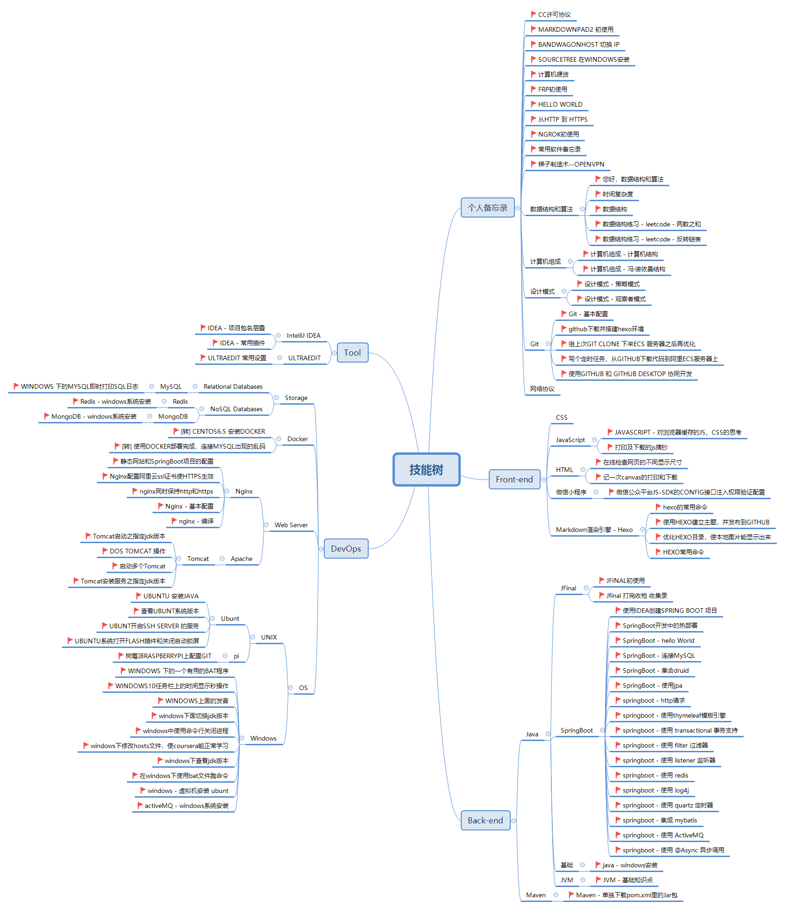

### 技术路线 ###

# Porschan #

## 个人备忘录 ##

- CC许可协议:[https://chanchifeng.com/2018/11/13/cc/](https://chanchifeng.com/2018/11/13/cc/ "CC许可协议")
- MARKDOWNPAD2 初使用:[https://chanchifeng.com/2018/07/25/markdownPad/](https://chanchifeng.com/2018/07/25/markdownPad/ "https://chanchifeng.com/2018/07/25/markdownPad/")
- BANDWAGONHOST 切换 IP：[https://chanchifeng.com/2018/11/11/Bandwagonhost-IP/](https://chanchifeng.com/2018/11/11/Bandwagonhost-IP/ "https://chanchifeng.com/2018/11/11/Bandwagonhost-IP/")
- SOURCETREE 在WINDOWS安装：[https://chanchifeng.com/2018/11/11/SourceTree/](https://chanchifeng.com/2018/11/11/SourceTree/ "https://chanchifeng.com/2018/11/11/SourceTree/")
- 计算机硬货:[https://chanchifeng.com/2018/11/11/computer/](https://chanchifeng.com/2018/11/11/computer/ "https://chanchifeng.com/2018/11/11/computer/")
- FRP初使用:[https://chanchifeng.com/2018/11/11/frp/](https://chanchifeng.com/2018/11/11/frp/ "https://chanchifeng.com/2018/11/11/frp/")
- HELLO WORLD:[https://chanchifeng.com/2018/11/11/hello-world/](https://chanchifeng.com/2018/11/11/hello-world/ "https://chanchifeng.com/2018/11/11/hello-world/")
- 从HTTP 到 HTTPS:[https://chanchifeng.com/2018/11/11/http-https/](https://chanchifeng.com/2018/11/11/http-https/ "https://chanchifeng.com/2018/11/11/http-https/")
- NGROK初使用:[https://chanchifeng.com/2018/11/11/ngrok/](https://chanchifeng.com/2018/11/11/ngrok/ "https://chanchifeng.com/2018/11/11/ngrok/")
- 常用软件备忘录:[https://chanchifeng.com/2018/11/11/note/](https://chanchifeng.com/2018/11/11/note/ "https://chanchifeng.com/2018/11/11/note/")
- 梯子制造术--OPENVPN:[https://chanchifeng.com/2018/11/11/openVpn/](https://chanchifeng.com/2018/11/11/openVpn/ "https://chanchifeng.com/2018/11/11/openVpn/")

----------

### 数据结构和算法 ###

- 您好，数据结构和算法:[https://chanchifeng.com/2018/11/19/hello-algorithm/](https://chanchifeng.com/2018/11/19/hello-algorithm/ "https://chanchifeng.com/2018/11/19/hello-algorithm/")
- 时间复杂度:[https://chanchifeng.com/2018/11/21/algorithm-BigO/](https://chanchifeng.com/2018/11/21/algorithm-BigO/ "https://chanchifeng.com/2018/11/21/algorithm-BigO/")
- 数据结构：[https://chanchifeng.com/2018/12/06/algorithm-dataStructure/](https://chanchifeng.com/2018/12/06/algorithm-dataStructure/ "https://chanchifeng.com/2018/12/06/algorithm-dataStructure/")
- 数据结构练习 - leetcode - 两数之和:[https://chanchifeng.com/2018/12/24/leetcode-two-sum/](https://chanchifeng.com/2018/12/24/leetcode-two-sum/ "https://chanchifeng.com/2018/12/24/leetcode-two-sum/")
- 数据结构练习 - leetcode - 反转链表:[https://chanchifeng.com/2019/01/30/leetcode-reverseLinkedList/](https://chanchifeng.com/2019/01/30/leetcode-reverseLinkedList/ "https://chanchifeng.com/2019/01/30/leetcode-reverseLinkedList/")

----------

### 计算机组成 ###

- 计算机组成 - 计算机结构:[https://chanchifeng.com/2018/12/31/ComputerComposition101/](https://chanchifeng.com/2018/12/31/ComputerComposition101/ "https://chanchifeng.com/2018/12/31/ComputerComposition101/")
- 计算机组成 - 冯·诺依曼结构:[https://chanchifeng.com/2019/01/06/ComputerComposition102/](https://chanchifeng.com/2019/01/06/ComputerComposition102/ "https://chanchifeng.com/2019/01/06/ComputerComposition102/")

### 设计模式 ###

- 设计模式 - 策略模式: [https://chanchifeng.com/2019/03/06/designPattern-strategyPattern/](https://chanchifeng.com/2019/03/06/designPattern-strategyPattern/ "https://chanchifeng.com/2019/03/06/designPattern-strategyPattern/")
- 设计模式 - 观察者模式:

### Git ###

- 写个定时任务，从GITHUB下载代码到阿里ECS服务器上:[https://chanchifeng.com/2018/11/11/github-ecs/](https://chanchifeng.com/2018/11/11/github-ecs/ "https://chanchifeng.com/2018/11/11/github-ecs/")
- 继上次GIT CLONE 下来ECS 服务器之后再优化:[https://chanchifeng.com/2018/11/11/git_clone-CES/](https://chanchifeng.com/2018/11/11/git_clone-CES/ "https://chanchifeng.com/2018/11/11/git_clone-CES/")
- 使用GITHUB 和 GITHUB DESKTOP 协同开发:[https://chanchifeng.com/2018/11/11/github-github_desktop/](https://chanchifeng.com/2018/11/11/github-github_desktop/ "https://chanchifeng.com/2018/11/11/github-github_desktop/")
- github下载并搭建hexo环境:[https://chanchifeng.com/2018/11/11/github-hexo-windows10/](https://chanchifeng.com/2018/11/11/github-hexo-windows10/ "github下载并搭建hexo环境")
- Git - 基本配置：[https://chanchifeng.com/2019/02/15/git-basic/](https://chanchifeng.com/2019/02/15/git-basic/ "https://chanchifeng.com/2019/02/15/git-basic/")

### 网络协议 ###

-  

## Front-end ##

### HTML ###

- 在线检查网页的不同显示尺寸:[https://chanchifeng.com/2018/10/24/ui/](https://chanchifeng.com/2018/10/24/ui/ "https://chanchifeng.com/2018/10/24/ui/")
- 记一次canvas的打印和下载：[https://chanchifeng.com/2018/12/11/html-canvas/](https://chanchifeng.com/2018/12/11/html-canvas/ "https://chanchifeng.com/2018/12/11/html-canvas/")

----------

### JavaScript ###

- JAVASCRIPT - 对浏览器缓存的JS、CSS的思考[https://chanchifeng.com/2018/11/11/JavaScript-js-css/](https://chanchifeng.com/2018/11/11/JavaScript-js-css/ "https://chanchifeng.com/2018/11/11/JavaScript-js-css/")
- 打印及下载的js摘抄:[https://chanchifeng.com/2019/01/25/html-print-down/](https://chanchifeng.com/2019/01/25/html-print-down/ "https://chanchifeng.com/2019/01/25/html-print-down/")

----------

### 微信小程序 ###

- 微信公众平台JS-SDK的CONFIG接口注入权限验证配置：[https://chanchifeng.com/2018/11/11/weChat-jssdk-config/](https://chanchifeng.com/2018/11/11/weChat-jssdk-config/ "https://chanchifeng.com/2018/11/11/weChat-jssdk-config/")

----------

### Markdown渲染引擎 - Hexo ###

- hexo的常用命令:[https://chanchifeng.com/2018/11/16/hexo-common/](https://chanchifeng.com/2018/11/16/hexo-common/ "https://chanchifeng.com/2018/11/16/hexo-common/")
- 使用HEXO建立主题，并发布到GITHUB:[https://chanchifeng.com/2018/11/11/hexo-github/](https://chanchifeng.com/2018/11/11/hexo-github/ "https://chanchifeng.com/2018/11/11/hexo-github/")
- 优化HEXO目录，使本地图片能显示出来:[https://chanchifeng.com/2018/11/11/hexo-image/](https://chanchifeng.com/2018/11/11/hexo-image/ "https://chanchifeng.com/2018/11/11/hexo-image/")
- HEXO常用命令：[https://chanchifeng.com/2018/11/11/hexo-shell/](https://chanchifeng.com/2018/11/11/hexo-shell/ "https://chanchifeng.com/2018/11/11/hexo-shell/")

----------

## DevOps ##

### Storage ###

#### Relational Databases ####

#### MySQL ####

- WINDOWS 下的MYSQL即时打印SQL日志：[https://chanchifeng.com/2018/11/11/windows-mysql-sql/](https://chanchifeng.com/2018/11/11/windows-mysql-sql/ "https://chanchifeng.com/2018/11/11/windows-mysql-sql/")

#### NoSQL Databases ####

#### MongoDB ####

- MongoDB - windows系统安装：[https://chanchifeng.com/2019/02/18/mongodb-install/](https://chanchifeng.com/2019/02/18/mongodb-install/ "https://chanchifeng.com/2019/02/18/mongodb-install/")

#### Redis ####

- Redis - windows系统安装：[https://chanchifeng.com/2019/02/16/redis-install/](https://chanchifeng.com/2019/02/16/redis-install/ "https://chanchifeng.com/2019/02/16/redis-install/")

### Docker ###

- [转] CENTOS6.5 安装DOCKER:[https://chanchifeng.com/2018/07/26/centos-docker/](https://chanchifeng.com/2018/07/26/centos-docker/ "https://chanchifeng.com/2018/07/26/centos-docker/")
- [转] 使用DOCKER部署完成，连接MYSQL出现的乱码:[https://chanchifeng.com/2018/07/27/docker-mysql-navicat/](https://chanchifeng.com/2018/07/27/docker-mysql-navicat/ "https://chanchifeng.com/2018/07/27/docker-mysql-navicat/")

----------

### Web Server ###

#### NGINX ####

- 静态网站和SpringBoot项目的配置:[https://porschan.github.io/2018/11/15/nginx-staticWeb-springBoot/](https://porschan.github.io/2018/11/15/nginx-staticWeb-springBoot/ "https://porschan.github.io/2018/11/15/nginx-staticWeb-springBoot/")
- Nginx配置阿里云ssl证书使HTTPS生效：[https://chanchifeng.com/2018/11/29/nginx-https-ali/](https://chanchifeng.com/2018/11/29/nginx-https-ali/ "https://chanchifeng.com/2018/11/29/nginx-https-ali/")
- nginx同时保持http和https:[https://chanchifeng.com/2018/11/30/nginx-https-http/](https://chanchifeng.com/2018/11/30/nginx-https-http/ "https://chanchifeng.com/2018/11/30/nginx-https-http/")
- nginx - 编译：[https://chanchifeng.com/2019/02/25/nginx-install/](https://chanchifeng.com/2019/02/25/nginx-install/ "https://chanchifeng.com/2019/02/25/nginx-install/")

----------

#### Apache ####

#### Tomcat ####

- Tomcat启动之指定jdk版本:[https://chanchifeng.com/2018/11/11/tomcat-jdk/](https://chanchifeng.com/2018/11/11/tomcat-jdk/ "https://chanchifeng.com/2018/11/11/tomcat-jdk/")
- DOS TOMCAT 操作:[https://chanchifeng.com/2018/11/11/tomcat-server/](https://chanchifeng.com/2018/11/11/tomcat-server/ "https://chanchifeng.com/2018/11/11/tomcat-server/")
- 启动多个Tomcat：[https://chanchifeng.com/2018/11/29/Tomcat-much/](https://chanchifeng.com/2018/11/29/Tomcat-much/ "https://chanchifeng.com/2018/11/29/Tomcat-much/")
- Tomcat安装服务之指定jdk版本：[https://chanchifeng.com/2018/12/02/tomcat-server-install/](https://chanchifeng.com/2018/12/02/tomcat-server-install/ "https://chanchifeng.com/2018/12/02/tomcat-server-install/")

### OS ###

#### UNIX ####

##### UBUNT #####

- UBUNTU 安装JAVA:[https://chanchifeng.com/2018/08/03/ubuntu-java/](https://chanchifeng.com/2018/08/03/ubuntu-java/ "https://chanchifeng.com/2018/08/03/ubuntu-java/")
- 查看UBUNT系统版本：[https://chanchifeng.com/2018/10/21/ubunt-version/](https://chanchifeng.com/2018/10/21/ubunt-version/ "https://chanchifeng.com/2018/10/21/ubunt-version/")
- UBUNT开启SSH SERVER 的服务：[https://chanchifeng.com/2018/10/24/ubunt-ssh-server/](https://chanchifeng.com/2018/10/24/ubunt-ssh-server/ "https://chanchifeng.com/2018/10/24/ubunt-ssh-server/")
- UBUNTU系统打开FLASH插件和关闭自动锁屏:[https://chanchifeng.com/2018/11/11/ubuntu-flash/](https://chanchifeng.com/2018/11/11/ubuntu-flash/ "https://chanchifeng.com/2018/11/11/ubuntu-flash/")
- 

----------

##### PI #####

- 树莓派RASPBERRYPI上配置GIT:[https://chanchifeng.com/2018/11/11/raspberrypi-git/](https://chanchifeng.com/2018/11/11/raspberrypi-git/ "https://chanchifeng.com/2018/11/11/raspberrypi-git/")

----------

#### Windows ####

- WINDOWS 下的一个有用的BAT程序：[https://chanchifeng.com/2018/11/11/windows-bat/](https://chanchifeng.com/2018/11/11/windows-bat/ "https://chanchifeng.com/2018/11/11/windows-bat/")
- WINDOWS10任务栏上的时间显示秒操作：[https://chanchifeng.com/2018/11/11/windows-second/](https://chanchifeng.com/2018/11/11/windows-second/ "https://chanchifeng.com/2018/11/11/windows-second/")
- WINDOWS上面的发音:[https://chanchifeng.com/2018/11/11/windows-speak/](https://chanchifeng.com/2018/11/11/windows-speak/ "https://chanchifeng.com/2018/11/11/windows-speak/")
- WINDOWS下面切换jdk版本：[https://chanchifeng.com/2018/11/29/windows-jdks/](https://chanchifeng.com/2018/11/29/windows-jdks/ "https://chanchifeng.com/2018/11/29/windows-jdks/")
- WINDOWS中使用命令行关闭进程：[https://chanchifeng.com/2018/12/01/windows-taskkill/](https://chanchifeng.com/2018/12/01/windows-taskkill/ "https://chanchifeng.com/2018/12/01/windows-taskkill/")
- windows下修改hosts文件，使coursera能正常学习：[https://chanchifeng.com/2018/12/24/windows-coursera/](https://chanchifeng.com/2018/12/24/windows-coursera/ "https://chanchifeng.com/2018/12/24/windows-coursera/")
- windows下查看jdk版本：[https://chanchifeng.com/2019/01/28/windows-jdk/](https://chanchifeng.com/2019/01/28/windows-jdk/ "https://chanchifeng.com/2019/01/28/windows-jdk/")
- 在windows下使用bat文件跑命令:[https://chanchifeng.com/2018/11/12/hexo-cmd-windows-bat/](https://chanchifeng.com/2018/11/12/hexo-cmd-windows-bat/ "在windows下使用bat文件跑命令")
- windows - 虚拟机安装 ubunt：[https://chanchifeng.com/2019/02/17/windows-install-ubunt-vm/](https://chanchifeng.com/2019/02/17/windows-install-ubunt-vm/ "https://chanchifeng.com/2019/02/17/windows-install-ubunt-vm/")
- activeMQ - windows系统安装：[https://chanchifeng.com/2019/02/28/windows-activeMQ-install/](https://chanchifeng.com/2019/02/28/windows-activeMQ-install/ "https://chanchifeng.com/2019/02/28/windows-activeMQ-install/")

----------

## Back-end ##

### Maven ###

- Maven - 单独下载pom.xml里的Jar包：[https://chanchifeng.com/2019/03/05/maven-down/](https://chanchifeng.com/2019/03/05/maven-down/ "https://chanchifeng.com/2019/03/05/maven-down/")

### Java ###

#### 基础 ####

- java - windows安装：[https://chanchifeng.com/2019/02/16/java-install/](https://chanchifeng.com/2019/02/16/java-install/ "https://chanchifeng.com/2019/02/16/java-install/")

#### JVM ####

- JVM - 基础知识点

- JVM - 基础知识点:[https://chanchifeng.com/2019/03/03/jvm-basic/](https://chanchifeng.com/2019/03/03/jvm-basic/ "https://chanchifeng.com/2019/03/03/jvm-basic/")

#### JFinal ####

- JFINAL初使用：[https://chanchifeng.com/2018/08/10/jfinal-jar-main/](https://chanchifeng.com/2018/08/10/jfinal-jar-main/ "https://chanchifeng.com/2018/08/10/jfinal-jar-main/")
- Jfinal 打完收枪 收集录:[https://chanchifeng.com/2019/01/04/jfinal-bo/](https://chanchifeng.com/2019/01/04/jfinal-bo/ "·https://chanchifeng.com/2019/01/04/jfinal-bo/")

----------

#### SpringBoot ####

- 使用IDEA创建SPRING BOOT 项目:[https://chanchifeng.com/2018/11/11/idea-springboot/](https://chanchifeng.com/2018/11/11/idea-springboot/ "https://chanchifeng.com/2018/11/11/idea-springboot/")
- SpringBoot开发中的热部署：[https://chanchifeng.com/2018/12/08/springboot-devtools/](https://chanchifeng.com/2018/12/08/springboot-devtools/ "https://chanchifeng.com/2018/12/08/springboot-devtools/")
- SpringBoot - hello World:[https://chanchifeng.com/2019/01/31/springboot-helloworld/](https://chanchifeng.com/2019/01/31/springboot-helloworld/ "https://chanchifeng.com/2019/01/31/springboot-helloworld/")
- SpringBoot - 连接MySQL：[https://chanchifeng.com/2019/01/31/springboot-mysql/](https://chanchifeng.com/2019/01/31/springboot-mysql/ "https://chanchifeng.com/2019/01/31/springboot-mysql/")
- SpringBoot - 集合druid：[https://chanchifeng.com/2019/01/31/springboot-druid/](https://chanchifeng.com/2019/01/31/springboot-druid/ "https://chanchifeng.com/2019/01/31/springboot-druid/")
- SpringBoot - 使用jpa:[https://chanchifeng.com/2019/01/31/springboot-jpa/](https://chanchifeng.com/2019/01/31/springboot-jpa/ "https://chanchifeng.com/2019/01/31/springboot-jpa/")
- springboot - http请求:[https://chanchifeng.com/2019/02/14/springboot-httpRequest/](https://chanchifeng.com/2019/02/14/springboot-httpRequest/ "https://chanchifeng.com/2019/02/14/springboot-httpRequest/")
- springboot - 使用thymeleaf模板引擎：[https://chanchifeng.com/2019/02/14/springboot-thymeleaf/](https://chanchifeng.com/2019/02/14/springboot-thymeleaf/ "https://chanchifeng.com/2019/02/14/springboot-thymeleaf/")
- springboot - 使用 transactional 事务支持：[https://chanchifeng.com/2019/02/14/springboot-transactional/](https://chanchifeng.com/2019/02/14/springboot-transactional/ "https://chanchifeng.com/2019/02/14/springboot-transactional/")
- springboot - 使用 filter 过滤器：[https://chanchifeng.com/2019/02/14/springboot-filter/](https://chanchifeng.com/2019/02/14/springboot-filter/ "https://chanchifeng.com/2019/02/14/springboot-filter/")
- springboot - 使用 listener 监听器：[https://chanchifeng.com/2019/02/14/springboot-listener/](https://chanchifeng.com/2019/02/14/springboot-listener/ "https://chanchifeng.com/2019/02/14/springboot-listener/")
- springboot - 使用 redis:[https://chanchifeng.com/2019/02/16/springboot-redis/](https://chanchifeng.com/2019/02/16/springboot-redis/ "https://chanchifeng.com/2019/02/16/springboot-redis/")
- springboot - 使用 log4j：[https://chanchifeng.com/2019/02/17/springboot-log4j/](https://chanchifeng.com/2019/02/17/springboot-log4j/ "https://chanchifeng.com/2019/02/17/springboot-log4j/")
- springboot - 使用 quartz 定时器：[https://chanchifeng.com/2019/02/17/springboot-quartz/](https://chanchifeng.com/2019/02/17/springboot-quartz/ "https://chanchifeng.com/2019/02/17/springboot-quartz/")
- springboot - 集成 mybatis：[https://chanchifeng.com/2019/02/18/springboot-mybatis/](https://chanchifeng.com/2019/02/18/springboot-mybatis/ "https://chanchifeng.com/2019/02/18/springboot-mybatis/")
- springboot - 使用 ActiveMQ：[https://chanchifeng.com/2019/03/04/springboot-activemq/](https://chanchifeng.com/2019/03/04/springboot-activemq/ "https://chanchifeng.com/2019/03/04/springboot-activemq/")
- springboot - 使用 @Async 异步调用:[https://chanchifeng.com/2019/03/06/springboot-async/](https://chanchifeng.com/2019/03/06/springboot-async/ "https://chanchifeng.com/2019/03/06/springboot-async/")

----------

## Tool ##

### IntelliJ IDEA ###

- 项目包名层叠：[https://chanchifeng.com/2019/01/31/idea-package-hidden/](https://chanchifeng.com/2019/01/31/idea-package-hidden/ "https://chanchifeng.com/2019/01/31/idea-package-hidden/")
- INTELLIJ IDEA常用设置:[https://chanchifeng.com/2018/11/11/intellij-idea/](https://chanchifeng.com/2018/11/11/intellij-idea/ "https://chanchifeng.com/2018/11/11/intellij-idea/")
- idea - 常用插件：[https://chanchifeng.com/2019/02/24/idea-plug/](https://chanchifeng.com/2019/02/24/idea-plug/ "https://chanchifeng.com/2019/02/24/idea-plug/")

### ULTRAEDIT ###

- ULTRAEDIT 常用设置:[https://chanchifeng.com/2018/07/19/ultraEdit/](https://chanchifeng.com/2018/07/19/ultraEdit/ "https://chanchifeng.com/2018/07/19/ultraEdit/")